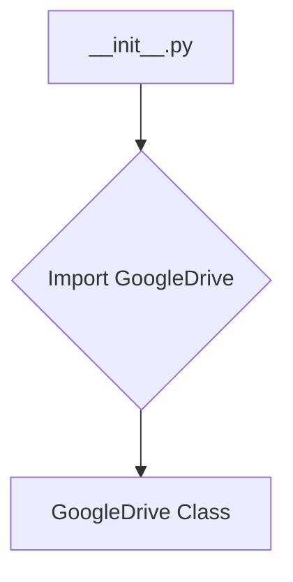
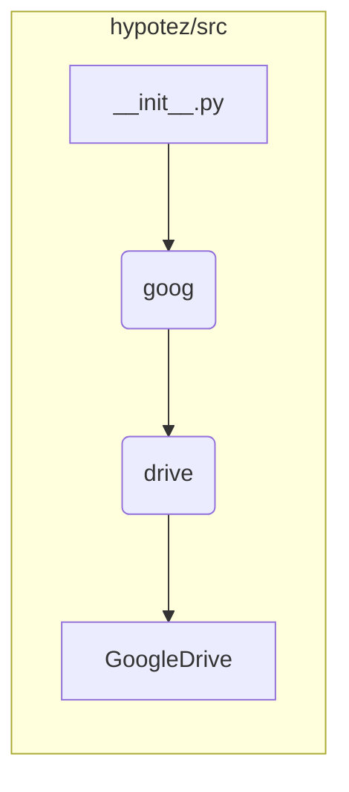

```MD
# Анализ кода hypotez/src/goog/drive/__init__.py

1. **<input code>**

```python
## \file hypotez/src/goog/drive/__init__.py
# -*- coding: utf-8 -*-
#! venv/Scripts/python.exe
#! venv/bin/python/python3.12

"""
.. module: src.goog.drive 
	:platform: Windows, Unix
	:synopsis:

"""
MODE = 'dev'


from .drive import GoogleDrive
```

2. **<algorithm>**

Этот код является инициализационным модулем для пакета `goog.drive`.  В нём нет явной логики выполнения, он только импортирует класс `GoogleDrive` из подпапки `drive`.  Блок-схема состоит из единственной операции импорта.



Пример:  При импорте этого модуля в другом месте проекта,  `GoogleDrive` становится доступным для использования.

3. **<mermaid>**




4. **<explanation>**

* **Импорты:** `from .drive import GoogleDrive` импортирует класс `GoogleDrive` из модуля `drive.py` внутри пакета `goog.drive`. Символ `.` указывает на импорт из текущего пакета, это важно для организации модулей в проекте.

* **Классы:**
    * **`GoogleDrive` (в `drive.py`):**  Этот класс (вероятно, определён в файле `hypotez/src/goog/drive/drive.py`) не показан в предоставленном фрагменте.  Он скорее всего отвечает за взаимодействие с Google Drive API.  Его атрибуты и методы определяют, как будут выполняться операции, например, загрузка, скачивание, создание файлов и папок.


* **Функции:** В данном фрагменте нет функций.


* **Переменные:**
    * **`MODE = 'dev'`**: Переменная, скорее всего, устанавливает режим работы приложения ('dev' - вероятно, режим разработки).  Значение может использоваться в других частях кода, например, для настройки логирования или других параметров.


* **Возможные ошибки и улучшения:**
    * Отсутствует описание класса `GoogleDrive`. Это значительно усложняет понимание цели модуля и его использования.
    * Неопределённый путь `#! venv/Scripts/python.exe`.  Не ясно, какой интерпретатор используется.  Такие указания лучше убирать, оставляя Python сам определять интерпретатор (или использовать виртуальный окружение).


* **Связь с другими частями проекта:**  Этот модуль является частью пакета, связанного с Google Drive.  Скорее всего, он используется в других модулях, где нужно взаимодействовать с облаком Google Drive (например, для хранения файлов, работы с документами и т.д.).  Необходим код `drive.py` для полного понимания.


**Вывод:**  Код представляет собой инициализационный модуль пакета `goog.drive`, который импортирует класс `GoogleDrive`. Для понимания работы этого пакета, необходимо просмотреть код класса `GoogleDrive`, определённого в `drive.py`.