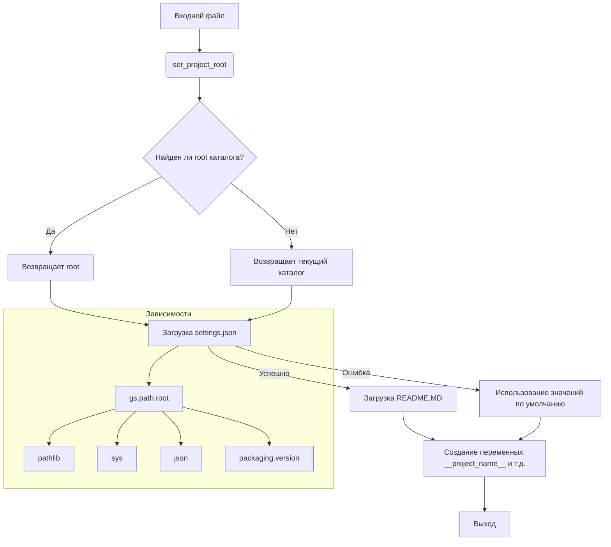

# <input code>

```python
## \file hypotez/src/goog/gtranslater/header.py
# -*- coding: utf-8 -*-\
#! venv/Scripts/python.exe
#! venv/bin/python/python3.12

"""
.. module: src.goog.gtranslater 
	:platform: Windows, Unix
	:synopsis:

"""


"""
	:platform: Windows, Unix
	:synopsis:

"""


"""
	:platform: Windows, Unix
	:synopsis:

"""


"""
  :platform: Windows, Unix

"""
"""
  :platform: Windows, Unix
  :platform: Windows, Unix
  :synopsis:
"""
  
""" module: src.goog.gtranslater """

import sys
import json
from packaging.version import Version

from pathlib import Path
def set_project_root(marker_files=('__root__','.git')) -> Path:
    """
    Finds the root directory of the project starting from the current file's directory,
    searching upwards and stopping at the first directory containing any of the marker files.

    Args:
        marker_files (tuple): Filenames or directory names to identify the project root.
    
    Returns:
        Path: Path to the root directory if found, otherwise the directory where the script is located.
    """
    __root__:Path
    current_path:Path = Path(__file__).resolve().parent
    __root__ = current_path
    for parent in [current_path] + list(current_path.parents):
        if any((parent / marker).exists() for marker in marker_files):
            __root__ = parent
            break
    if __root__ not in sys.path:
        sys.path.insert(0, str(__root__))
    return __root__


# Get the root directory of the project
__root__ = set_project_root()
"""__root__ (Path): Path to the root directory of the project"""

from src import gs

settings:dict = None
try:
    with open(gs.path.root / 'src' /  'settings.json', 'r') as settings_file:
        settings = json.load(settings_file)
except (FileNotFoundError, json.JSONDecodeError):
    ...

doc_str:str = None
try:
    with open(gs.path.root / 'src' /  'README.MD', 'r') as settings_file:
        doc_str = settings_file.read()
except (FileNotFoundError, json.JSONDecodeError):
    ...


__project_name__ = settings.get("project_name", 'hypotez') if settings  else 'hypotez'
__version__: str = settings.get("version", '')  if settings  else ''
__doc__: str = doc_str if doc_str else ''
__details__: str = ''
__author__: str = settings.get("author", '')  if settings  else ''
__copyright__: str = settings.get("copyrihgnt", '')  if settings  else ''
__cofee__: str = settings.get("cofee", "Treat the developer to a cup of coffee for boosting enthusiasm in development: https://boosty.to/hypo69")  if settings  else "Treat the developer to a cup of coffee for boosting enthusiasm in development: https://boosty.to/hypo69"
```

# <algorithm>

**Шаг 1:** Функция `set_project_root`: Инициализируется переменная `__root__` текущим директорием. Цикл итерируется по родительским директориям, проверяя наличие файлов/папок в списке `marker_files`. Если такой файл/папка найден, `__root__` устанавливается и цикл прерывается. В противном случае `__root__` остается неизменной. Если `__root__` не находится в `sys.path`, она добавляется в начало. Возвращает путь к корневому каталогу проекта.

**Шаг 2:** Вызывается функция `set_project_root` для получения корневого каталога проекта. Результат сохраняется в переменной `__root__`.

**Шаг 3:**  Используя переменную `gs.path.root`, формируется путь к файлу `settings.json` внутри проекта.
**Шаг 4:**  Происходит попытка открыть файл `settings.json` и загрузить его содержимое в виде JSON объекта в переменную `settings`. Если файл не найден или содержимое файла некорректно, то переменной `settings` присваивается значение `None`.

**Шаг 5:** Аналогично, пытается получить содержимое файла `README.MD` в переменную `doc_str`. Если файл не найден или не может быть обработаен, то `doc_str` остается `None`.

**Шаг 6:**  Используя `settings` объект, если он доступен, получаем значения для переменных `__project_name__`, `__version__`, `__author__`, `__copyright__`, `__cofee__` , либо устанавливаются значения по умолчанию (если `settings` отсутствует).

**Шаг 7:** Происходит присвоение значений по умолчанию для всех остальных переменных.


**Пример:**

Если файл `pyproject.toml` находится в родительской папке текущего файла, то `__root__` будет содержать путь к этой родительской папке. Данные из `settings.json` и `README.MD` будут загружены в соответствующие переменные, если файлы существуют и содержат корректный JSON. В противном случае, значения по умолчанию будут использованы.


# <mermaid>



**Объяснение диаграммы:**

* **A**: Точка входа - исполняемый файл.
* **B**: Вызов функции `set_project_root`.
* **C**: Условие поиска корневого каталога проекта.
* **D, E**:  Результат поиска.
* **F**: Загрузка файла `settings.json`.
* **G**: Загрузка файла `README.MD`.
* **H**: Обработка ошибок при загрузке файлов.
* **I**: Формирование переменных.
* **J**: Конец выполнения.


# <explanation>

* **Импорты**:
    * `sys`: Предоставляет доступ к системным переменным, включая пути. Используется для добавления корневого каталога проекта в `sys.path`.
    * `json`: Для работы с JSON-файлами (`settings.json`).
    * `packaging.version`: Для работы с версиями пакетов. Не используется непосредственно, но включена для использования в `requirements.txt`, например.
    * `pathlib`: Для работы с путями к файлам, упрощая манипуляции с файловой системой.
* **Классы**: Нет явных классов, только функция `set_project_root`.
* **Функции**:
    * `set_project_root(marker_files)`: Находит корневой каталог проекта, начиная с текущего файла, и проверяет наличие указанных маркеров файлов (например, `pyproject.toml`). Очень важная функция для организации импорта модулей и доступа к ресурсам проекта.
* **Переменные**:
    * `__root__`: Хранит путь к корневому каталогу проекта.  (тип: `Path`)
    * `settings`: Словарь с настройками проекта, загруженными из `settings.json`. (тип: `dict` или `None`)
    * `doc_str`: Содержимое файла `README.MD`. (тип: `str` или `None`)
    * `__project_name__`, `__version__`, `__author__`, `__copyright__`, `__cofee__`, `__doc__`, `__details__`: Переменные с метаданными проекта, получаемые из `settings.json` или значениями по умолчанию. (тип: `str`)
    * `MODE`: Переменная с режимом работы. (тип: `str`)


* **Возможные ошибки и улучшения**:
    * Проверка наличия `gs.path`. Если `gs` не импортирован, то `gs.path.root` вызовет ошибку. Необходимо убедиться, что модуль `gs` корректно импортирован, возможно, в этом модуле определен свой метод `path` или он должен быть определен.
    * Лучше использовать `try-except` блоки для обработки `FileNotFoundError` и других исключений при работе с файлами, вместо `...`.
    * Обработка разных типов ошибок (`json.JSONDecodeError`): обработка некорректного JSON.
    * Добавление логирования: очень полезно для отладки и мониторинга работы скрипта.
    * Дополнительные валидации: Например, проверка типа данных в `settings` перед использованием.

**Взаимосвязи с другими частями проекта**:
Функция `set_project_root` играет критическую роль для организации проекта, делая доступными другие модули. Модуль `gs` (судя по коду) определяет переменную `path` (возможно, класс или структура), которая необходима для формирования путей к `settings.json` и `README.MD`.  Без этого модуля этот код не будет работать.  `gs` скорее всего содержит константы, необходимые для работы с проектом, и должен быть импортирован из `src`.