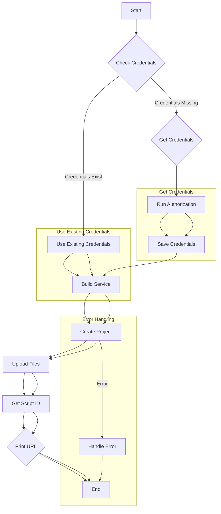

# <input code>

```python
## \file hypotez/src/goog/quickstart.py
# -*- coding: utf-8 -*-
#! venv/Scripts/python.exe
#! venv/bin/python/python3.12

"""
.. module: src.goog 
	:platform: Windows, Unix
	:synopsis:

"""


"""
Shows basic usage of the Apps Script API.
Call the Apps Script API to create a new script project, upload a file to the
project, and log the script's URL to the user.

https://developers.google.com/apps-script/api/quickstart/python
"""


from pathlib import Path

from google.auth.transport.requests import Request
from google.oauth2.credentials import Credentials
from google_auth_oauthlib.flow import InstalledAppFlow
from googleapiclient import errors
from googleapiclient.discovery import build

import header
from src import gs

# If modifying these scopes, delete the file token.json.
SCOPES = ['https://www.googleapis.com/auth/script.projects']

SAMPLE_CODE = """
function helloWorld() {
  console.log("Hello, world!");
}
""".strip()

SAMPLE_MANIFEST = """
{
  "timeZone": "America/New_York",
  "exceptionLogging": "CLOUD"
}
""".strip()


def main():
    """Calls the Apps Script API."""
    creds = None
    # The file token.json stores the user's access and refresh tokens, and is
    # created automatically when the authorization flow completes for the first
    # time.
    token_path = gs.path.tmp / 'e-cat-346312-137284f4419e.json'
    if token_path.exists():
        creds = Credentials.from_authorized_user_file(token_path, SCOPES)
    # If there are no (valid) credentials available, let the user log in.
    if not creds or not creds.valid:
        if creds and creds.expired and creds.refresh_token:
            creds.refresh(Request())
        else:
            flow = InstalledAppFlow.from_client_secrets_file(
                'credentials.json', SCOPES)
            creds = flow.run_local_server(port=0)
        # Save the credentials for the next run
        with Path('token.json').open('w') as token:
            token.write(creds.to_json())

    try:
        service = build('script', 'v1', credentials=creds)

        # Call the Apps Script API
        # Create a new project
        request = {'title': 'My Script'}
        response = service.projects().create(body=request).execute()

        # Upload two files to the project
        request = {
            'files': [
                {'name': 'hello', 'type': 'SERVER_JS', 'source': SAMPLE_CODE},
                {'name': 'appsscript', 'type': 'JSON', 'source': SAMPLE_MANIFEST}
            ]
        }
        response = service.projects().updateContent(
            body=request,
            scriptId=response['scriptId']).execute()
        print('https://script.google.com/d/' + response['scriptId'] + '/edit')
    except errors.HttpError as error:
        # The API encountered a problem.
        print(error.content)


if __name__ == '__main__':
    main()
```

# <algorithm>



**Пример:**

Если `token.json` существует и содержит валидные данные, выполнение переходит к блоку `Use Existing Credentials`. Если `token.json` не существует, выполнение переходит к блоку `Get Credentials`. В этом случае будет запущен локальный сервер для авторизации пользователя, и полученные данные будут сохранены в `token.json`.


# <mermaid>

```mermaid
graph LR
    subgraph Google Apps Script API
        A[quickstart.py] --> B(build);
        B --> C[projects().create];
        C --> D[projects().updateContent];
        D --> E{Get Script ID};
    end
    
    subgraph Python Libraries
        A --> F[google.auth];
        A --> G[google_auth_oauthlib];
        A --> H[googleapiclient];
        F --> I(Request);
        G --> J(InstalledAppFlow);
        H --> K(errors, build);
        A --> L[pathlib];
    end

    
    subgraph Local Files
        A --> M[credentials.json];
        A --> N[token.json];
    end
    
    subgraph External Dependencies
        I --> O[HTTP Requests];
        J --> P[Authorization Flow];
        E --> Q[Google Cloud Platform];
    end
```

**Объяснение зависимостей:**

* `google.auth`:  Работа с аутентификацией Google.
* `google_auth_oauthlib`:  Осуществление потока авторизации приложений.
* `googleapiclient`:  Клиентская библиотека для взаимодействия с API Google.
* `pathlib`:  Работа с файлами и каталогами.


# <explanation>

**Импорты:**

- `pathlib`:  Обеспечивает удобный способ работы с путями к файлам.  Подключается из стандартной библиотеки Python.
- `google.auth.transport.requests`:  Предоставляет методы для взаимодействия с Google API.
- `google.oauth2.credentials`:  Работа с учетными данными доступа.
- `google_auth_oauthlib.flow`:  Реализует процесс авторизации приложений Google.
- `googleapiclient.errors`:  Обработка ошибок API.
- `googleapiclient.discovery`:  Построение объектов API.
- `header`:  Вероятно, содержит дополнительные настройки или импорты для приложения. Необходима информация о его местоположении.
- `src.gs`:  Полагаю, это модуль (класс или функция), используемый для работы с Google Storage.  Его зависимость от `src` предполагает, что он содержится в одной папке с другими модулями проекта.

**Классы:**

- `Credentials`: Класс, представляющий учетные данные доступа к Google API. Используется для авторизации запросов.
- `InstalledAppFlow`:  Управляет процессом авторизации.


**Функции:**

- `main()`:  Основная функция приложения. Она отвечает за загрузку учетных данных, создание проекта, загрузку файлов и вывод URL скрипта.
- `Credentials.from_authorized_user_file()`:  Загружает учетные данные из файла `token.json`.
- `InstalledAppFlow.from_client_secrets_file()`:  Создает объект `InstalledAppFlow` для авторизации пользователя, используя файл `credentials.json`.
- `creds.refresh()`:  Обновляет учетные данные, если они истекли.
- `build()`:  Создает объект API.
- `service.projects().create()`: Создает новый проект Apps Script.
- `service.projects().updateContent()`: Загружает файлы в проект.


**Переменные:**

- `SCOPES`:  Список требуемых доступов к Google API.
- `SAMPLE_CODE`:  Пример кода на JavaScript.
- `SAMPLE_MANIFEST`:  Пример манифеста Apps Script.


**Возможные ошибки и улучшения:**

- **Обработка ошибок:** Код содержит обработку `HttpError`, но может быть полезно добавить обработку других возможных исключений (например, `FileNotFoundError` при поиске `credentials.json`).
- **Логирование:** Добавление логирования в код поможет отслеживать ход выполнения, особенно при возникновении проблем.
- **Генерация ключей:** Улучшение кода заключается в автоматизации процесса генерации `credentials.json` и `token.json`, особенно если они требуют предоставления ключей.
- **Управление данными:** Подробнее рассмотрите структуру данных и управление данными в модуле `src.gs`.
- **Конкретизация ошибок:** В блоке обработки ошибок будет полезно выводить информацию об ошибке в более структурированном формате.

**Цепочка взаимосвязей:**

Код взаимодействует с `src.gs`, который, по всей видимости, управляет доступом к ресурсам Google Cloud Platform (например, Google Storage).  `credentials.json` — это файл с ключами доступа к Google API, который необходим для авторизации. `token.json` хранит токены доступа, которые используются для последующих взаимодействий с Google Apps Script API.  Связь с `header` в данном случае неясна, и потребуется больше информации, чтобы проанализировать ее влияние.