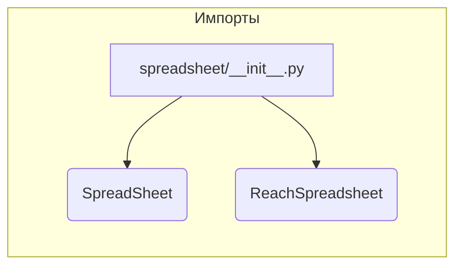

# Анализ файла hypotez/src/goog/spreadsheet/__init__.py

## <input code>

```python
## \file hypotez/src/goog/spreadsheet/__init__.py
# -*- coding: utf-8 -*-\
#! venv/Scripts/python.exe
#! venv/bin/python/python3.12

"""
.. module: src.goog.spreadsheet 
	:platform: Windows, Unix
	:synopsis:

"""


from .spreadsheet import SpreadSheet
from .reach_spreadsheet import ReachSpreadsheet
```

## <algorithm>

**Блок-схема отсутствует** так как код состоит из импортов и константы.  Алгоритм работы состоит в основном из импорта классов.


## <mermaid>



## <explanation>

**1. Импорты:**

- `from .spreadsheet import SpreadSheet`:  Импортирует класс `SpreadSheet` из модуля `spreadsheet.py` в текущем пакете (`src.goog.spreadsheet`).  Символ `.` указывает на поиск файла в текущей директории (в подпапке `spreadsheet`).  Это означает, что файл `spreadsheet.py` должен существовать в подпапке `hypotez/src/goog/spreadsheet`.
- `from .reach_spreadsheet import ReachSpreadsheet`: Импортирует класс `ReachSpreadsheet` из модуля `reach_spreadsheet.py` в текущем пакете.  Аналогично предыдущему, `.` указывает на поиск в текущей папке.  Так же необходим файл `reach_spreadsheet.py` в папке `hypotez/src/goog/spreadsheet`.


**2. Классы (предполагаемые):**

- `SpreadSheet`:  Предполагаемый класс, который, вероятно, взаимодействует с Google Spreadsheets API для работы с электронными таблицами. Без доступа к `spreadsheet.py` сложно дать точный анализ.
- `ReachSpreadsheet`: Предполагаемый класс, который, вероятно, имеет дополнительные методы для доступа к или обработки данных Google Spreadsheets.  Так же, как и `SpreadSheet`, без доступа к файлам сложно сказать точно, чем он занимается.

**3. Функции (отсутствуют):**

В данном файле нет функций.

**4. Переменные:**

- ``:  Строковая константа, вероятно, используемая для определения режима работы программы (например, `dev` для разработки, `prod` для производства).  Это просто переменная.

**5. Возможные ошибки или области для улучшений:**

- **Недостаток документации:** Файл содержит docstring, но в нем нет подробных объяснений о `SpreadSheet` и `ReachSpreadsheet`.  Добавление документации к классам и их методам значительно улучшит читаемость и понимание кода.
- **Отсутствие проверки существования файлов:** Импорты не проверяют существование файлов `spreadsheet.py` и `reach_spreadsheet.py`.  Это может привести к ошибкам во время выполнения, если файлы отсутствуют.

**6. Взаимосвязи с другими частями проекта:**

Этот файл импортирует классы из других файлов.  Поэтому, для полноценного понимания работы кода, нужно проанализировать `spreadsheet.py` и `reach_spreadsheet.py`.  Вероятно, эти классы будут использовать какие-либо внешние библиотеки (например, для взаимодействия с Google Sheets API).


**Вывод:**

Файл `hypotez/src/goog/spreadsheet/__init__.py` представляет собой инициализирующий модуль для работы с Google Spreadsheets.  Он импортирует необходимые классы из подмодулей, но без доступа к их определениям  нельзя дать подробное описание их функциональности.  Дополнительно, код нужно документировать, чтобы было понятно, для чего используются эти классы.