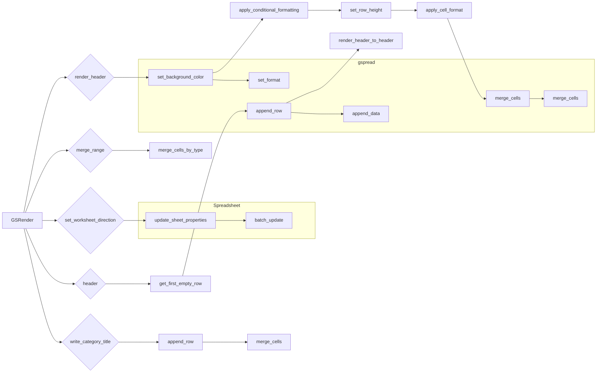

# <input code>

```python
## \file hypotez/src/goog/spreadsheet/bberyakov/grender.py
# -*- coding: utf-8 -*-
#! venv/Scripts/python.exe
#! venv/bin/python/python3.12

"""
.. module: src.goog.spreadsheet.bberyakov 
	:platform: Windows, Unix
	:synopsis:

"""
MODE = 'dev'


"""
	:platform: Windows, Unix
	:synopsis:

"""


"""
	:platform: Windows, Unix
	:synopsis:

"""


"""
  :platform: Windows, Unix

"""
"""
  :platform: Windows, Unix
  :platform: Windows, Unix
  :synopsis:
"""MODE = 'dev'
  
""" module: src.goog.spreadsheet.bberyakov """


"""  Render Google Table

 
 @section libs imports:
  - json 
  - typing 
  - gspread_formatting 
  - gspread 
  - goog.helpers 
  - gspread.utils 
  
Author(s):
  - Created by [Davidka] [BenAvraham] on 08.11.2023 .
"""
# ------------------------------
from src import gs
from src.helpers import logger, WebDriverException,  pprint

# -------------------------------


import json
from typing import List, Type, Union
from spread_formatting import *
from spread import Spreadsheet, Worksheet
from goog.helpers import hex_color_to_decimal, decimal_color_to_hex, hex_to_rgb

from spread.utils import ValueInputOption, ValueRenderOption


class GSRender():
    """
     [Class's description]


    """
    """
     Table Render
    Украшательства. \n
    ------------------------------\n
    class CellFormat(
        \t numberFormat: Any | None = None,
        \t backgroundColor: Any | None = None,
        \t borders: Any | None = None,
        \t padding: Any | None = None,
        \t horizontalAlignment: Any | None = None,
        \t verticalAlignment: Any | None = None,
        \t wrapStartegy: Any | None = None,
        \t textDirection: Any | None = None,
        \t textFormat: Any | None = None,
        \t hyperlinkDisplayType: Any | None = None,
        \t textRotation: Any | None = None,
        \t backgroundColorStyle: Any | None = None
    )
    """
    render_schemas: dict
    

    def __init__ (self, *args, **kwards) -> None:
        """
         [Function's description]

        Parameters : 
             self : [description]
             *args : [description]
             **kwards : [description]
        Returns : 
             None : [description]

        """
        #self.render_schemas = json.loads('goog\\schema.json')
        ...
    
    def render_header (self, ws: Worksheet, world_title: str, range: str = 'A1:Z1', merge_type: str('MERGE_ALL') | str('MERGE_COLUMNS') | str('MERGE_ROWS') = 'MERGE_ALL' ) -> None:
        """
         Рисую заголовок таблицы в первой строке

        Parameters : 
             self : [description]
             ws : Worksheet : таблица в книге
             world_title : str : заголовок гугл таблицы
             range : 'A1:Z1' : диапазон ячеек
             merge_type : str('MERGE_ALL') | str('MERGE_COLUMNS') | str('MERGE_ROWS') = 'MERGE_ALL' : 'MERGE_ALL' | 'MERGE_COLUMNS' | 'MERGE_ROWS'
        Returns : 
             None : [description]

        """
        # ... (rest of the code)
```

# <algorithm>

The code defines a class `GSRender` for rendering Google Sheets.  It has methods for formatting headers, merging cells, and setting worksheet direction.

**`render_header`:**

1. Takes a worksheet (`ws`), title (`world_title`), range (`range`), and merge type (`merge_type`) as input.
2. Sets background and foreground colors (`bg_color`, `fg_color`) using `hex_to_rgb`.
3. Creates a `CellFormat` object with formatting options (background color, alignment, direction, text format).
4. Applies conditional formatting to the specified range if cell values are greater than 50.
5. Sets row height to 50.
6. Applies the `CellFormat` to the entire range.
7. Merges cells in the specified range using `merge_type`.


**`merge_range`:**

1. Takes a worksheet (`ws`), range (`range`), and merge type (`merge_type`) as input.
2. Merges cells in the specified range based on the `merge_type` using `ws.merge_cells()`.

**`set_worksheet_direction`:**

1. Takes a spreadsheet (`sh`), worksheet (`ws`), and direction (`direction`) as input.
2. Updates the worksheet properties to set the right-to-left direction.

**`header`:**

1. Retrieves the next empty row (`row`) using `get_first_empty_row`.
2. Constructs a range string for the header.
3. Handles both string and list inputs for `ws_header`.
4. Appends the header row to the worksheet using `append_row`.
5. Applies the formatting with `render_header` method to render the header.

**`write_category_title`:**

1. Similar to `header`, but appends the category title to a specific column.

**`get_first_empty_row`:**

1. Finds the first empty row by scanning the first column (`col_values(1)`).


# <mermaid>




# <explanation>

**Imports:**

The code imports necessary libraries.  Crucially, it imports `gs` from `src`, which likely handles Google Sheets interaction. `logger`, `WebDriverException`, and `pprint` are from the `src.helpers` module, indicating they are part of a helper library likely for logging, handling potential errors during web interaction, and pretty-printing data.


**Classes:**

- **`GSRender`:** This class encapsulates the logic for rendering data to Google Sheets.  It defines methods for formatting, merging cells, setting worksheet direction, and handling various header types.  It interacts with the `Spreadsheet` and `Worksheet` classes (from the `spread` module) to manipulate the sheets themselves.


**Functions:**

- **`render_header`:** Formats a header row in a worksheet, applying background colors, alignment, and bolding.   It uses `CellFormat` and conditional formatting.
- **`merge_range`:** Merges cells in a specified range based on the type of merge (all, columns, or rows).
- **`set_worksheet_direction`:** Updates the worksheet properties to set the direction to right-to-left. It performs a batch update on the spreadsheet.
- **`header`:** Appends a header row to the worksheet, optionally handling different inputs and automatically calculating the row if not given.
- **`write_category_title`:** Appends a category title row to the worksheet, with merging similar to `header`.
- **`get_first_empty_row`:** Finds the first empty row in the worksheet, either in a specific column or across the whole worksheet, depending on the `by_col` parameter.


**Variables:**

The `MODE` variable is likely a global configuration setting for the script.  `render_schemas` is a dictionary, probably storing data schemas for the rendering process.

**Possible Errors/Improvements:**

- **Error Handling:** The code lacks extensive error handling. If there's a problem with the Google Sheets API call, a generic error message might not be helpful. Try using `try...except` blocks in sensitive areas.
- **Input Validation:** Input values like `range` and `merge_type` in `render_header` and other methods should be validated to prevent unexpected behavior.
- **`__init__`:** The `__init__` method is incomplete (the comment `...`). It probably needs to load the data from `goog\\schema.json`.
- **`render_schemas`:**  While a dictionary, loading this data through `json.loads` is not safe. The correct method needs to handle potential JSON errors or malformed JSON objects.
- **`get_first_empty_row`:** The logic for determining the empty row is based on the first column.  The logic might not be reliable if the first column is not the primary column for the sheet data.

**Relationships with other parts of the project:**

The code heavily relies on the `gs`, `helpers`, `spread`, and `goog` modules/packages (`src`, `src.helpers`, `spread`, `goog`). These likely provide crucial functionality for interacting with Google Sheets, handling the UI/UX aspects, general utilities, and any custom implementations for processing and rendering sheet data.  The `src` folder would be the entry point, containing a set of python modules.  Proper documentation for these modules is critical to a complete understanding of the project structure.