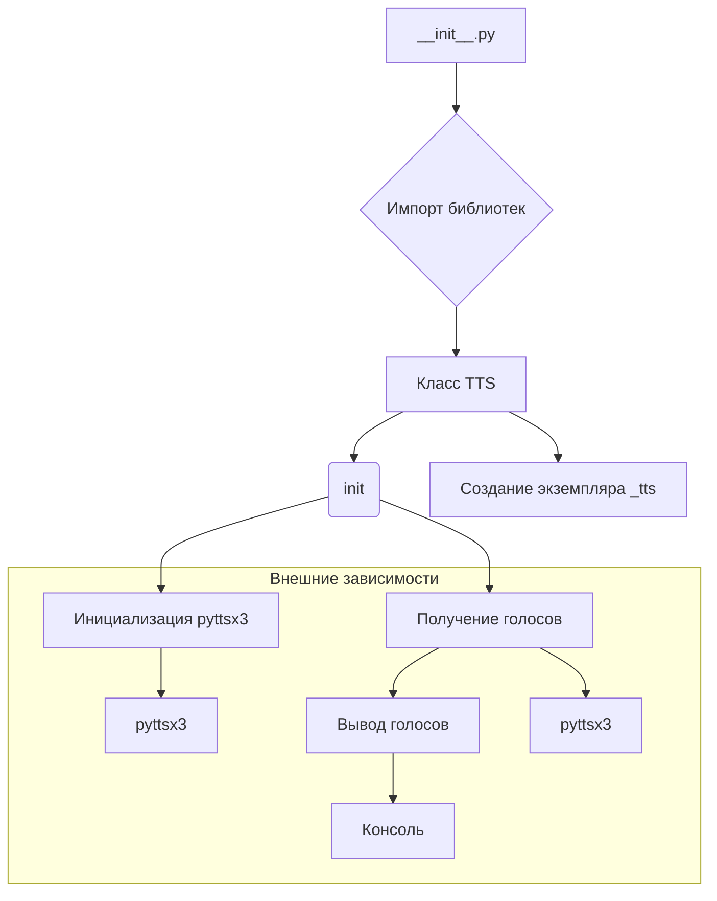

# <input code>

```python
## \file hypotez/src/goog/text_to_speech/__init__.py
# -*- coding: utf-8 -*-\
#! venv/Scripts/python.exe
#! venv/bin/python/python3.12

"""
.. module: src.goog.text_to_speech 
	:platform: Windows, Unix
	:synopsis: Google TTS 

"""
MODE = 'dev'

import header   

from attr import attr, attrs

import pyttsx3

from gtts import gTTS


class TTS():
    """ Google text to speach """
    def __init__(self,*args,**kwards):
        tts = pyttsx3.init()
        voices = tts.getProperty('voices')
        for v in voices:
            print(v)
    ...
_tts = TTS()
```

# <algorithm>

Алгоритм работы модуля `text_to_speech` достаточно прост:

1. **Импорт библиотек**: Импортируются необходимые библиотеки: `header` (вероятно, содержит настройки), `attr`, `pyttsx3`, и `gtts`.
2. **Объявление константы MODE**: Определяется константа `MODE` со значением `'dev'`.
3. **Класс `TTS`**:  Создается класс `TTS`, который, судя по комментарию, предназначен для работы с текстовым преобразованием в речь (Text-to-Speech) с использованием Google TTS.
   - **Метод `__init__`**: В конструкторе инициализируется объект `pyttsx3`.  Затем извлекаются голоса (`voices`) и выводятся в консоль. Важно:  код внутри `__init__`  не использует `gTTS`. Он только инициализирует `pyttsx3`.
4. **Создание экземпляра класса**: Создается экземпляр класса `TTS` под именем `_tts`.


**Пример данных**:

Нет явного примера потока данных, так как код в `__init__`  выводит информацию, а не обрабатывает данные.


# <mermaid>



**Объяснение диаграммы:**

- `__init__.py` - точка входа модуля.
- `Импорт библиотек` - показывает импортируемые модули, которые необходимы для работы (`header`, `attr`, `pyttsx3`, `gtts`).
- `Класс TTS` - определяет класс для работы с TTS.
- `init` - метод инициализации класса, который взаимодействует с библиотекой `pyttsx3`.
- `Инициализация pyttsx3` - инициализация объекта `pyttsx3`.
- `Получение голосов` - чтение списка доступных голосов из `pyttsx3`.
- `Вывод голосов` - выведение списка голосов в консоль.
- `Создание экземпляра _tts` - создание экземпляра класса, что создает экземпляр класса и запускает инициализацию.

**Внешние зависимости:**

Модуль `header`, `attr`, `pyttsx3`, и `gtts` являются внешними зависимостями, они нужны для работы `text_to_speech`. `Консоль` это stdout.


# <explanation>

- **Импорты**:
    - `header`: Вероятно, содержит конфигурацию или другие необходимые для работы модуля данные. Без доступа к `header` сложно сказать точно.
    - `attr`: Библиотека для работы с атрибутами. В данном случае, возможно, используется для дескрипторов.
    - `pyttsx3`: Библиотека для синтеза речи. Используется для инициализации двигателя синтеза речи.
    - `gtts`: Библиотека для Google Text-to-Speech. Не используется напрямую в данном примере.

- **Классы**:
    - `TTS`: Класс для управления синтезом речи, но в текущем коде он лишь инициализирует `pyttsx3`, не используя `gtts`.  Необходимо дополнить функциональность для преобразования текста в речь с помощью `gtts`.

- **Функции**:
    - `__init__`: Конструктор класса `TTS`. Инициализирует `pyttsx3`, получает список голосов и выводит их в консоль.

- **Переменные**:
    - `MODE`: Константа, хранящая строковое значение режима, скорее всего, для дебага или настройки.


**Возможные ошибки и улучшения**:

* **Неиспользование `gTTS`**: Код инициализирует `pyttsx3`, но не использует `gTTS` для синтеза речи. Необходимо добавить функциональность для преобразования текста в речь с помощью `gTTS`.
* **Отсутствие обработки ошибок**: При инициализации `pyttsx3` или получении списка голосов может возникнуть ошибка. Необходимо добавить проверку на ошибки.
* **Отсутствие логики**: В текущей версии, класс не содержит логики для преобразования текста в речь. Необходимы методы для передачи текста и запуска синтеза речи.
* **Переход к gTTS**: Код не использует `gtts` и должен быть изменен для использования `gTTS`.


**Взаимосвязи с другими частями проекта**:

Этот модуль скорее всего будет использоваться в других частях приложения для синтеза речи.  Например, модуль мог бы принимать текст, отправлять его в `TTS` для преобразования, а результат выдавать в нужное место.   Без контекста проекта сложно проследить все связи.