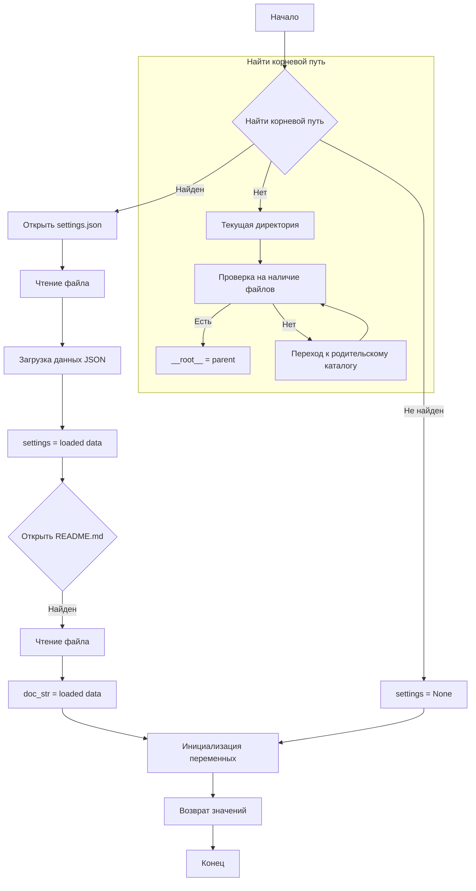

```MD
# Анализ кода файла hypotez/src/gui/header.py

## <input code>

```python
## \file hypotez/src/gui/header.py
# -*- coding: utf-8 -*-\n
#! venv/bin/python/python3.12

"""
.. module: src.gui 
	:platform: Windows, Unix
	:synopsis:

"""


"""
	:platform: Windows, Unix
	:synopsis:

"""


"""
	:platform: Windows, Unix
	:synopsis: Модуль определяющий корневой путь к проекту. Все импорты строятся относительно этого пути.
    :TODO: В дальнейшем перенести в системную переменную

"""

import sys
import json
from packaging.version import Version
from pathlib import Path

def set_project_root(marker_files=('__root__','.git')) -> Path:
    """
    Finds the root directory of the project starting from the current file's directory,
    searching upwards and stopping at the first directory containing any of the marker files.

    Args:
        marker_files (tuple): Filenames or directory names to identify the project root.
    
    Returns:
        Path: Path to the root directory if found, otherwise the directory where the script is located.
    """
    __root__:Path
    current_path:Path = Path(__file__).resolve().parent
    __root__ = current_path
    for parent in [current_path] + list(current_path.parents):
        if any((parent / marker).exists() for marker in marker_files):
            __root__ = parent
            break
    if __root__ not in sys.path:
        sys.path.insert(0, str(__root__))
    return __root__


# Get the root directory of the project
__root__ = set_project_root()
"""__root__ (Path): Path to the root directory of the project"""

from src import gs

settings:dict = None
try:
    with open(gs.path.root / 'src' / 'settings.json', 'r') as settings_file:
        settings = json.load(settings_file)
except (FileNotFoundError, json.JSONDecodeError):
    ...

doc_str:str = None
try:
    with open(gs.path.root / 'src' / 'README.MD', 'r') as settings_file:
        doc_str = settings_file.read()
except (FileNotFoundError, json.JSONDecodeError):
    ...


__project_name__ = settings.get("project_name", 'hypotez') if settings  else 'hypotez'
__version__: str = settings.get("version", '')  if settings  else ''
__doc__: str = doc_str if doc_str else ''
__details__: str = ''
__author__: str = settings.get("author", '')  if settings  else ''
__copyright__: str = settings.get("copyrihgnt", '')  if settings  else ''
__cofee__: str = settings.get("cofee", "Treat the developer to a cup of coffee for boosting enthusiasm in development: https://boosty.to/hypo69")  if settings  else "Treat the developer to a cup of coffee for boosting enthusiasm in development: https://boosty.to/hypo69"
```

## <algorithm>



**Пример:** Если файл `pyproject.toml` находится в директории выше текущей, алгоритм найдет корневой путь и загрузит данные из `settings.json` и `README.MD`. В противном случае, переменные `settings` и `doc_str` будут иметь значение `None`.


## <mermaid>

```mermaid
graph LR
    subgraph Код
        A[set_project_root] --> B(Path(__file__));
        B --> C[resolve()];
        C --> D[parent];
        D --> E{marker_files};
        E -- True --> F[__root__ = parent];
        E -- False --> G[sys.path.insert(0)];
        F --> H[__root__];
        G --> H;
    end
    subgraph Загрузка данных
        H --> I[gs.path.root];
        I --> J[settings.json];
        J --> K{try...except};
        K -- Success --> L[settings];
        K -- Failure --> M[settings=None];

        H --> N[README.MD];
        N --> O{try...except};
        O -- Success --> P[doc_str];
        O -- Failure --> Q[doc_str=None];

    end
    H --> R[Инициализация переменных];
    R --> S[Возврат значений];
```

**Объяснение диаграммы:**

Код `set_project_root` ищет корневую директорию проекта, начиная с текущей директории и поднимаясь по иерархии каталогов, пока не найдет файлы `pyproject.toml`, `requirements.txt`, или `.git`. Если корневой путь найден, он добавляется в `sys.path`.


## <explanation>

**Импорты:**

* `sys`: предоставляет доступ к системным параметрам, включая `sys.path`.
* `json`: используется для работы с файлами JSON.
* `packaging.version`: необходим для работы с версиями пакетов.
* `pathlib`: позволяет работать с путями к файлам и каталогам в удобном объектно-ориентированном стиле.
* `src.gs`: предполагается, что это модуль, который содержит переменную `gs.path.root`, которая хранит путь к корневой папке проекта.


**Классы:**

Нет явных классов.


**Функции:**

* `set_project_root(marker_files=...)`: находит корневой каталог проекта.  Принимает кортеж `marker_files` (файлы-маркеры для поиска корневого каталога). Возвращает `Path` объект к корневой папке.  Это ключевая функция, обеспечивающая поиск корневого пути и добавление его в `sys.path`.


**Переменные:**

* `MODE`: строка, хранящая режим работы ('dev').
* `__root__`: путь к корневому каталогу проекта.
* `settings`: словарь, содержащий данные из `settings.json`.
* `doc_str`: строка, содержащая данные из `README.MD`.
* `__project_name__`, `__version__`, `__doc__`, `__details__`, `__author__`, `__copyright__`, `__cofee__`: переменные, содержащие данные, взятые из `settings.json` или имеющие значения по умолчанию.

**Возможные ошибки и улучшения:**

* Обработка ошибок `FileNotFoundError` и `json.JSONDecodeError` важна для предотвращения аварийных остановок программы при отсутствии файлов или некорректных данных.
* Документация кода может быть улучшена.
* Вместо `sys.path.insert(0, str(__root__))`, лучше использовать `sys.path.insert(0, str(__root__))` и явно указать тип переменной.
*  `gs.path.root` - это внешняя ссылка. Необходимо убедиться, что `gs` импортирован корректно и содержит нужные данные.


**Взаимосвязь с другими частями проекта:**

Модуль `header.py` служит для инициализации общих констант и переменных (`__root__`, `settings`, `doc_str`), которые используются другими частями проекта, особенно в части `gui` (`src.gui`).  Без определения корневого пути импорт других модулей (`src.gs`) невозможен.