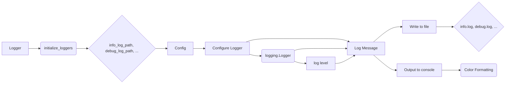

```MD
# Документация модуля `src.logger`

## <input code>

```
### Документация модуля `src.logger`

Модуль `src.logger` предоставляет гибкую систему логирования, поддерживающую консольное, файловое и JSON-логирование. Он использует паттерн Singleton для обеспечения того, что в приложении используется только один экземпляр логгера. Логгер поддерживает различные уровни логирования (например, `INFO`, `ERROR`, `DEBUG`) и включает цветной вывод для консольных логов. Также вы можете настроить форматы вывода логов и контролировать логирование в различные файлы.


---

### Классы:
- **SingletonMeta**: Метакласс, реализующий паттерн Singleton для логгера.
- **JsonFormatter**: Пользовательский форматтер, выводящий логи в формате JSON.
- **Logger**: Основной класс логгера, поддерживающий консольное, файловое и JSON-логирование.


---

### Функции:

#### `__init__`
Инициализирует экземпляр Logger с заглушками для разных типов логгеров (консоль, файл и JSON).

#### `_configure_logger(name: str, log_path: str, level: Optional[int] = logging.DEBUG, formatter: Optional[logging.Formatter] = None, mode: Optional[str] = 'a') -> logging.Logger`
Настраивает и возвращает экземпляр логгера.

**Параметры:**
- `name`: Имя логгера.
- `log_path`: Путь к лог-файлу.
- `level`: Уровень логирования, например, `logging.DEBUG`. По умолчанию `logging.DEBUG`.
- `formatter`: Пользовательский форматтер (необязательно).
- `mode`: Режим файла, например, `'a'` для добавления (по умолчанию).

**Возвращает:** Настроенный экземпляр `logging.Logger`.

#### `initialize_loggers(info_log_path: Optional[str] = '', debug_log_path: Optional[str] = '', errors_log_path: Optional[str] = '', json_log_path: Optional[str] = '')`
Инициализирует логгеры для консольного и файлового логирования (info, debug, error и JSON).

**Параметры:**
- `info_log_path`: Путь для файла логов info (необязательно).
- `debug_log_path`: Путь для файла логов debug (необязательно).
- `errors_log_path`: Путь для файла логов ошибок (необязательно).
- `json_log_path`: Путь для файла логов JSON (необязательно).


#### `log(level, message, ex=None, exc_info=False, color=None)`
Записывает сообщение на указанном уровне (например, `INFO`, `DEBUG`, `ERROR`) с необязательным исключением и форматированием цвета.

**Параметры:**
- `level`: Уровень логирования (например, `logging.INFO`, `logging.DEBUG`).
- `message`: Сообщение лога.
- `ex`: Необязательное исключение для записи.
- `exc_info`: Нужно ли включать информацию об исключении (по умолчанию `False`).
- `color`: Кортеж с текстовым и фоновым цветами для консольного вывода (необязательно).

#### Методы `info`, `success`, `warning`, `debug`, `error`, `critical`
Аналогичны методу `log`, но имеют специфические уровни логирования.


---

### Параметры для Logger
Класс `Logger` принимает несколько необязательных параметров для настройки поведения логирования.

- **Уровень (Level)**: Контролирует серьезность логов, которые записываются. Общие уровни:
  - `logging.DEBUG`: Подробная информация, полезная для диагностики проблем.
  - `logging.INFO`: Общая информация, например, о завершении успешных операций.
  - `logging.WARNING`: Предупреждения, которые не требуют немедленного действия.
  - `logging.ERROR`: Сообщения об ошибках.
  - `logging.CRITICAL`: Критические ошибки, требующие немедленного внимания.

- **Форматтер (Formatter)**: Определяет, как форматируются сообщения логов. По умолчанию сообщения форматируются как `'%(asctime)s - %(levelname)s - %(message)s'`. Вы можете указать пользовательский форматтер для других форматов, например, JSON.

- **Цвет (Color)**: Цвета для сообщений логов в консоли. Цвета задаются как кортеж из двух элементов:
  - **Цвет текста**: Указывает цвет текста (например, `colorama.Fore.RED`).
  - **Цвет фона**: Указывает цвет фона (например, `colorama.Back.WHITE`).

Цвет можно настроить для разных уровней логирования (например, зеленый для info, красный для ошибок).


---

### Настройка файлового логирования (`config`)
Для записи сообщений в файл вы можете указать пути к файлам в конфигурации.

```python
config = {
    'info_log_path': 'logs/info.log',
    'debug_log_path': 'logs/debug.log',
    'errors_log_path': 'logs/errors.log',
    'json_log_path': 'logs/log.json'
}
```

Пути к файлам, указанные в `config`, используются для записи логов в соответствующие файлы для каждого уровня логирования.

---

### Пример использования

```
```

## <algorithm>

**Пошаговая блок-схема алгоритма:**

1. **Инициализация Logger:** Создается экземпляр класса Logger.
2. **Настройка логгеров:** Используется метод `initialize_loggers` для настройки логгеров для консольного и файлового логирования (info, debug, error, JSON). Входные параметры -- пути к файлам для каждого типа лога.
3. **Логирование сообщений:** Методы `info`, `success`, `warning`, `debug`, `error`, `critical` вызываются с уровнями логирования и сообщениями. Эти методы вызывают `log` с соответствующим уровнем.
4. **Логирование исключений:**  Методы могут принимать необязательные параметры `ex` (исключение) и `exc_info`, влияющие на запись информации об исключении в лог.
5. **Вывод в консоль:** Сообщения, выводимые в консоль, могут быть форматированы цветом.
6. **Запись в файлы:**  Сообщения пишутся в соответствующие файлы (info.log, debug.log, errors.log, log.json), в зависимости от уровня логирования.  

**Примеры:**

- Логирование сообщения INFO: `logger.info("Данные успешно обработаны.")`
- Логирование ошибки с исключением: `logger.error("Ошибка обработки данных", ex=e, exc_info=True)`

## <mermaid>



**Описание зависимостей диаграммы:**

- `Logger` — основной класс, управляющий логированием.
- `initialize_loggers` — функция, настраивающая логгеры.
- `config` — словарь конфигурации с путями к лог-файлам.
- `Configure Logger` —  блок, где происходит настройка loggers.
- `Log Message` — вызов функций `info`, `debug`, etc., для записи сообщений.
- `logging.Logger` — объект модуля `logging`, который отвечает за логирование в файлы.
- `Write to file` и `Output to console` — отдельные блоки для записи в файлы и вывод в консоль.
- `Color Formatting` — блок для форматирования сообщений в консоли.


## <explanation>

**Импорты:**

Модуль `src.logger` не содержит прямых импортов, кроме, как предполагается, `logging`.  `colorama` используется для цветного вывода, но это не указано явно в приведенном коде.  Важно, что все импорты будут происходить из `src` директории, т.е. импортируются другие модули из пакета.

**Классы:**

- `SingletonMeta`: Реализует паттерн Singleton, гарантируя, что `Logger` будет иметь только один экземпляр. Подробности реализации этого метакласса не приведены, но предполагается, что он определяет методы для получения экземпляра `Logger`.
- `JsonFormatter`:  Определяет способ форматирования логов в JSON-формате.  В коде нет его реализации, но он необходим для работы JSON-логирования.
- `Logger`:  Основной класс, отвечающий за все операции логирования.  У него есть методы для инициализации, настройки логгеров, записи сообщений разных уровней.

**Функции:**

- `__init__`: Инициализирует `Logger`, устанавливая необходимые параметры для записи логов.
- `_configure_logger`:  Настраивает конкретный logger (для консоли, файла или JSON).  Этот метод является вспомогательным и необходим для инициализации логгеров.
- `initialize_loggers`:  Инициализирует все логгеры, используя информацию из входного словаря `config`.  Этот метод важен для настройки логов для разных уровней и файлов.
- `log`, `info`, `success`, `warning`, `debug`, `error`, `critical`:  Записывают сообщения логов разного уровня.  `log` — основной метод, другие являются его оберточными функциями для разных уровней.  Они могут принимать исключения (`ex`) и информацию об исключении (`exc_info`), если необходимо.

**Переменные:**

Переменные `info_log_path`, `debug_log_path`, `errors_log_path`, `json_log_path` содержат пути к файлам, где хранятся логи.   Они имеют тип `str` или `None`.

**Возможные ошибки и улучшения:**

- Не хватает реализации `SingletonMeta`.
- Не хватает реализации `JsonFormatter`.
- Отсутствует проверка на существование `colorama`.  Это важно, т.к.  код предполагает цветной вывод.
- Нет явного указания на использование `logging`.
- Нет проверки на корректность путей к файлам, а также на отсутствие ошибок записи в файлы.


**Взаимосвязь с другими частями проекта:**

Модуль `src.logger` тесно связан с другими частями проекта, которые используют логирование для отслеживания событий, отладки и диагностики.   Он предоставляет централизованный способ записи логов для разных целей и уровней. Примеры использования находятся в коде.