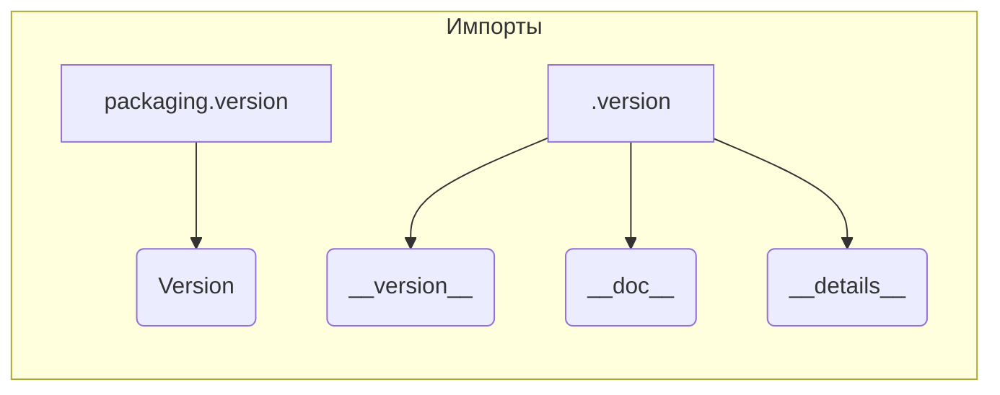

## <input code>

```python
## \file hypotez/src/logger/_examples/__init__.py
# -*- coding: utf-8 -*-
#! venv/Scripts/python.exe
#! venv/bin/python/python3.12

"""
.. module: src.logger._examples 
	:platform: Windows, Unix
	:synopsis:

"""
MODE = 'dev'

"""
	:platform: Windows, Unix
	:synopsis:

"""


"""
	:platform: Windows, Unix
	:synopsis:

"""


"""
  :platform: Windows, Unix

"""
"""
  :platform: Windows, Unix
  :platform: Windows, Unix
  :synopsis:
"""MODE = 'dev'
  
""" module: src.logger._examples """


from packaging.version import Version
from .version import __version__, __doc__, __details__
```

## <algorithm>

Этот код представляет собой инициализацию модуля `src.logger._examples`.  Поскольку он содержит только импорты и константы, алгоритм очень прост.

1. **Импорты:** Модуль `packaging.version` импортирует функцию `Version`, которая, вероятно, используется для проверки версий пакетов. Модуль `.version` (локальный модуль) импортирует переменные `__version__`, `__doc__`, и `__details__`.  Эти переменные, вероятно, содержат метаданные о версии, документации и дополнительных деталях модуля.

* **Пример**:  `Version` используется для сравнения версий при работе с зависимостями пакетов или определении совместимости.  `__version__` может хранить строку типа "1.2.3".


## <mermaid>



## <explanation>

**Импорты:**

- `from packaging.version import Version`: Импортирует функцию `Version` из пакета `packaging.version`. Это пакет, который используется для работы с версиями программного обеспечения.  Этот импорт необходим для обработки версий пакетов (часто для проверки совместимости). Он находится вне пакета `src.logger`, но в стандартном окружении Python.
- `from .version import __version__, __doc__, __details__`: Импортирует переменные `__version__`, `__doc__`, и `__details__` из локального модуля `.version` (который, предположительно, находится в той же директории, что и `__init__.py`). Эти переменные, вероятно, содержат метаданные о версии, документации и дополнительных деталях модуля.  Это типичный способ хранения информации о модуле в `__init__.py` для использования в документации или других инструментах.


**Классы:**

В коде нет классов.


**Функции:**

Нет функций.


**Переменные:**

- `MODE = 'dev'`: Строковая константа, которая, вероятно, определяет режим работы (например, 'dev', 'prod').  Константы с большой буквой часто используются для конфигурации.  Здесь она используется для установки режима работы, вероятно, в модуле `logger`.

**Возможные ошибки или области для улучшений:**

- **Недостаточная документация:** Несмотря на комментарии `"""Docstrings"""`, многие строки документации пустые.  Необходимо заполнить их информацией о том, что делают эти константы и переменные.


**Взаимосвязи с другими частями проекта:**

Этот файл `__init__.py` является частью пакета `src.logger._examples`.  Он, скорее всего, будет импортирован в другие части проекта (например, для инициализации логгеров, обработки версии или использования конфигурации `MODE`).  Это подразумевает, что где-то есть код, использующий информацию, импортированную из `__init__.py`.