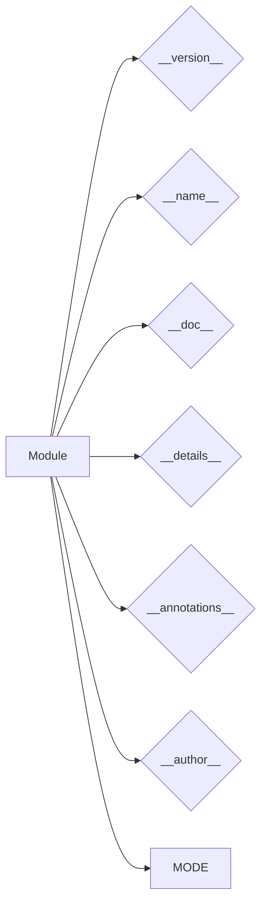

# <input code>

```python
## \file hypotez/src/logger/_examples/version.py
# -*- coding: utf-8 -*-\
#! venv/Scripts/python.exe
#! venv/bin/python/python3.12

"""
.. module: src.logger._examples 
	:platform: Windows, Unix
	:synopsis:

"""
MODE = 'dev'

"""
	:platform: Windows, Unix
	:synopsis:

"""


"""
	:platform: Windows, Unix
	:synopsis:

"""


"""
  :platform: Windows, Unix

"""
"""
  :platform: Windows, Unix
  :platform: Windows, Unix
  :synopsis:
"""MODE = 'dev'
  
""" module: src.logger._examples """


"""
- `__version__`: This variable holds the version of the module or package.
- `__name__`: Contains the name of the module. If the script is being run directly, the value will be `"__main__"`.
- `__doc__`: The module's documentation string.
- `__details__`: This variable likely contains additional details about the module, but the exact purpose depends on the specific module or package.
- `__annotations__`: Contains type annotations for variables and functions in the module.
- `__author__`: The name(s) of the author(s) of the module.
"""
__name__:str
__version__="3.12.0.0.0.4"
__doc__:str
__details__:str="Details about version for module or class"
__annotations__

__author__='hypotez '
```

# <algorithm>

Этот код не содержит алгоритма в традиционном понимании, а представляет собой объявление констант, переменных и метаданных для модуля.  В нём нет циклов, условных операторов или вызовов функций, которые изменяют данные.  Вместо этого он описывает атрибуты модуля.  Данные не передаются между функциями, классами или методами, поскольку их нет.

# <mermaid>



# <explanation>

Этот Python-файл определяет метаданные для модуля `src.logger._examples.version`.  Он не содержит выполняемого кода, а только константы (строки) для хранения информации о версии, имени, документации и авторе.

**Импорты:**

Нет импортов, все необходимые данные содержатся в текущем файле.

**Классы:**

Нет классов.

**Функции:**

Нет функций.

**Переменные:**

- `MODE`:  Строковая константа со значением 'dev'. Скорее всего, это глобальный параметр для конфигурации режима работы модуля логирования.
- `__version__`:  Строковая переменная, хранящая версию модуля ('3.12.0.0.0.4').
- `__name__`:  Строковая переменная, хранящая имя модуля.  В этом случае это `__main__`, если этот файл выполнялся бы напрямую, но он не выполняется напрямую. 
- `__doc__`:  Строковая переменная, являющаяся строкой документации модуля.
- `__details__`:  Строковая переменная, хранящая дополнительные детали о версии модуля.
- `__annotations__`:  Пустая переменная, предполагающая возможность добавления в будущем аннотаций типов.
- `__author__`: Строковая переменная, содержащая имя автора.

**Возможные ошибки или области для улучшений:**

* **Документация:** Документация (строка `""" ... """`) могла бы быть более структурированной с использованием специальных инструментов Python для генерации документации.
* **Типизация:** Не использует явную типизацию для переменных, что может привести к ошибкам во время выполнения.
* **Консистентность:**  Много повторяющихся блоков документации. Стоит подумать о способе обобщения.

**Взаимосвязи с другими частями проекта:**

Файл `version.py`  представляет собой метаданные для модуля `src.logger._examples`.  Он не взаимодействует напрямую с другими модулями, но служит для определения информации о нём самом.  Данные из этого файла могли бы быть использованы другими частями проекта (например, для отображения версии в пользовательском интерфейсе или для автообновлений).