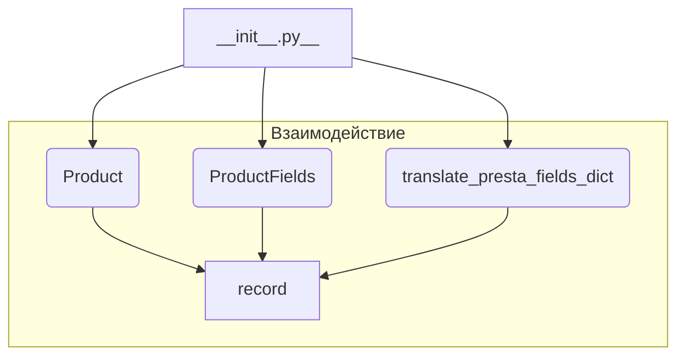

```MD
# Анализ кода hypotez/src/product/__init__.py

## <input code>

```python
## \file hypotez/src/product/__init__.py
# -*- coding: utf-8 -*-\
#! venv/Scripts/python.exe
#! venv/bin/python/python3.12

"""
.. module: src.product 
	:platform: Windows, Unix
	:synopsis: Product module
External classes and attributes:
- `Product`: Methods and attributes of the product. Detailed description in `product.py`
- `ProductFields`: Product fields. Detailed description in `product_fields.py`
- `record`: A dictionary of product fields in flat format (without nesting)
- `translate_presta_fields_dict`: Function that translates multilingual fields of `ProductFields`

"""


from .product import Product
from .product_fields.product_fields import ProductFields
from .product_fields.product_fields_translator import translate_presta_fields_dict
```

## <algorithm>



**Пошаговая блок-схема:**

1. Модуль `__init__.py` импортирует классы `Product`, `ProductFields` и функцию `translate_presta_fields_dict` из соответствующих файлов.

2. `Product`, `ProductFields` и `translate_presta_fields_dict` содержат свои методы и атрибуты, которые определяют поведение продукта, его полей и функции перевода, соответственно.  `record` - это словарь, в котором хранится плоская структура данных по продукту.

3. `__init__.py` предоставляет доступ к этим компонентам для других модулей через импорты.


## <mermaid>

```mermaid
graph LR
    subgraph "Product Module"
        Product[Product] --> record;
        Product --> ProductFields;
    end
    subgraph "Product Fields Module"
        ProductFields[ProductFields] --> translate_presta_fields_dict;
        ProductFields --> record;
    end
    translate_presta_fields_dict --> record;
    record -- Данные продукта -- Product;
    record -- Данные продукта -- ProductFields;
    record -- Переведенные данные -- translate_presta_fields_dict;
```

## <explanation>

**Импорты:**

- `from .product import Product`: Импортирует класс `Product` из модуля `product.py` в текущем пакете (`src.product`).  Это позволяет использовать класс `Product` в данном модуле.
- `from .product_fields.product_fields import ProductFields`: Импортирует класс `ProductFields` из модуля `product_fields.py` в текущем пакете.
- `from .product_fields.product_fields_translator import translate_presta_fields_dict`: Импортирует функцию `translate_presta_fields_dict` из модуля `product_fields_translator.py`.  По всей видимости, эта функция отвечает за перевод мультиязычных полей продукта.

**Классы:**

- `Product`: Определяет класс продукта.  Подробное описание содержится в `product.py`.
- `ProductFields`: Определяет классы полей продукта.  Подробное описание содержится в `product_fields.py`.   
Взаимодействие с `Product` предполагает хранение и обработку данных о полях.

**Функции:**

- `translate_presta_fields_dict`: Функция, скорее всего, предназначена для перевода мультиязычных полей `ProductFields`, принимая словарь данных и возвращая его, вероятно, с добавленными или изменёнными переведёнными полями. Подробное описание содержится в файле `product_fields_translator.py`.

**Переменные:**

- ``: Переменная, вероятно, устанавливает режим работы приложения (например, 'dev', 'prod').  Это может влиять на поведение или конфигурацию других частей приложения.

**Возможные ошибки и улучшения:**

- Отсутствие документации в отдельных модулях `product.py`, `product_fields.py` и `product_fields_translator.py` затрудняет понимание их назначения и использования. Необходимо добавить подробные документации с описаниями аргументов, возвращаемых значений и примерами.

**Взаимосвязи с другими частями проекта:**

Модуль `src.product.__init__.py` служит точкой входа для работы с продуктами.  Он предоставляет доступ к классам и функциям, которые используются другими частями приложения для управления данными о продуктах.  Связь с другими частями проекта устанавливается через импорты и последующее использование этих классов и функций.  Например, модуль `product.py` содержит детали о классе `Product` и возможностях работы с ним, а `product_fields.py` содержит определения полей.  Модуль `__init__.py` это интерфейс для доступа к этой информации.