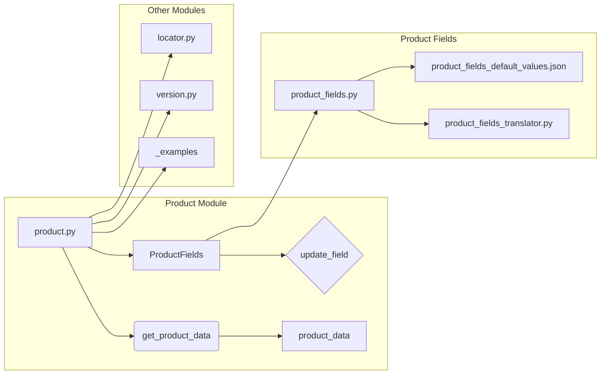

# <input code>

```python
I'll start by extracting the contents of the `product.zip` file to see what it contains. Let's proceed with that.

I'll extract the contents of the `product.zip` file.

The `product` module contains several Python files, example files, and a JSON file. Here is a summary of the extracted contents:

1. `__init__.py`: Initializes the module.
2. `locator.py`: Likely contains locator definitions for web elements.
3. `product.py`: Contains the main logic related to products.
4. `product_fields`: Directory containing files related to product fields.
5. `version.py`: Manages the version information of the module.
6. `_examples`: Directory containing example scripts.

### Key Components

1. **Locator**
    - **Purpose**: Defines locators for web elements related to products.
    - **Functionality**:
        - Contains locators used by Selenium WebDriver to interact with web pages.

2. **Product**
    - **Purpose**: Manages product-related functionality.
    - **Functionality**:
        - Handles operations related to product data.
        - Interacts with the `product_fields` module to manage product attributes.

3. **Product Fields**
    - **Purpose**: Manages fields and attributes of products.
    - **Functionality**:
        - Defines product fields and their default values.
        - Translates product field names and values as needed.
        - Provides a central location for product attribute management.

4. **Version Management**
    - **Purpose**: Manages the versioning of the module.
    - **Functionality**:
        - Defines the current version of the module.
        - Provides version information for compatibility and updates.

5. **Documentation and Examples**
    - **Purpose**: Provides detailed documentation and usage examples for developers.
    - **Functionality**:
        - Explains the functionality and usage of the module.
        - Provides example scripts to demonstrate how to interact with product data.

### Example Usage

Here's an example of how you might use the `product` module:

```python
from product.product import Product
from product.product_fields import ProductFields

# Initialize the Product and ProductFields
product = Product()
product_fields = ProductFields()

# Example operation on product
product_data = product.get_product_data(product_id="12345")
product_fields.update_field("price", 19.99)

print(product_data)
```

### Additional Information

The `product_fields` directory contains additional scripts:

- **product_fields.py**: Defines the fields and their operations.
- **product_fields_default_values.json**: JSON file containing default values for product fields.
- **product_fields_translator.py**: Handles translation of field names and values.

### Documentation

The `_examples` directory contains example scripts and documentation files to help developers understand and use the module effectively.

---

This overview provides a comprehensive understanding of the `product` module's functionality. Let me know if you need any specific details or modifications!
```

# <algorithm>

The code provided is a description, not executable code.  It outlines the structure and functionality of a Python module (`product`) but doesn't show the actual implementation.  A flowchart for the *described* functionality would need the implementation to be detailed.   There is no algorithm to describe as the example is a documentation of the overall product module.

# <mermaid>



**Explanation of Dependencies:**

The diagram shows a high-level overview of the dependencies and interactions. The `Product` class in `product.py` interacts with the `ProductFields` class (and potentially related classes within the `product_fields` directory). The `Product` also likely interacts with `locator.py` for web element location and `version.py` for version information. `_examples` directory supplies example usage and documentation.  The `product_fields` module has dependencies on data stored in `product_fields_default_values.json` and the translation logic in `product_fields_translator.py`.

# <explanation>

The provided code is a module overview, not executable code. It details the structure and components of a Python module named `product`, but does not contain any code for implementation.


* **Imports**:  The example usage shows `from product.product import Product` and `from product.product_fields import ProductFields`.  These imports are essential for using classes defined within the `product` module.  This implies a clear package structure (e.g., a `product` folder containing these files).  Without seeing the implementation of `Product` and `ProductFields`, we can't detail their specific interactions with other parts of the system.

* **Classes**:  The code describes two main classes, `Product` and `ProductFields`.  `Product` is responsible for product-related operations (e.g., `get_product_data`). `ProductFields` manages product attributes, potentially including field updates, translations, and default values.

* **Functions**: The overview mentions `get_product_data` as a method of the `Product` class.  It's used to retrieve product data.  `update_field` is a method of the `ProductFields` class used to modify fields.  Without the implementation, we can't detail their arguments, return types, or inner workings.

* **Variables**: The `product_data` and `product_id` variables are used in the example. `product_id` is a string, `product_data` is likely a complex data structure representing product information (e.g., a dictionary, a custom class).

* **Possible Errors/Improvements**:  The documentation lacks specific implementation details.  To analyze possible errors or areas for improvement, the code itself is required.


**Interdependencies**: The described module (`product`) appears to rely on a few internal parts (e.g., files in the `product_fields` directory) and likely external systems (such as a database for product storage if used) if it handles database interactions.  Understanding the whole architecture of the project and its dependencies is essential for a complete analysis.   It is possible that Selenium or other web frameworks may be used by this module.