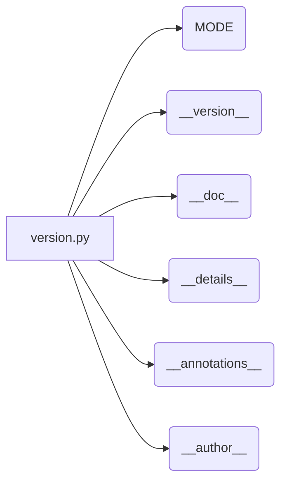

# <input code>

```python
## \file hypotez/src/product/_examples/version.py
# -*- coding: utf-8 -*-
#! venv/Scripts/python.exe
#! venv/bin/python/python3.12

"""
.. module: src.product._examples 
	:platform: Windows, Unix
	:synopsis:

"""


"""
	:platform: Windows, Unix
	:synopsis:

"""


"""
	:platform: Windows, Unix
	:synopsis:

"""


"""
  :platform: Windows, Unix

"""
"""
  :platform: Windows, Unix
  :platform: Windows, Unix
  :synopsis:
"""
  
""" module: src.product._examples """


"""
- `__version__`: This variable holds the version of the module or package.
- `__name__`: Contains the name of the module. If the script is being run directly, the value will be `"__main__"`.
- `__doc__`: The module's documentation string.
- `__details__`: This variable likely contains additional details about the module, but the exact purpose depends on the specific module or package.
- `__annotations__`: Contains type annotations for variables and functions in the module.
- `__author__`: The name(s) of the author(s) of the module.
"""
__name__:str
__version__="3.12.0.0.0.4"
__doc__:str
__details__:str="Details about version for module or class"
__annotations__

__author__='hypotez '
```

# <algorithm>

Этот код представляет собой файл модуля Python, вероятно, для определения версии и метаданных.  Алгоритм работы - это просто определение констант и строк.  Данных здесь нет, что обрабатывается или передается.

**Шаг 1:** Определение констант
* `` - Определяется константа, которая, вероятно, хранит режим работы (например, 'dev', 'prod').

**Шаг 2:** Определение метаданных
* `__version__ = "3.12.0.0.0.4"` -  Задается версия модуля.
* `__doc__`, `__details__`, `__annotations__`, `__author__` -  Задаются другие метаданные, такие как документация, дополнительные детали, аннотации типа и автор.


# <mermaid>



**Описание диаграммы:**

Диаграмма представляет собой простой граф, показывающий, как переменные (константы и метаданные) определяются в файле `version.py`.  Здесь нет сложных зависимостей или вызовов функций, потому что этот файл скорее всего служит для описания метаинформации.

# <explanation>

**Импорты:**
В коде отсутствуют импорты.  Это чисто локальный файл, содержащий конфигурацию и метаданные.


**Классы:**
В коде нет классов.


**Функции:**
В коде нет функций.


**Переменные:**
`MODE`:  Строковая переменная, вероятно, хранит режим работы модуля (разработка/производство).
`__version__`, `__doc__`, `__details__`, `__annotations__`, `__author__`:  Эти переменные содержат строковые значения, представляющие метаданные о модуле (версия, документация, авторы).

**Возможные ошибки и улучшения:**
- **Документация:** Документация внутри строк многословна и не особенно информативна.
- **Стиль кода:** Необходимо следовать стандарту именования Python (например, `__version__` должно быть `VERSION` или `__module_version__`).
- **Использование:** Не понятно, как именно эти значения будут использоваться в других частях проекта.


**Цепочка взаимосвязей с другими частями проекта:**
Файл `version.py` скорее всего служит для обеспечения метаданных для других модулей или файлов проекта `hypotez`.  Например, эта информация может использоваться при сборе или распространении пакета.   Для этого нужно будет явно использовать эти значения в других частях кода проекта. Без контекста других модулей, определить точный способ использования этих данных невозможно.  Необходима дополнительная информация, чтобы понять всю цепочку.