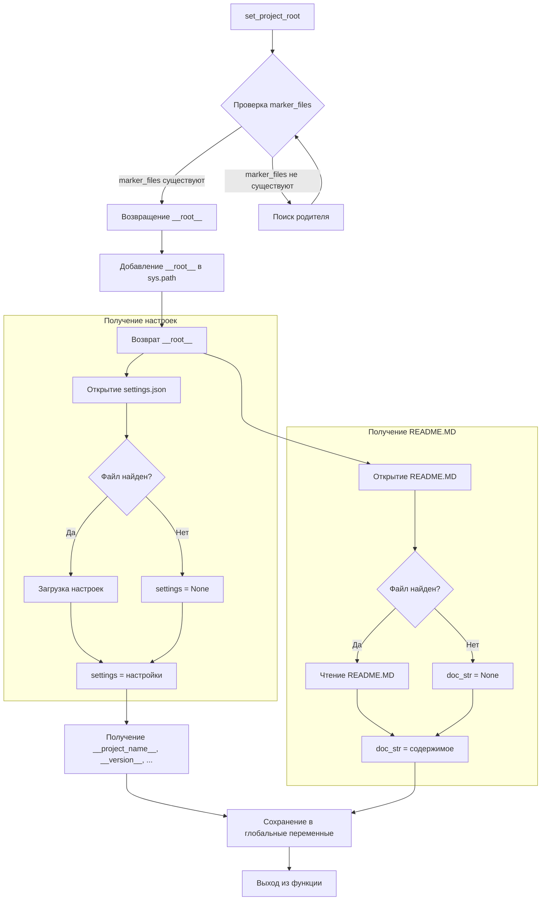

# <input code>

```python
## \file hypotez/src/product/header.py
# -*- coding: utf-8 -*-\n#! venv/Scripts/python.exe
#! venv/bin/python/python3.12
"""
.. module: src.product 
	:platform: Windows, Unix
	:synopsis:

"""
MODE = 'dev'

"""
	:platform: Windows, Unix
	:synopsis:

"""


"""
	:platform: Windows, Unix
	:synopsis: Модуль определяющий корневой путь к проекту. Все импорты строятся относительно этого пути.
    :TODO: В дальнейшем перенести в системную переменную

"""

import sys
import json
from packaging.version import Version
from pathlib import Path
def set_project_root(marker_files=('__root__')) -> Path:
    """
    Finds the root directory of the project starting from the current file's directory,
    searching upwards and stopping at the first directory containing any of the marker files.

    Args:
        marker_files (tuple): Filenames or directory names to identify the project root.
    
    Returns:
        Path: Path to the root directory if found, otherwise the directory where the script is located.
    """
    __root__:Path
    current_path:Path = Path(__file__).resolve().parent
    __root__ = current_path
    for parent in [current_path] + list(current_path.parents):
        if any((parent / marker).exists() for marker in marker_files):
            __root__ = parent
            break
    if __root__ not in sys.path:
        sys.path.insert(0, str(__root__))
    return __root__


# Get the root directory of the project
__root__ = set_project_root()
"""__root__ (Path): Path to the root directory of the project"""

from src import gs

settings:dict = None
try:
    with open(gs.path.root / 'src' / 'settings.json', 'r') as settings_file:
        settings = json.load(settings_file)
except (FileNotFoundError, json.JSONDecodeError):
    ...

doc_str:str = None
try:
    with open(gs.path.root / 'src' / 'README.MD', 'r') as settings_file:
        doc_str = settings_file.read()
except (FileNotFoundError, json.JSONDecodeError):
    ...


__project_name__ = settings.get("project_name", 'hypotez') if settings  else 'hypotez'
__version__: str = settings.get("version", '')  if settings  else ''
__doc__: str = doc_str if doc_str else ''
__details__: str = ''
__author__: str = settings.get("author", '')  if settings  else ''
__copyright__: str = settings.get("copyrihgnt", '')  if settings  else ''
__cofee__: str = settings.get("cofee", "Treat the developer to a cup of coffee for boosting enthusiasm in development: https://boosty.to/hypo69")  if settings  else "Treat the developer to a cup of coffee for boosting enthusiasm in development: https://boosty.to/hypo69"
```

# <algorithm>

**Шаг 1:** Функция `set_project_root` ищет корневой каталог проекта.

*   Принимает кортеж `marker_files` с названиями файлов/каталогов, указывающих на корень проекта.
*   Начинает поиск от текущего каталога (`__file__`).
*   Перебирает родительские каталоги.
*   Если в текущем каталоге присутствует какой-либо из файлов/каталогов, то функция возвращает путь к нему.
*   В противном случае продолжает поиск вверх по дереву каталогов.
*   Если корень проекта не найден, функция возвращает текущий каталог.
*   Если корень проекта найден, добавляет его в `sys.path`, чтобы импорты работали.

**Шаг 2:** Присваивается корневой путь проекта переменной `__root__`.

**Шаг 3:** Получаются настройки проекта из файла `settings.json` в корневом каталоге.

*   Если файл `settings.json` существует и загружается без ошибок, то переменная `settings` получает значение из файла.
*   В противном случае переменная `settings` остаётся `None`.

**Шаг 4:** Получается строка документации проекта из файла `README.MD` в корневом каталоге.

*   Если файл `README.MD` существует и загружается без ошибок, то переменная `doc_str` получает содержимое файла.
*   В противном случае переменная `doc_str` остаётся `None`.

**Шаг 5:** Создаются переменные, содержащие метаданные проекта: `__project_name__`, `__version__`, `__doc__`, `__details__`, `__author__`, `__copyright__`, `__cofee__`.

*   Значения этих переменных извлекаются из словаря `settings`.
*   Если `settings` равен `None`, используется значение по умолчанию.

**Пример:** Если `pyproject.toml` находится в родительском каталоге текущего файла, то `set_project_root` вернет этот родительский каталог. Данные передаются в глобальные переменные.

# <mermaid>



# <explanation>

**Импорты:**

*   `sys`: Модуль предоставляет доступ к системным параметрам, например, пути к модулям. Используется для добавления корневого пути проекта в `sys.path`, чтобы избежать ошибок импорта.
*   `json`: Модуль для работы с JSON-файлами. Используется для загрузки настроек проекта из `settings.json`.
*   `packaging.version`: Модуль для работы с версиями пакетов. Используется для работы с версиями.
*   `pathlib`: Модуль для работы с путями к файлам. Используется для работы с путями к файлам и каталогам.
*   `gs`: Этот импорт предполагает, что существует модуль `gs` в пакете `src`. Без контекста проекта, невозможно понять его назначение. Скорее всего, он содержит вспомогательные функции для работы с файлами и каталогами в проекте.

**Классы:**

В данном коде нет определений классов.

**Функции:**

*   `set_project_root(marker_files)`:
    *   Находит корневой каталог проекта, начиная с текущего файла.
    *   Принимает кортеж `marker_files` (по умолчанию ('pyproject.toml', 'requirements.txt', '.git')) - файлы/каталоги, присутствие которых в каталоге указывает на корень проекта.
    *   Возвращает `Path` к корневому каталогу проекта. Если корень не найден, возвращает каталог текущего файла.
    *   Добавляет корневой каталог в `sys.path` для корректной работы импорта модулей.

**Переменные:**

*   `MODE`: Строковая константа, вероятно, определяет режим работы приложения ('dev', 'prod').
*   `__root__`: `Path` объект, содержащий путь к корневому каталогу проекта.
*   `settings`: Словарь, содержащий настройки проекта. Загружается из `settings.json`.
*   `doc_str`: Строка, содержащая содержимое файла `README.MD`.
*   `__project_name__`, `__version__`, `__doc__`, `__details__`, `__author__`, `__copyright__`, `__cofee__`: Глобальные переменные, содержащие метаданные о проекте.
*   `marker_files`: кортеж, используемый в `set_project_root` для поиска корневого каталога.


**Возможные ошибки и улучшения:**

*   **Обработка ошибок:**  Обработка `FileNotFoundError` и `json.JSONDecodeError` в блоках `try...except` корректна, но можно добавить более детализированный вывод об ошибке.
*   **Документация:** Документация (`"""Docstrings"""`) для некоторых переменных и функций очень кратка. Необходимо добавить больше информации, особенно для понимания назначения функций.
*   **Глобальные переменные:**  Использование глобальных переменных `__root__`, `__project_name__` и т.д. может усложнить понимание и сопровождение кода. Предпочтительнее использовать локальные переменные там, где это возможно.
*   **`gs.path.root`:** Необходимо знать, что такое `gs`. Это часть кода, использующая вспомогательный модуль (`gs`), который должен быть описан в других файлах, чтобы понять его функциональность.

**Взаимосвязи с другими частями проекта:**

Модуль `header.py` играет ключевую роль в определении корневого каталога проекта.  Другие модули проекта (например, модули `gs` из `src`) должны ссылаться на этот модуль, чтобы получать путь к корневому каталогу.  Взаимодействия между `header.py` и другими частями проекта необходимо проследить в файлах, использующих эти функции.