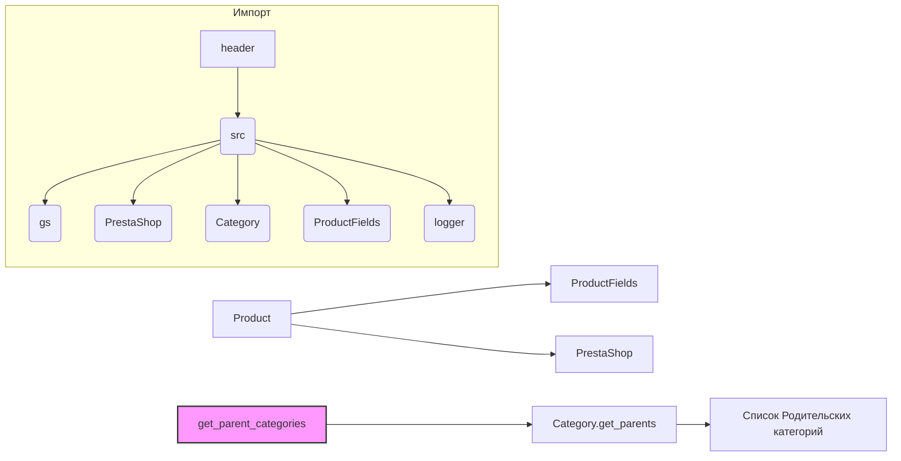

# <input code>

```python
## \file hypotez/src/product/product.py
# -*- coding: utf-8 -*-\
#! venv/Scripts/python.exe
#! venv/bin/python/python3.12

"""
.. module: src.product 
	:platform: Windows, Unix
	:synopsis: Interaction between website, product, and PrestaShop.
Defines the behavior of a product in the project.

"""


import header
from src import gs
from src.endpoints.prestashop import PrestaShop  # Explicit import
from src.category import Category
from src.product.product_fields import ProductFields
from src.logger import logger


class Product(ProductFields, PrestaShop):
    """  Manipulations with the product.
    Initially, I instruct the grabber to fetch data from the product page,
    and then work with the PrestaShop API.
    """
    def __init__(self, *args, **kwargs):
        """
        Initializes a Product object.

        :param args: Variable length argument list.
        :param kwargs: Arbitrary keyword arguments.
        """
        super().__init__(*args, **kwargs)
        # ... (rest of the __init__ method)


    @staticmethod
    def get_parent_categories(id_category: int, dept: int = 0) -> list:
        """ Collects parent categories from the specified category.
        Duplicates the function get_parents() from the Category class.

        :param id_category: ID of the category.
        :type id_category: int
        :param dept: Depth of the category.
        :type dept: int
        :raises TypeError: if id_category is not an integer.
        :returns: List of parent categories.
        :rtype: list
        """
        if not isinstance(id_category, int):
            raise TypeError("id_category must be an integer")
        return Category.get_parents(id_category, dept)
```

# <algorithm>

**Шаг 1:** Импортируются необходимые модули и классы.

**Пример:** Импорт `PrestaShop` из `src.endpoints.prestashop` указывает на использование функциональности, связанной с взаимодействием с API PrestaShop.

**Шаг 2:** Определяется класс `Product`, который наследуется от `ProductFields` и `PrestaShop`. Это означает объединение функциональности из обоих классов.

**Пример:**  Наследование от `ProductFields` предполагает доступ к атрибутам и методам, связанным с данными о продуктах, а наследование от `PrestaShop` – к методам, взаимодействующим с API PrestaShop.

**Шаг 3:**  Определяется метод `__init__`. Этот метод отвечает за инициализацию объекта `Product`.

**Пример:**   Здесь происходит инициализация объекта с помощью супер класса `super().__init__(*args, **kwargs)`.


**Шаг 4:** Определяется статический метод `get_parent_categories`.

**Пример:** Этот метод получает список родительских категорий по заданному `id_category`. Он вызывает метод `get_parents` из класса `Category`.

**Пример данных:**

Входные данные: `id_category = 123`.

Выходные данные: Список родительских категорий, связанных с `id_category = 123`.


# <mermaid>



**Объяснение диаграммы:**

Диаграмма показывает взаимосвязь между классами и модулями.  `Product` зависит от `ProductFields`, `PrestaShop`, `Category`, и других импортированных модулей (включая `logger`, `gs`, `header`).  Метод `get_parent_categories` напрямую взаимодействует с методом `Category.get_parents`.

# <explanation>

**Импорты:**

- `header`:  Скорее всего, это файл с дополнительными импортами или настройками, относящимися к проекту. Недостаточно информации для точного определения его назначения.
- `gs`:  Вероятно, это модуль, отвечающий за взаимодействие с Google Sheets или другим сервисом.
- `PrestaShop`: Модуль, содержащий класс `PrestaShop`, который предоставляет методы для взаимодействия с API PrestaShop.
- `Category`: Модуль, содержащий класс `Category` для работы с категориями.
- `ProductFields`:  Модуль, содержащий класс `ProductFields` с атрибутами и методами, относящимися к характеристикам продукта.
- `logger`: Модуль, предоставляющий инструменты для ведения логов.

**Классы:**

- `Product`: Главный класс, комбинирующий функциональность для работы с продуктами на сайте и API PrestaShop.
    - `__init__`: Инициализирует объект `Product`.  Остальная часть метода (`...`)  предполагает, что он имеет дополнительные параметры для инициализации, кроме указанных здесь.
    - `get_parent_categories`: Статический метод для получения родительских категорий продукта, делегируя вызов `Category.get_parents`.

**Функции:**

- `get_parent_categories`: Статический метод, принимающий `id_category` и необязательный параметр `dept`, возвращает список родительских категорий.  Важная валидация - проверка типа `id_category` на целочисленность.

**Переменные:**

- `MODE`: Строковая переменная, вероятно, задающая режим работы приложения (`'dev'` в данном случае).

**Возможные ошибки и улучшения:**

- Необходима реализация метода `__init__` класса `Product` для полного понимания.
- Проверка корректности входных данных (например, `id_category` может быть невалидным).
- Добавить `try...except` блоков для обработки возможных исключений при работе с API PrestaShop или другими внешними ресурсами.
- Документировать `ProductFields`.
- Улучшить обработку ошибок (например, более точные исключения).

**Связь с другими частями проекта:**

Код явно зависит от `src.endpoints.prestashop`, `src.category`, `src.product.product_fields` и `src.logger`, а также, вероятно, от `gs` и `header`.  Более подробная информация о проекте позволит уточнить зависимости.  Например, `gs` вероятно, используется для работы с данными продукта из внешнего источника, а  `header`  может содержать общие настройки.