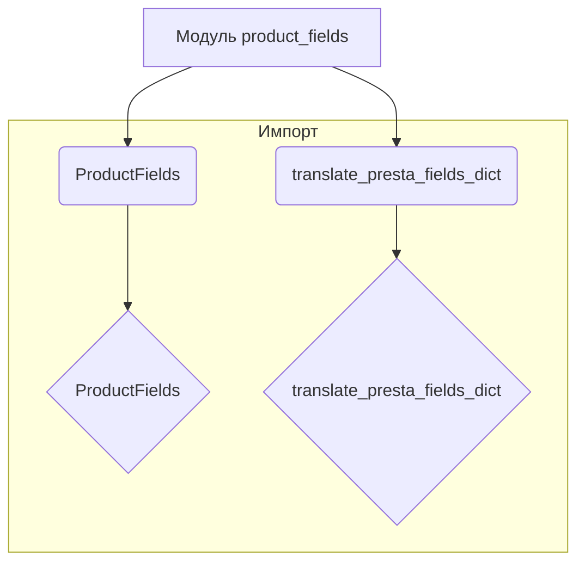
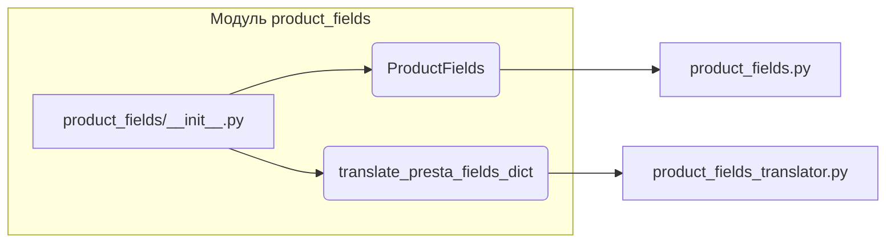

# <input code>

```python
## \file hypotez/src/product/product_fields/__init__.py
# -*- coding: utf-8 -*-
#! venv/Scripts/python.exe
#! venv/bin/python/python3.12

"""
.. module: src.product.product_fields 
	:platform: Windows, Unix
	:synopsis: Модуль полей товара

"""
MODE = 'dev'

from .product_fields import ProductFields
from .product_fields_translator import translate_presta_fields_dict
```

# <algorithm>



**Пошаговый алгоритм:**

1. Модуль `product_fields` импортирует класс `ProductFields` и функцию `translate_presta_fields_dict` из соответствующих файлов.
2. Переменная `MODE` определяет режим работы (в данном случае 'dev').

Этот код не выполняет никаких действий, а лишь определяет импорты, необходимых для использования в других частях проекта.  Все дальнейшие действия будут зависеть от того, как этот модуль будет использован в других частях приложения.


# <mermaid>



**Объяснение диаграммы:**

Диаграмма показывает, что модуль `product_fields/__init__.py` импортирует классы и функции из подмодулей `product_fields.py` и `product_fields_translator.py`.  Эти подмодули, скорее всего, содержат детализацию логики работы с полями товаров.

# <explanation>

**Импорты:**

* `from .product_fields import ProductFields`: Импортирует класс `ProductFields` из файла `product_fields.py` внутри текущей директории.  Это стандартный импорт из подмодуля.
* `from .product_fields_translator import translate_presta_fields_dict`: Импортирует функцию `translate_presta_fields_dict` из файла `product_fields_translator.py` внутри текущей директории.  Это указывает, что существует функция для перевода данных из какого-то внешнего источника (вероятно, связанного с PrestaShop) в формат, используемый в системе.

**Классы:**

* `ProductFields`:  Класс, вероятно, описывает структуру или логику работы с полями товара.  Подробности определения этого класса и его функциональности могут содержаться в файле `product_fields.py`.

**Функции:**

* `translate_presta_fields_dict`: Эта функция, по всей видимости, отвечает за перевод словаря полей, полученного от системы PrestaShop, в внутренний формат, используемый системой.  Её реализация (и аргументы/возвращаемые значения) содержится в `product_fields_translator.py`.

**Переменные:**

* `MODE = 'dev'`: Переменная, вероятно, определяет режим работы системы (разработка, производство и т.д.).   Этот параметр может быть использован для подгрузки различных конфигураций или настроек в зависимости от фазы работы.

**Возможные ошибки или области для улучшений:**

* Отсутствие ясной документации в файлах `product_fields.py` и `product_fields_translator.py` затрудняет понимание функциональности.
*  В коде не указаны типы данных переменных.  Добавление аннотаций типов (например, `MODE: str = 'dev'`) улучшило бы читаемость и поддержку кода.

**Взаимосвязи с другими частями проекта:**

Этот модуль, скорее всего, интегрируется с другими частями приложения, отвечающими за работу с данными о товарах.  Связь будет осуществляться через вызовы функций и классов этого модуля в других частях проекта.  Необходимо проанализировать эти вызовы для более полного понимания функциональности.