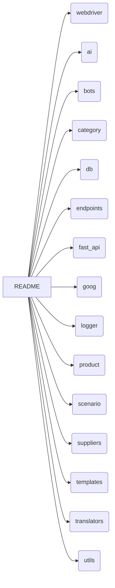

# <input code>

```
# Оглавление

1. [webdriver](#webdriver)
2. [ai](#ai)
3. [bots](#bots)
4. [category](#category)
5. [db](#db)
6. [endpoints](#endpoints)
7. [fast_api](#fast_api)
8. [goog](#goog)
9. [logger](#logger)
10. [product](#product)
11. [scenario](#scenario)
12. [suppliers](#suppliers)
13. [templates](#templates)
14. [translators](#translators)
15. [utils](#utils)

# Модули

## webdriver
Модуль для работы с веб-драйверами и автоматизацией действий в браузере.

## ai
Модуль для интеграции с искусственным интеллектом, включая взаимодействие с различными ИИ-моделями.

## bots
Модуль для создания и управления ботами, которые взаимодействуют с пользователями.

## category
Модуль для работы с категориями товаров или данных.

## db
Модуль для работы с базами данных, включая создание, чтение и обновление данных.

## endpoints
Модуль для создания и обработки API эндпоинтов, которые взаимодействуют с клиентами.

## fast_api
Модуль для использования FastAPI в проекте, включая маршрутизацию запросов и конфигурацию.

## goog
Модуль для работы с сервисами Google, такими как Google Cloud или API.

## logger
Модуль для логирования, предоставляет функциональность для записи логов и ошибок.

## product
Модуль для работы с продуктами, включая обработку данных о товарах и услугах.

## scenario
Модуль для моделирования и выполнения сценариев взаимодействия.

## suppliers
Модуль для работы с поставщиками, включая интеграцию с внешними системами.

## templates
Модуль для работы с шаблонами данных и их генерации.

## translators
Модуль для перевода текста с использованием различных инструментов и API.

## utils
Утилитарный модуль, включающий различные вспомогательные функции для проекта.
```

# <algorithm>

Этот код представляет собой структурированный список модулей (возможно, файла README), а не алгоритм в традиционном смысле.  Блок-схема не применима.  Данные не перемещаются между функциями или классами.

# <mermaid>



# <explanation>

Этот код представляет собой описание структуры проекта, а не фрагмент работающего кода. Он описывает различные модули (`webdriver`, `ai`, `bots`, и т.д.), которые, предположительно, составляют часть более крупного проекта.  Каждому модулю дано краткое описание, что предполагает, что код для каждого из этих модулей будет существовать в других файлах проекта.

**Импорты:**

Нет импортов в данном коде, так как это описание структуры, а не сам код.

**Классы:**

Нет классов, так как это всего лишь список модулей.

**Функции:**

Нет функций.

**Переменные:**

Нет переменных.

**Возможные ошибки/улучшения:**

* **Недостаток деталей:**  Для каждого модуля было бы полезно добавить более подробное описание задач и функций, предоставляемых данным модулем.
* **Связи между модулями:** Необходима информация о том, как модули взаимодействуют друг с другом. Это необходимо для понимания структуры проекта.  Например, как `webdriver` взаимодействует с `endpoints`?
* **Файловая структура:**  Был бы полезен указание на то, где расположены эти модули. Например, `src/webdriver.py`.


**Цепочка взаимосвязей:**

Как описано, это скорее структура, чем непосредственная взаимосвязь.  Для построения взаимосвязей потребуется дополнительная информация о коде каждого модуля, включая импорты и методы взаимодействия.  Например, `fast_api` взаимодействует с `endpoints` и `logger`. `utils` может быть вспомогательным модулем для других модулей.  Без дополнительного кода сложно проследить детальные взаимосвязи.