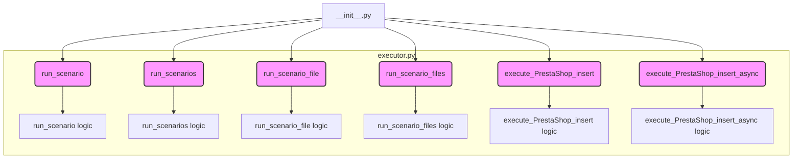

```MD
# Анализ кода hypotez/src/scenario/__init__.py

## <input code>

```python
## \file hypotez/src/scenario/__init__.py
# -*- coding: utf-8 -*-\
#! venv/Scripts/python.exe
#! venv/bin/python/python3.12

"""
.. module: src.scenario 
	:platform: Windows, Unix
	:synopsis: Module with scenario execution functions: `run_scenario_files`, `run_scenarios`  
Scenario executor for suppliers.
----

.. :codeblock:
s = Supplier('aliexpress')

run_scenario_files(s, 'file1')

scenario_files = ['file1', ...]
run_scenario_files(s, scenario_files)


scenario1 = {'key': 'value'}
run_scenarios(s, scenario1)


list_of_scenarios = [scenario1, ...]
run_scenarios(s, list_of_scenarios)

.. :examples:
Example of a scenario file:
```json
{
  "scenarios": {

    "feet-hand-treatment": {
      "url": "https://hbdeadsea.co.il/product-category/bodyspa/feet-hand-treatment/",
      "name": "Foot and Hand Care",
      "condition": "new",
      "presta_categories": {
        "default_category": 11259,
        "additional_categories": []
      }
    },

    "creams-butters-serums-for-body": {
      "url": "https://hbdeadsea.co.il/product-category/bodyspa/creams-butters-serums-for-body/",
      "name": "Creams, Butters, and Serums for Body",
      "condition": "new",
      "presta_categories": {
        "default_category": 11260,
        "additional_categories": []
      }
    }
}
}
```
```python

For detailed information on the scenario dictionary, read here: ...

When the program is started via main(), the following sequence of execution occurs:
@code
s = Supplier('aliexpress')

s.run()

s.run('file1')

scenario_files = ['file1', ...]
s.run(scenario_files)

scenario1 = {'key': 'value'}
s.run(scenario1)


list_of_scenarios = [scenario1, ...]
s.run(list_of_scenarios)
```
"""

from .executor import (
    run_scenario, 
    run_scenarios, 
    run_scenario_file, 
    run_scenario_files, 
    execute_PrestaShop_insert, 
    execute_PrestaShop_insert_async,
)
```

## <algorithm>

(Описание алгоритма в виде блок-схемы)

К сожалению, предоставленного кода недостаточно для построения полной блок-схемы.  Неизвестны определения `Supplier` и `run_scenario`, `run_scenarios` и т.д.  

Предполагаемый алгоритм:

1. Импортируются функции из модуля `.executor`.
2. Переменная `MODE` получает значение 'dev'.
3. Код предполагает дальнейшее использование функций `run_scenario`, `run_scenarios` и т.д.  для обработки сценариев, скорее всего, связанных с поставщиками (`Supplier`) и выполнением операций в PrestaShop.

## <mermaid>



## <explanation>

* **Импорты:** Модуль импортирует функции из подмодуля `executor`. Это указывает на то, что логика выполнения сценариев (возможно, связанных с интеграцией с PrestaShop) находится в отдельном файле или модуле `executor.py`.
    * `run_scenario`, `run_scenarios`, `run_scenario_file`, `run_scenario_files`: Функции для выполнения сценариев, вероятно, принимающие на вход различные данные (списки сценариев, файлы со сценариями).
    * `execute_PrestaShop_insert`, `execute_PrestaShop_insert_async`: Функции для выполнения операций добавления данных в PrestaShop (возможно, синхронно или асинхронно).
    *  Связь с `src`: Импорты указывают, что этот файл (`scenario/__init__.py`) находится в `src` папке и использует функции из подмодуля `executor` в том же пакете (`src.scenario.executor`).
* **Классы:** Отсутствуют объявления классов.
* **Функции:**  Отсутствуют определения функций кроме импортов.  Из документации видно, что ожидаются функции, принимающие на вход данные, относящиеся к поставщикам и сценариям.
* **Переменные:**
    * `MODE`: Переменная, вероятно, хранит режим работы (`'dev'`).
* **Возможные ошибки или улучшения:**
    * Отсутствуют определения классов и функций. Не хватает данных для анализа.  Нужно посмотреть на файлы `hypotez/src/scenario/executor.py`, `hypotez/src/scenario/Supplier.py` (если таковой существует) для понимания логики и структуры.
    * Отсутствие подробных проверок входных данных в функциях может привести к ошибкам (например, к ошибкам типа `TypeError` или `ValueError`).
    * Неизвестно, что такое `Supplier`.


**Цепочка взаимосвязей:**
Этот модуль (`scenario/__init__.py`) зависим от модуля `executor.py`, который, вероятно, содержит реализацию функциональности для обработки сценариев и взаимодействия с Престашоп.  Для дальнейшего анализа потребуется просмотреть `hypotez/src/scenario/executor.py` и любой класс или модуль, к которому обращаются функции `run_scenario`, `run_scenarios`, `Supplier`.