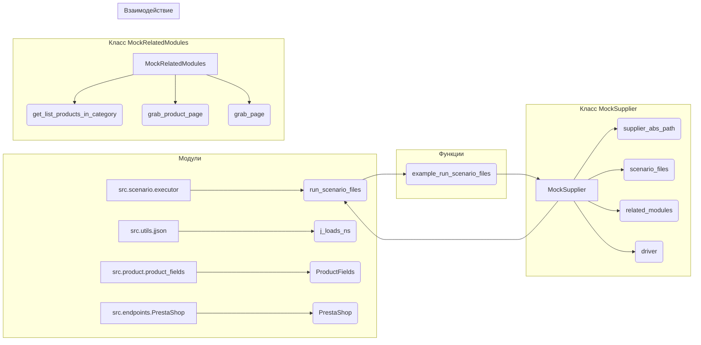

# <input code>

```python
## \file hypotez/src/scenario/_examples/_example_executor.py
# -*- coding: utf-8 -*-
#! venv/Scripts/python.exe
#! venv/bin/python/python3.12

"""
.. module: src.scenario._examples 
	:platform: Windows, Unix
	:synopsis:

"""
MODE = 'dev'


"""
	:platform: Windows, Unix
	:synopsis:

"""


"""
	:platform: Windows, Unix
	:synopsis:

"""


"""
  :platform: Windows, Unix

"""
"""
  :platform: Windows, Unix
  :platform: Windows, Unix
  :synopsis:
"""MODE = 'dev'
  
""" module: src.scenario._examples """


...
"""
Examples for the `executor` module from `src.scenario.executor`.

This file contains examples of how to use the functions provided in the `executor` module.
The examples demonStarte how to run scenarios, handle scenario files, and interact with PrestaShop API.

@details
- `Example 1` shows how to run a list of scenario files.
- `Example 2` demonStartes how to run a single scenario file.
- `Example 3` illuStartes how to run a single scenario.
- `Example 4` provides an example of executing a product page scenario.
- `Example 5` shows how to add a coupon using PrestaShop API.

@image html executor.png
"""

import asyncio
from pathlib import Path
from src.scenario.executor import run_scenario_files, run_scenario_file, run_scenarios, run_scenario, insert_grabbed_data, execute_PrestaShop_insert, execute_PrestaShop_insert_async, add_coupon
from src.utils.jjson import j_loads_ns
from src.product.product_fields import ProductFields
from src.endpoints.PrestaShop import PrestaShop

# Assuming `Supplier` class is available and has necessary methods and attributes
class MockSupplier:
    def __init__(self):
        self.supplier_abs_path = Path('/path/to/scenarios')
        self.scenario_files = [Path('scenarios/scenario1.json'), Path('scenarios/scenario2.json')]
        self.current_scenario = None
        self.supplier_settings = {'runned_scenario': []}
        self.related_modules = MockRelatedModules()
        self.driver = MockDriver()

class MockRelatedModules:
    def get_list_products_in_category(self, s):
        return ['http://example.com/product1', 'http://example.com/product2']

    def grab_product_page(self, s):
        return ProductFields(
            presta_fields_dict={'reference': 'REF123', 'name': [{'id': 1, 'value': 'Sample Product'}], 'price': 100},
            assist_fields_dict={'images_urls': ['http://example.com/image1.jpg'], 'default_image_url': 'http://example.com/default_image.jpg', 'locale': 'en'}
        )

    async def grab_page(self, s):
        return self.grab_product_page(s)

class MockDriver:
    def get_url(self, url):
        return True

# Example 1: Run a list of scenario files
def example_run_scenario_files():
    supplier = MockSupplier()
    scenario_files = [Path('scenarios/scenario1.json'), Path('scenarios/scenario2.json')]
    result = run_scenario_files(supplier, scenario_files)
    if result:
        print("All scenarios executed successfully.")
    else:
        print("Some scenarios failed.")

# ... (other examples)
```

# <algorithm>

**Блок-схема (неполная, фокусируется на `example_run_scenario_files`):**

```mermaid
graph TD
    A[Начало] --> B{Создать экземпляр MockSupplier};
    B --> C[Задать список scenario_files];
    C --> D{Вызвать run_scenario_files(supplier, scenario_files)};
    D --> E[Обработка результата];
    E --Результат True --> F[Вывести "All scenarios executed successfully."];
    E --Результат False --> G[Вывести "Some scenarios failed."];
    F --> H[Конец];
    G --> H;
```

**Пример данных:**

* `supplier`: Экземпляр класса `MockSupplier`, содержащий пути к сценариям.
* `scenario_files`: Список путей к файлам сценариев (`Path`).
* `result`: Булевое значение, указывающее на успех выполнения всех сценариев.


# <mermaid>



# <explanation>

**Импорты:**

* `import asyncio`: Используется для асинхронных операций, например, в `execute_PrestaShop_insert_async`.
* `from pathlib import Path`: Для работы с путями файлов.
* `from src.scenario.executor import ...`: Импортирует функции для выполнения сценариев.  Связь с `src.scenario.executor` - модуль `executor` содержит реализацию логики выполнения сценариев.
* `from src.utils.jjson import j_loads_ns`: Импортирует функцию `j_loads_ns` для обработки JSON-данных. Связь с `src.utils.jjson` - модуль содержит утилиты для работы с JSON.
* `from src.product.product_fields import ProductFields`: Импортирует класс `ProductFields` для представления данных о продуктах.  Связь с `src.product.product_fields` - модуль содержит класс для представления данных о продуктах.
* `from src.endpoints.PrestaShop import PrestaShop`: Импортирует класс `PrestaShop` для взаимодействия с API PrestaShop. Связь с `src.endpoints.PrestaShop` - модуль содержит класс для взаимодействия с API PrestaShop.

**Классы:**

* **`MockSupplier`:**  Представляет поставщика данных сценариев. В реальной реализации этот класс скорее всего взаимодействует с базами данных или другими источниками данных.  `MockSupplier` используется для тестирования.
* **`MockRelatedModules`:**  Представляет модули, связанные с обработкой сценариев, таких как получение списка продуктов или данных с продуктовой страницы.
* **`MockDriver`:** Мок для драйвера (вероятно, веб-драйвера). Необходим для тестирования.

**Функции:**

* `example_run_scenario_files`:  Пример выполнения списка файлов сценариев.  Принимает экземпляр `MockSupplier` и список `Path`-объектов.
* `run_scenario_files`: Выполняет список файлов сценариев, возвращает True, если все сценарии выполнены успешно, иначе False.
* `run_scenario`: Выполняет один сценарий.
* `run_scenario_file`: Выполняет один файл сценария.

**Переменные:**

* `MODE`:  Переменная, определяющая режим работы.
* `supplier`: Экземпляр класса `MockSupplier`.

**Возможные ошибки и улучшения:**

* **Отсутствие валидации:** Код не содержит проверки корректности входных данных. Необходимо добавить проверки на наличие файлов, корректность формата данных в JSON-файлах сценариев и т.д.
* **Мокирование:** Использование моков (`MockSupplier`, `MockRelatedModules`, `MockDriver`) упрощает тестирование, но в продакшене необходимо заменить их реальными реализациями.
* **Обработка ошибок:** Функции `run_scenario_files`, `run_scenario_file`, `run_scenario` и другие должны обрабатывать возможные исключения (например, ошибки при чтении файлов, проблемы с API).

**Цепочка взаимосвязей:**

Функции в `src.scenario.executor` взаимодействуют с данными, предоставляемыми `MockSupplier`. Классы `ProductFields` и `PrestaShop` используются для обработки данных продуктов и взаимодействия с API.  Модуль `src.utils.jjson` поддерживает обработку JSON-данных, что важно для работы со сценариями.