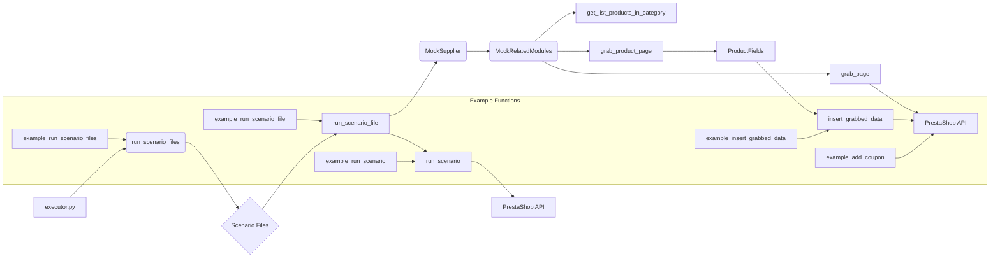

# Анализ кода модуля executor.py

## 1. <input code>

```python
"""
Examples for the `executor` module from `src.scenario.executor`.

This file contains examples of how to use the functions provided in the `executor` module.
The examples demonStarte how to run scenarios, handle scenario files, and interact with PrestaShop API.

@details
- `Example 1` shows how to run a list of scenario files.
- `Example 2` demonStartes how to run a single scenario file.
- `Example 3` illuStartes how to run a single scenario.
- `Example 4` provides an example of executing a product page scenario.
- `Example 5` shows how to add a coupon using PrestaShop API.

@image html executor.png
"""

from pathlib import Path
from src.scenario.executor import run_scenario_files, run_scenario_file, run_scenarios, run_scenario, insert_grabbed_data, execute_PrestaShop_insert, execute_PrestaShop_insert_async, add_coupon
from src.utils.jjson import j_loads_ns
from src.endpoints.prestashop.product_fields import ProductFields
from src.endpoints.PrestaShop import PrestaShop

# Assuming `Supplier` class is available and has necessary methods and attributes
class MockSupplier:
    def __init__(self):
        self.supplier_abs_path = Path('/path/to/scenarios')
        self.scenario_files = [Path('scenarios/scenario1.json'), Path('scenarios/scenario2.json')]
        self.current_scenario = None
        self.supplier_settings = {'runned_scenario': []}
        self.related_modules = MockRelatedModules()
        self.driver = MockDriver()

class MockRelatedModules:
    def get_list_products_in_category(self, s):
        return ['http://example.com/product1', 'http://example.com/product2']

    def grab_product_page(self, s):
        return ProductFields(
            presta_fields_dict={'reference': 'REF123', 'name': [{'id': 1, 'value': 'Sample Product'}], 'price': 100},
            assist_fields_dict={'images_urls': ['http://example.com/image1.jpg'], 'default_image_url': 'http://example.com/default_image.jpg', 'locale': 'en'}
        )

    async def grab_page(self, s):
        return self.grab_product_page(s)

class MockDriver:
    def get_url(self, url):
        return True

# ... (Example functions)
```

## 2. <algorithm>

(Блок-схема - сложно отобразить в текстовом формате.  Представлена концептуальная схема)

**Общая схема:**

1.  **Инициализация:** Создается экземпляр `MockSupplier` с путями к сценариям.
2.  **Выполнение сценариев:** Вызываются функции `run_scenario_files`, `run_scenario_file`, `run_scenario` с объектом `MockSupplier` и соответствующими данными.
3.  **Обработка данных:** `run_scenario` и другие функции взаимодействуют с `MockRelatedModules` для получения данных о продуктах (например, `get_list_products_in_category`, `grab_product_page`).
4.  **Вставка в PrestaShop:** Функции `insert_grabbed_data`, `execute_PrestaShop_insert`, `execute_PrestaShop_insert_async` обрабатывают полученные данные и отправляют их в PrestaShop API.
5.  **Добавление купона:** Функция `add_coupon` взаимодействует с API PrestaShop для добавления купона.


**Пример `run_scenario_files`:**

- Вход: Список путей к файлам сценариев.
- Выход: `True`, если все сценарии выполнены успешно; `False` в противном случае.
- Действия:  Цикл по файлам. Для каждого файла вызывается `run_scenario_file`.


**Пример `run_scenario`:**

- Вход: Объект `MockSupplier` и словарь сценария.
- Выход: `True` или `False` в зависимости от успеха выполнения.
- Действия: Обработка данных сценария, взаимодействие с `MockRelatedModules`, обработка ошибок.


## 3. <mermaid>



**Объяснение диаграммы:**

Диаграмма показывает взаимосвязь между модулем `executor.py` и другими компонентами (классы `MockSupplier`, `MockRelatedModules`, `ProductFields`, и вызовы API). `Mock`-объекты имитируют взаимодействие с другими частями приложения. Важно, что в данном случае `PrestaShop API` не является частью анализируемого кода и представлен как внешний ресурс.  Обработка ошибок и взаимодействие между этими частями в `mermaid` не показаны.


## 4. <explanation>

**Импорты:**

- `from pathlib import Path`: Для работы с путями к файлам.
- `from src.scenario.executor import ...`: Импортирует функции для выполнения сценариев (например, `run_scenario_files`).  Важная связь с модулем `scenario.executor`.
- `from src.utils.jjson import j_loads_ns`:  Предполагает наличие функций для работы с JSON, вероятно, связанных с разбором сценариев.  Связь с `utils` модулем.
- `from src.endpoints.prestashop.product_fields import ProductFields`: Определяет структуру данных для представления данных о продукте, связь с `product` модулем.
- `from src.endpoints.PrestaShop import PrestaShop`:  Связь с модулем для работы с API PrestaShop.


**Классы:**

- `MockSupplier`:  Имитирует работу поставщика сценариев и данных.  Используется для тестирования. Имеет атрибуты для хранения путей к файлам, текущего сценария, и настроек.
- `MockRelatedModules`:  Имитирует взаимодействие с другими модулями.  Важно, что в реальном проекте `MockRelatedModules` должен быть заменен на реальные классы для взаимодействия с базами данных и API.
- `MockDriver`:  Имитирует работу с веб-драйвером.  В реальном проекте `MockDriver` должен быть заменен на реальный класс для взаимодействия с браузером.

**Функции:**

- `run_scenario_files`, `run_scenario_file`, `run_scenarios`, `run_scenario`: Обрабатывают сценарии, взаимодействуют с `MockSupplier`.
- `insert_grabbed_data`: Вставляет данные о продукте в PrestaShop.
- `execute_PrestaShop_insert`, `execute_PrestaShop_insert_async`:  Выполняют вставку данных в PrestaShop, одна из асинхронная.
- `add_coupon`: Добавляет купон.

**Переменные:**

- `supplier`, `scenario_files`, `scenario`: Хранят данные о поставщике, списках файлов сценариев, и текущем сценарии.

**Возможные ошибки и улучшения:**

- Отсутствие обработки ошибок (например, исключений). Необходимо добавлять проверки и обработку потенциальных ошибок.
- `Mock`-классы. Для реального использования нужно заменить на реальные классы, обрабатывающие взаимодействие с PrestaShop API, базами данных и другими компонентами.
- Неопределённые пути.  `supplier_abs_path` содержит `/path/to/scenarios`, что не должно быть частью кода. Это placeholder и должен быть определён в конфигурационном файле.
- Отсутствие ясной структуры ошибок. Нужно определить, как модуль `executor` обрабатывает ошибки при выполнении сценариев (например, если какой-либо сценарий завершается неудачно).
- Отсутствие логирования. Для отладки и мониторинга процесса выполнения сценариев необходимо добавить логирование.
- Неочевидные типы возвращаемых данных. В некоторых функциях (например, `run_scenario_files`) следует явно указывать, какой тип значения возвращается (`True`/`False`?).


**Взаимосвязи с другими частями проекта:**

Код явно связан с другими модулями (`src.utils.jjson`, `src.product.product_fields`, `src.endpoints.PrestaShop`).  Необходимо смотреть на реализацию этих модулей, чтобы понять всю цепочку взаимодействия.  Учитывайте, что представленные классы `Mock` являются частью этих взаимосвязей и имитируют работу других компонентов.