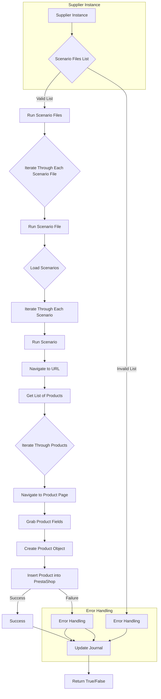

1. <input code>
```graph TD
    A[Supplier Instance] --> B{Scenario Files List}
    B -- Valid List --> C[Run Scenario Files]
    B -- Invalid List --> D[Error Handling]
    C --> E{Iterate Through Each Scenario File}
    E --> F[Run Scenario File]
    F --> G{Load Scenarios}
    G --> H[Iterate Through Each Scenario]
    H --> I[Run Scenario]
    I --> J[Navigate to URL]
    J --> K[Get List of Products]
    K --> L{Iterate Through Products}
    L --> M[Navigate to Product Page]
    M --> N[Grab Product Fields]
    N --> O[Create Product Object]
    O --> P[Insert Product into PrestaShop]
    P -- Success --> Q[Success]
    P -- Failure --> R[Error Handling]
    Q --> S[Update Journal]
    R --> S
    S --> T[Return True/False]
```

2. <algorithm>
* **Шаг 1:** Supplier Instance вызывает функцию, получающую список сценариев.
* **Шаг 2:** Проверяется валидность списка сценариев.
* **Шаг 3:** Если список валидный, запускается цикл обработки файлов сценариев.
* **Шаг 4:** Внутри цикла для каждого файла сценария происходит загрузка сценариев.
* **Шаг 5:** Внутри цикла для каждого сценария выполняется сценарий, что включает следующие шаги:
    * **Шаг 5.1:** Переход на URL.
    * **Шаг 5.2:** Получение списка продуктов.
    * **Шаг 5.3:** Цикл обработки каждого продукта.
    * **Шаг 5.4:** Переход на страницу продукта.
    * **Шаг 5.5:** Получение данных о продукте.
    * **Шаг 5.6:** Создание объекта продукта.
    * **Шаг 5.7:** Добавление продукта в PrestaShop.
    * **Шаг 5.8:** Обработка успеха или ошибки добавления.
* **Шаг 6:** Обновление журнала в случае успеха или при обработке ошибки.
* **Шаг 7:** Возвращается результат (True/False).


Примеры данных:

* Supplier Instance - экземпляр класса, управляющего сценариями.
* Список сценариев - список путей к файлам сценариев.
* Сценарий - набор инструкций для выполнения определенной задачи (например, добавление продукта в интернет-магазин).
* URL - адрес страницы интернет-магазина.
* Продукт - информация о продукте (название, цена, описание).


3. <mermaid>




4. <explanation>

* **Импорты:**  В данном коде импорты не показаны, поэтому о связи с другими пакетами (`src.`) судить нельзя.

* **Классы:**  Описание работы основано на диаграмме. Класс `Supplier Instance` отвечает за запуск сценариев.  Подробности о классах, создающих и обрабатывающих сценарии, продукты, не представлены.

* **Функции:**  Функции, реализующие загрузку сценариев, работу с URL, получение и обработку продуктов, создание объектов, вставка в PrestaShop, обновление журнала,  не показаны. Это общая модель сценария.


* **Переменные:** Переменные, хранящие список файлов сценариев,  сценарии, URL, продукты, данные продуктов - не описаны в коде.


**Возможные ошибки/улучшения:**

* Отсутствует проверка на существование файлов сценариев и их валидность.
* Отсутствует обработка исключений при работе с файлами сценариев и при выполнении сценария (например, ошибки сети,  некорректные данные в файлах).
* Не указано, где хранятся файлы сценариев.
* Не описано поведение при обработке ошибок на разных этапах процесса.
* Непонятно, как происходит передача данных между этапами обработки сценариев и компонентами.

**Взаимосвязи с другими частями проекта:**

Схема показывает выполнение сценариев, запускаемых компонентом `Supplier Instance`.  Для понимания полной картины необходимо знать, где и как определяется `Supplier Instance`, список сценариев, сами сценарии, структура для обработки продуктов и взаимодействие с PrestaShop.