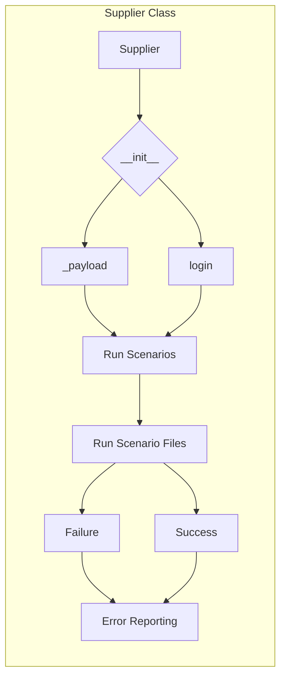

# <input code>

```python
Here's a detailed explanation of what the `Supplier` class does, in English:

### Overview of the `Supplier` Class

The `Supplier` class serves as a base class for managing data suppliers in your application. It provides a framework for interacting with various data sources, such as Amazon, AliExpress, Walmart, and others. This class handles the initialization of supplier-specific settings, manages scenarios for data collection, and provides methods for logging in and executing scenarios.

### Components of the `Supplier` Class

#### 1. **Class Attributes**
   - `supplier_id`: Unique identifier for the supplier.
   - `supplier_prefix`: Prefix for the supplier, e.g., `aliexpress` or `amazon`.
   - `supplier_settings`: Settings for the supplier, loaded from a configuration file.
   - `locale`: Localization code (e.g., `en` for English, `ru` for Russian).
   - `price_rule`: Rule for calculating prices (e.g., adding VAT or applying discounts).
   - `related_modules`: Module containing supplier-specific functions.
   - `scenario_files`: List of scenario files to be executed.
   - `current_scenario`: The currently executing scenario.
   - `login_data`: Login credentials for accessing the supplier’s website (if required).
   - `locators`: Locators for web elements on the supplier’s site.
   - `driver`: Web driver for interacting with the supplier’s site.
   - `parsing_method`: Method for data parsing (e.g., `webdriver`, `api`, `xls`, `csv`).


#### 2. **Methods**
   - `__init__`: Constructor that initializes attributes based on the supplier prefix and other parameters.
     ```python
     def __init__(self, supplier_prefix: str, locale: str = 'en', webdriver: str | Driver | bool = 'default', *attrs, **kwargs):
         # Initializes supplier prefix, locale, and web driver
     ```

   - `_payload`: Loads supplier-specific configurations, locators, and initializes the web driver.
     ```python
     def _payload(self, webdriver: str | Driver | bool, *attrs, **kwargs) -> bool:
         # Loads configuration files and initializes the web driver
     ```

   - `login`: Handles the login process for the supplier’s site if authentication is required.
     ```python
     def login(self) -> bool:
         # Performs login to the supplier's site
     ```

   - `run_scenario_files`: Executes one or more scenario files.
     ```python
     def run_scenario_files(self, scenario_files: str | List[str] = None) -> bool:
         # Executes scenario files and returns True if all scenarios are successfully completed
     ```

   - `run_scenarios`: Executes one or more scenarios.
     ```python
     def run_scenarios(self, scenarios: dict | list[dict]) -> bool:
         # Executes given scenarios and returns True if all scenarios are successfully completed
     ```
```

# <algorithm>

The algorithm can be visualized as a flowchart, describing the interaction between the `Supplier` class and its methods.

1. **Initialization:** A `Supplier` object is created with the `__init__` method, setting the supplier prefix, locale, and webdriver type.
2. **Payload Loading:**  The `_payload` method is called to load supplier-specific configurations (settings, locators). It also initializes the web driver. The return value indicates success or failure in loading the configurations.
3. **Login (if necessary):** The `login` method is called to log in to the supplier's website if authentication is required. This step returns a boolean value indicating success or failure.
4. **Scenario Execution:** Either `run_scenario_files` or `run_scenarios` is called to execute specified scenario files or dictionaries. This steps return a boolean indicating if all scenarios executed successfully. Each scenario within the run processes could contain individual steps like data scraping and validation. 

```mermaid
graph TD
    A[Create Supplier Object] --> B{Init: Supplier Prefix, Locale, Webdriver};
    B --> C[Load Configs & Driver (_payload)];
    C -- Success --> D[Login (if needed)];
    C -- Failure --> E[Error Handling];
    D -- Success --> F[Execute Scenarios];
    D -- Failure --> E;
    F -- Success --> G[Success];
    F -- Failure --> H[Error Handling];
    E --> H;
    H --> I[Exit/Report];
    G --> I;
```

# <mermaid>




# <explanation>

**Imports:** The provided code doesn't include any import statements.  This means the code probably imports classes and functions from other modules within the `src` directory or standard python libraries (e.g., `List`, `Driver`).  The lack of imports means that  the context of the code is necessary to understand which libraries are used.

**Classes:**

* **`Supplier`:**  This class is a base class for interacting with different data suppliers. It encapsulates the logic for configuring, logging in to, and executing scenarios for each supplier.  The attributes (`supplier_id`, `supplier_prefix`, `supplier_settings`, etc.) represent the characteristics of a supplier, while methods (`__init__`, `_payload`, `login`, `run_scenario_files`, `run_scenarios`) provide functionalities like initialization, configuration loading, login, and scenario execution.

**Methods:**

* **`__init__`**: Initializes the `Supplier` object with the necessary parameters, including supplier prefix, locale, and webdriver. This method sets the initial state of the object.
* **`_payload`**: Responsible for loading supplier-specific configuration data (e.g., settings and locators) and initializing the web driver. It's crucial for the proper functionality of the other methods.
* **`login`**: Attempts to log in to the supplier's website. Returns a boolean indicating success or failure.
* **`run_scenario_files` and `run_scenarios`**: Execute scenarios, either from a list of files or a list of scenarios (likely dictionaries). These are the core methods for running data collection operations.

**Variables:**  The variables (`supplier_prefix`, `locale`, `webdriver`, `scenario_files`, `scenarios`, etc.) represent different types of data, like strings, lists, and dictionaries.  Their use is essential for controlling the actions and behavior of the `Supplier` class.

**Possible Errors and Improvements:**

* **Error Handling:**  The code lacks detailed error handling.  A proper implementation should include `try...except` blocks to catch potential exceptions (e.g., network issues, file not found, invalid configurations) and handle them appropriately, logging the errors.
* **Dependency Injection:** The `webdriver` parameter suggests a flexible approach to using different web drivers, but it would benefit from explicit dependency injection for better testability and maintainability.
* **Logging:**  The code should utilize a logging framework for debugging and monitoring purposes.  It will help in troubleshooting the execution and analyze scenarios that are failing.


**Relationships with Other Parts of the Project:**

The `Supplier` class likely interacts with other parts of the project to load configuration files, handle scenarios, and potentially store collected data.  The other modules might contain functions related to specific scenarios, data parsing, database interactions, or reporting.

The `Driver` class mentioned would be an external library or a module part of the larger codebase responsible for interacting with web browsers, which isn't detailed in this documentation snippet.

**Overall:** The `Supplier` class is designed well for managing different data suppliers but could significantly benefit from robust error handling, better logging, and more comprehensive dependency injection to enhance its flexibility and reliability.