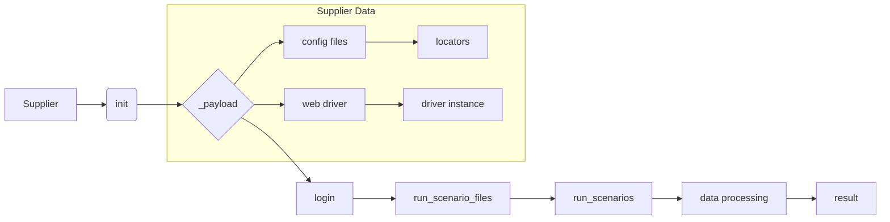

```MD
# Объяснение кода класса Supplier

## <input code>

```
Класс `Supplier` в данном коде является базовым классом для работы с поставщиками данных в вашем приложении. Вот подробное объяснение его назначения и функциональности:

### Назначение Класса

Класс `Supplier` служит основой для реализации различных поставщиков данных (например, Amazon, AliExpress, Walmart и т.д.). Он предоставляет общие методы и атрибуты, которые могут быть использованы или переопределены конкретными реализациями поставщиков.

### Основные Компоненты Класса

#### 1. **Атрибуты Класса**
   - `supplier_id`: Уникальный идентификатор поставщика.
   - `supplier_prefix`: Префикс для поставщика, например, `aliexpress` или `amazon`.
   - `supplier_settings`: Настройки для поставщика, загруженные из файла конфигурации.
   - `locale`: Код локализации (например, `en` для английского, `ru` для русского).
   - `price_rule`: Правило для расчета цены (например, добавление НДС или скидки).
   - `related_modules`: Модуль, содержащий специфические для поставщика функции.
   - `scenario_files`: Список файлов сценариев, которые должны быть выполнены.
   - `current_scenario`: Текущий сценарий выполнения.
   - `login_data`: Данные для входа на сайт поставщика (если требуется).
   - `locators`: Локаторы для веб-элементов на страницах сайта поставщика.
   - `driver`: Веб-драйвер для взаимодействия с сайтом поставщика.
   - `parsing_method`: Метод парсинга данных (например, `webdriver`, `api`, `xls`, `csv`).

#### 2. **Методы Класса**
   - `__init__`: Конструктор класса, инициализирующий атрибуты на основе префикса поставщика и других параметров.
   - `_payload`: Загружает настройки поставщика, конфигурационные файлы и инициализирует веб-драйвер.
   - `login`: Метод для выполнения входа на сайт поставщика (если требуется).
   - `run_scenario_files`: Запускает выполнение файлов сценариев.
   - `run_scenarios`: Запускает один или несколько сценариев.

### Как Это Работает

1. **Инициализация**: При создании объекта `Supplier`, конструктор `__init__` загружает настройки поставщика и инициализирует необходимые компоненты.
   ```python
   def __init__(self, supplier_prefix: str, locale: str = 'en', webdriver: str | Driver | bool = 'default', *attrs, **kwargs):
       # Инициализация префикса поставщика, локали и веб-драйвера
   ```

2. **Загрузка Конфигурации**: Метод `_payload` загружает конфигурации для данного поставщика, включая локаторы для страниц и сценарии выполнения.

3. **Вход на Сайт**: Метод `login` используется для выполнения процесса входа на сайт поставщика, если это требуется.

4. **Выполнение Сценариев**: Методы `run_scenario_files` и `run_scenarios` запускают сценарии, которые определяют, какие действия нужно выполнить (например, сбор данных).

### Пример Использования

```python
# Создаем объект для поставщика 'aliexpress'
supplier = Supplier(supplier_prefix='aliexpress', locale='en', webdriver='chrome')

# Выполняем вход на сайт поставщика
supplier.login()

# Запускаем сценарии из файлов
supplier.run_scenario_files(['example_scenario.json'])

# Или запускаем сценарии по определенным условиям
supplier.run_scenarios([{'action': 'scrape', 'target': 'product_list'}])
```

## <algorithm>

(Пошаговая блок-схема отсутствует в предоставленном коде. Она сложная и зависит от реализации внутри `Supplier` и зависимых модулей. Примерные этапы для метода `run_scenario_files`):

1. Получить список файлов сценариев (`scenario_files`).
2. Для каждого файла:
    a. Загрузить файл сценария (например, JSON).
    b. Выполнить действия, указанные в сценарии.
    c. Обработать результаты.
3. Возвратить результат выполнения всех сценариев.


## <mermaid>



**Объяснение диаграммы:**

* `Supplier`: Базовый класс для работы с поставщиками.
* `init`: Инициализация объекта `Supplier`.
* `_payload`: Загрузка конфигурации поставщика (файлов, драйвера).
* `login`: Выполнение входа на сайт.
* `run_scenario_files`: Запуск сценариев из файлов.
* `run_scenarios`: Запуск сценариев.
* `data processing`: Обработка собранных данных (результат `run_scenarios`).
* `result`: Результат работы всего процесса.

**Зависимости:**

* `config files`: Файлы конфигурации для конкретного поставщика.
* `web driver`: Библиотека для управления веб-драйвером.
* `locators`: Данные для поиска элементов на веб-странице.
* `driver instance`: Экземпляр веб-драйвера, используемого для взаимодействия с сайтом.

## <explanation>

**Импорты:**

В коде отсутствуют явные импорты, но предполагается, что будут использоваться импорты для работы с веб-драйвером (например, Selenium), чтением файлов (например, json), и другими зависимостями, необходимыми для реализации методов `_payload`, `login` и `run_scenario_files`.

**Классы:**

* `Supplier`: Базовый класс для работы с поставщиками данных.  Определяет общую структуру взаимодействия с источниками данных.  Предполагается, что он будет расширяться для конкретных поставщиков, например, `AmazonSupplier`, `AliExpressSupplier`.

**Функции:**

* `__init__`: Инициализация атрибутов `Supplier`.
* `_payload`: Загрузка конфигурации поставщика (файлы, веб-драйвер).  Возвращает `bool` для успешного выполнения.
* `login`: Метод входа на сайт поставщика.  Возвращает `bool` для успешного выполнения.
* `run_scenario_files`: Запуск сценариев из файлов.  Возвращает `bool`.
* `run_scenarios`: Запуск сценариев.  Возвращает `bool`.

**Переменные:**

Переменные (атрибуты класса `Supplier`) представляют данные о поставщике, конфигурацию, файлы сценариев и другие параметры для взаимодействия с источником данных.


**Возможные ошибки и улучшения:**

* **Обработка ошибок:** Не хватает обработки ошибок (исключений) в методах. Важно обрабатывать ситуации, когда файл сценария не найден, веб-драйвер не инициализирован корректно, сайт недоступен и т.д.
* **Логирование:** Добавление логирования позволит отслеживать ход выполнения каждого шага, что очень важно для отладки и поддержки.
* **Проверка входных данных:**  Необходимо проверять валидность входных параметров в методах (`scenario_files`, `scenarios`, `supplier_prefix`).
* **Переиспользование кода:** Методы `run_scenario_files` и `run_scenarios` выполняют схожие операции, возможно, их можно объединить для уменьшения дублирования кода.


**Взаимосвязи с другими частями проекта:**

Класс `Supplier` зависит от:

* **Модулей для работы с веб-драйвером (Selenium):** Для взаимодействия с веб-сайтами поставщиков.
* **Модулей для работы с файлами конфигурации (например, JSON):** Для загрузки настроек поставщиков.
* **Модулей для работы со сценариями:** Для выполнения пользовательских действий.


Взаимодействует с:

* **Модулями для обработки полученных данных:** Для анализа и сохранения информации, извлеченной из поставщиков.

В целом, `Supplier` — хороший фундамент для создания гибкой системы работы с данными от разных поставщиков.  Но для практической применимости необходимо добавить механизмы обработки ошибок, логирования и более детальные проверки входных данных.