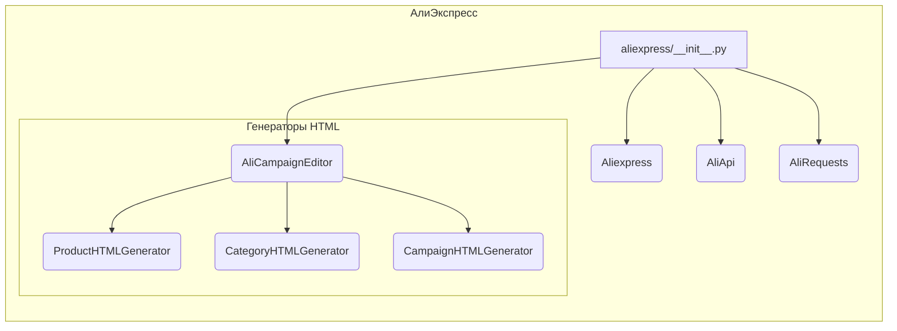

```MD
# Анализ кода hypotez/src/suppliers/aliexpress/__init__.py

## <input code>

```python
## \file hypotez/src/suppliers/aliexpress/__init__.py
# -*- coding: utf-8 -*-\

#! venv/bin/python/python3.12

"""
.. module: src.suppliers.aliexpress 
	:platform: Windows, Unix
	:synopsis:

"""


from .aliexpress import Aliexpress
from .aliapi import AliApi
from .alirequests import AliRequests
from .campaign import AliCampaignEditor
from .campaign.html_generators import ProductHTMLGenerator, CategoryHTMLGenerator, CampaignHTMLGenerator 
```

## <algorithm>

В данном файле определены импорты модулей, относящихся к поставщику AliExpress.  Нет явной пошаговой обработки данных, он скорее описывает структуру модулей.  Алгоритм состоит из определения константы `MODE` и импорта других модулей.


```mermaid
graph TD
    A[] --> B{Импорт Aliexpress};
    B --> C{Импорт AliApi};
    C --> D{Импорт AliRequests};
    D --> E{Импорт AliCampaignEditor};
    E --> F{Импорт ProductHTMLGenerator};
    F --> G{Импорт CategoryHTMLGenerator};
    G --> H{Импорт CampaignHTMLGenerator};
```

В примере, данные не перемещаются между функциями/классами, так как это файл инициализации пакета. Он определяет, какие компоненты доступны при импорте из `src.suppliers.aliexpress`.


## <mermaid>



## <explanation>

**Импорты:**

Файл `__init__.py` в папке `aliexpress` служит для импорта модулей и классов из других файлов внутри этой же папки.

*   `from .aliexpress import Aliexpress`: Импортирует класс `Aliexpress` из файла `aliexpress.py` в текущей папке.
*   `from .aliapi import AliApi`: Импортирует класс `AliApi` из файла `aliapi.py` в текущей папке.
*   `from .alirequests import AliRequests`: Импортирует класс `AliRequests` из файла `alirequests.py` в текущей папке.
*   `from .campaign import AliCampaignEditor`: Импортирует класс `AliCampaignEditor` из файла `campaign.py` в папке `campaign`.
*   `from .campaign.html_generators import ProductHTMLGenerator, CategoryHTMLGenerator, CampaignHTMLGenerator`: Импортирует классы генераторов HTML из папки `html_generators` внутри папки `campaign`.


**Классы:**

Классы `Aliexpress`, `AliApi`, `AliRequests`, `AliCampaignEditor`, `ProductHTMLGenerator`, `CategoryHTMLGenerator`, `CampaignHTMLGenerator` определены в других файлах (не показанных в предоставленном коде). Этот `__init__.py` файл просто делает их доступными для импорта в других частях проекта.


**Функции:**

В данном файле нет определений функций. Это файл инициализации, который импортирует другие модули и классы.


**Переменные:**

``: Переменная, которая, вероятно, используется для выбора режима работы (например, `dev` - для разработки, `prod` - для производства).


**Возможные ошибки или области для улучшений:**

*   Нет информации о реализации классов и методов, что затрудняет оценку их корректной работы.
*   Отсутствует документация для классов и методов, что может быть проблемой для других разработчиков, которые будут работать с кодом.
*   Файлы `aliexpress.py`, `aliapi.py`, `alirequests.py` и `campaign.py` должны быть в папке `hypotez/src/suppliers/aliexpress/`,  чтобы импорты работали корректно.
*   Убедитесь, что файлы, которые импортируются, существуют и содержат правильные определения классов.


**Взаимосвязи с другими частями проекта:**

Этот файл инициализации является частью проекта `hypotez`. Он определяет интерфейс для доступа к функциональности, связанной с обработкой данных с AliExpress.  Другие части проекта, вероятно, будут импортировать классы и функции из этого модуля для взаимодействия с API AliExpress.  Например,  модули, которые занимаются парсингом данных, или модули, которые используют API для публикации рекламных кампаний.