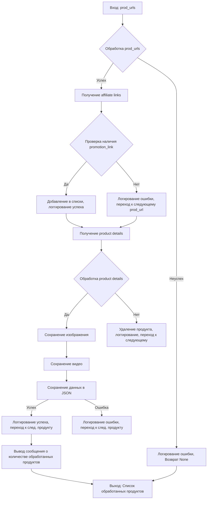

# Анализ кода `affiliated_products_generator.py`

## <input code>

```python
import asyncio
from itertools import count
from math import log
from pathlib import Path
from typing import List, Union, Optional
from types import SimpleNamespace
from urllib.parse import urlparse, parse_qs

from src import gs
from src.suppliers.aliexpress import AliApi
from src.suppliers.aliexpress import Aliexpress
from src.suppliers.aliexpress.affiliate_links_shortener_via_webdriver import AffiliateLinksShortener
from src.suppliers.aliexpress.utils.extract_product_id import extract_prod_ids
from src.suppliers.aliexpress.utils.set_full_https import ensure_https
from src.utils.convertor.csv2json import csv2dict
from src.utils.jjson import j_dumps
from src.utils import save_png_from_url, save_video_from_url
from src.utils.printer import pprint
from src.utils.file import read_text_file, save_text_file

from src.logger import logger
```

```python
class AliAffiliatedProducts(AliApi):
    """ Class to collect full product data from URLs or product IDs
    locator_description For more details on how to create templates for ad campaigns, see the section `Managing Aliexpress Ad Campaigns`
    @code
    # Example usage:
    prod_urls = ['123','456',...]
    prod_urls = ['https://www.aliexpress.com/item/123.html','456',...]

    parser = AliAffiliatedProducts(
                                campaign_name,
                                campaign_category,
                                language,
                                currency)

    products = parser._affiliate_product(prod_urls)
    @endcode
    """
    campaign_name: str
    campaign_category: Optional[str]
    campaign_path: Path
    language: str
    currency: str

    def __init__(self,
             campaign_name: str,
             campaign_category: Optional[str] = None,
             language: str = 'EN',
             currency: str = 'USD',
             *args, **kwargs):
        """
        @param campaign_name `str`: Name of the advertising campaign. The directory with the prepared material is taken by name.
        @param campaign_category `Optional[str]`: Category for the campaign (default None).
        @param language `str`: Language for the campaign (default 'EN').
        @param currency `str`: Currency for the campaign (default 'USD').
        @param tracking_id `str`: Tracking ID for Aliexpress API.
        """
        super().__init__(language, currency)

        self.campaign_name = campaign_name
        self.campaign_category = campaign_category
        self.language = language
        self.currency = currency
        self.locale = f"{self.language}_{self.currency}"
        self.campaign_path = gs.path.google_drive / 'aliexpress' / 'campaigns' / self.campaign_name / 'categories' / self.campaign_category
```

```python
def process_affiliate_products(self, prod_urls: List[str]) -> List[SimpleNamespace]:
    """
    Processes a list of URLs and returns a list of products with affiliate links and saved images.

    :param prod_urls: List of product URLs or IDs.
    :return: List of processed products.
    """
    ...
```

## <algorithm>

**Шаг 1:** Получение списка `prod_urls` (продуктов).

**Шаг 2:** Обработка списка:
   - для каждого `prod_url`:
       - получить аффилированный URL (`_link`) используя `super().get_affiliate_links(prod_url)`.
       - если аффилированный URL есть и содержит `promotion_link`, добавить `prod_url` и `promotion_link` в соответствующие списки. Выводить сообщение об успехе.
       - если аффилированный URL не найден или `promotion_link` отсутствует, выводить сообщение об ошибке в лог и переходить к следующему `prod_url`.
   - если ни один аффилированный URL не найден, выводить ошибку в лог и возвращать None.

**Шаг 3:** Получить детали продуктов (`_affiliate_products`) по списку обработанных `_prod_urls`.

**Шаг 4:** Обработка полученных деталей продуктов:
   - для каждого `product` и соответствующего `promotion_link` :
       - если `promotion_link` отсутствует:
           - парсить `product.promotion_link` для получения `aff_short_key`
           - если `aff_short_key` найден, перенастроить `product.promotion_link`
           - если `aff_short_key` не найден, удалить `product` из списка (`self.delete_product(product.product_id)`), логгировать ошибку и перейти к следующему продукту.
       - сохранить изображение (`product.product_main_image_url`) в `campaign_path`, обновить `product.local_saved_image`.
       - если есть видео (`product.product_video_url`), сохранить видео в `campaign_path`, обновить `product.local_saved_video`.
       - сохранить данные продукта (`product`) в JSON формате в `campaign_path` используя `j_dumps`. Выводить сообщение об успехе.
       - если сохранение в JSON не удалось, выводить предупреждение в лог и перейти к следующему продукту.
   - Вывести сообщение об общем количестве обработанных продуктов.
   - вернуть список обработанных продуктов `_affiliate_products`.


## <mermaid>



## <explanation>

### Импорты

Импортируются стандартные библиотеки Python (asyncio, itertools, math, pathlib, typing, types, urllib.parse) и сторонние библиотеки (gs, AliApi, Aliexpress, AffiliateLinksShortener, extract_prod_ids, ensure_https, csv2dict, j_dumps, save_png_from_url, save_video_from_url, pprint, read_text_file, save_text_file, logger). Импорты из `src` указывают на внутренние модули проекта, что позволяет вызывать функции и классы из других частей проекта.

### Классы

* **`AliAffiliatedProducts`**: Наследует от `AliApi`, отвечая за сбор полных данных о продуктах с AliExpress Affiliate API.
    * **Атрибуты:** `campaign_name`, `campaign_category`, `campaign_path`, `language`, `currency` хранят параметры кампании и пути для сохранения данных.
    * **Метод `__init__`:** Инициализирует объект, вызывая конструктор родительского класса `AliApi` и устанавливая параметры кампании.
    * **Метод `process_affiliate_products`**: Обрабатывает список URL или ID продуктов, извлекает аффилированные ссылки, сохраняет изображения и видео, и сохраняет данные продукта в формате JSON на диске.
    * **Метод `delete_product`**: Удаляет продукт из списка, если он не имеет аффилированной ссылки.

### Функции

* **`process_affiliate_products`:** Извлекает данные продуктов, сохраняет их и логирует результаты, обрабатывая списки URL и возвращая обработанные данные.
* **`delete_product`:**  Удаляет данные о продукте, если не удалось получить аффилированную ссылку.
* Функции из `src.utils`, `src.utils.convertor`, `src.logger`  - это вспомогательные функции, например для работы с файлами, изображениями, видео и логированием.

### Переменные

Типы переменных (например, `List[str]`, `SimpleNamespace`) указаны в документации, определяя ожидаемые типы данных.

### Возможные ошибки и улучшения

* **Недостаточная обработка ошибок:**  Код не полностью обрабатывает все возможные исключения (например, проблемы с сетью, некорректные URL).  Нужно добавить более глубокую обработку ошибок, включая логирование подробностей об ошибках.
* **Асинхронность:**  Для ускорения обработки большого количества продуктов рекомендуется использовать асинхронные запросы (asyncio).
* **Документация:** Некоторые методы могли бы иметь более подробную документацию для лучшего понимания их функциональности.
* **Обработка отсутствия аффилированных ссылок:** Улучшить обработку случаев, когда у продукта нет аффилированной ссылки.


### Взаимосвязи с другими частями проекта

`AliAffiliatedProducts` использует классы и функции из модулей `src.suppliers.aliexpress` (например, `AliApi`, `AffiliateLinksShortener`), `src.utils` (для работы с изображениями, видео и JSON) и `src.logger` (для логирования).  Также существуют зависимости от функций `src.utils.file`, `src.utils.convertor`.  Эти зависимости показывают, что `AliAffiliatedProducts` взаимодействует с другими частями проекта, отвечающими за аффилированную базу, хранение данных и логирование.