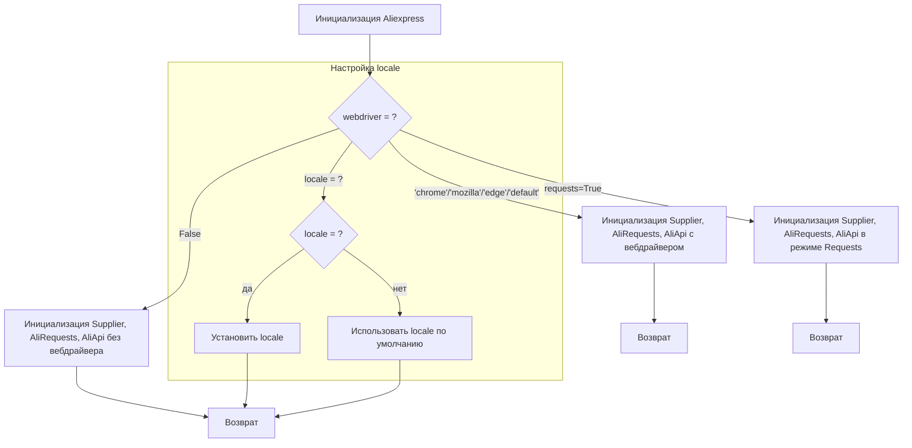
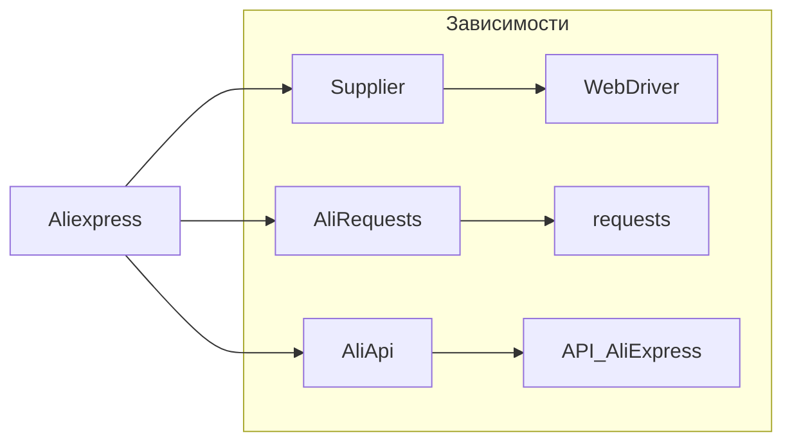

```MD
# Анализ кода модуля aliexpress

## <input code>

```rst
.. module:: src.suppliers.aliexpress
```

```
# Модуль Aliexpress

## Обзор

Модуль `aliexpress` предоставляет класс `Aliexpress`, который интегрирует функциональность из классов `Supplier`, `AliRequests` и `AliApi` для работы с AliExpress. Он предназначен для выполнения задач, связанных с парсингом и взаимодействием с API AliExpress.

## Оглавление

- [Модуль Aliexpress](#модуль-aliexpress)
- [Класс Aliexpress](#класс-aliexpress)
  - [Метод __init__](#метод-__init__)

## Класс Aliexpress

### `Aliexpress`

**Описание**: Базовый класс для работы с AliExpress. Объединяет возможности классов `Supplier`, `AliRequests` и `AliApi` для удобного взаимодействия с AliExpress.

**Примеры использования**:

```python
# Запуск без вебдрайвера
a = Aliexpress()

# Вебдрайвер Chrome
a = Aliexpress('chrome')

# Режим Requests
a = Aliexpress(requests=True)
```

### Метод `__init__`

**Описание**: Инициализирует класс `Aliexpress`.

**Параметры**:

- `webdriver` (bool | str, optional): Определяет режим использования вебдрайвера. Возможные значения:
  - `False` (по умолчанию): Без вебдрайвера.
  - `'chrome'`: Вебдрайвер Chrome.
  - `'mozilla'`: Вебдрайвер Mozilla.
  - `'edge'`: Вебдрайвер Edge.
  - `'default'`: Системный вебдрайвер по умолчанию.
- `locale` (str | dict, optional): Настройки языка и валюты. По умолчанию `{'EN': 'USD'}`.
- `*args`: Дополнительные позиционные аргументы.
- `**kwargs`: Дополнительные именованные аргументы.

**Примеры**:

```python
# Запуск без вебдрайвера
a = Aliexpress()

# Вебдрайвер Chrome
a = Aliexpress('chrome')
```

**Возвращает**: Не возвращает значения.

**Вызывает исключения**: Возможны исключения, связанные с инициализацией вебдрайвера или ошибки при взаимодействии с AliExpress.

# <алгоритм>



## <mermaid>



## <explanation>

**Импорты**:
Отсутствуют явные импорты в данном фрагменте. Директива `.. module:: src.suppliers.aliexpress` указывает, что это модуль в пакете `src.suppliers`, что предполагает наличие файлов `Supplier.py`, `AliRequests.py`, `AliApi.py` в структуре проекта.

**Классы**:
- **`Aliexpress`**: Этот класс является основным интерфейсом для взаимодействия с AliExpress. Он использует и объединяет функциональность классов `Supplier`, `AliRequests`, и `AliApi`, делегируя им конкретные задачи, например, взаимодействие с API или веб-драйвером.


**Функции**:
- **`__init__`**: Конструктор класса `Aliexpress`.  Он принимает опциональные параметры `webdriver`, `locale`, `*args` и `**kwargs` для настройки поведения.  В зависимости от значения `webdriver` создаются экземпляры `Supplier`, `AliRequests` и `AliApi`. Параметры `*args` и `**kwargs` могут быть переданы в конструкторы этих внутренних классов.  Настройка `locale` (языка и валюты) производится, если он передан.


**Переменные**:
- `webdriver`: Определяет, будет ли использоваться веб-драйвер и какой.
- `locale`: Настройки языка и валюты.

**Возможные ошибки/улучшения**:
- **Обработка ошибок**: Отсутствует явное описание обработки возможных исключений (например, проблем с инициализацией вебдрайвера или ошибками при работе с API AliExpress). Нужно добавить блоки `try...except` для обработки этих ситуаций.
- **Детали реализации**:  Код документации не показывает, как `Aliexpress` обрабатывает дополнительные аргументы (`*args`, `**kwargs`). Необходимо более подробно описать, как эти аргументы передаются и используются внутренними классами.
- **Модульное тестирование**: Отсутствует информация о модульном тестировании, что затруднит проверку работы модуля и позволит быстрее найти ошибки.

**Связь с другими компонентами проекта**:
Модуль `aliexpress` зависит от классов `Supplier`, `AliRequests`, `AliApi`, а также от библиотек, предоставляющих возможность взаимодействия с веб-драйверами (например, Selenium) и API-запросами (например, requests).  Эти зависимости должны быть установлены в среде проекта.