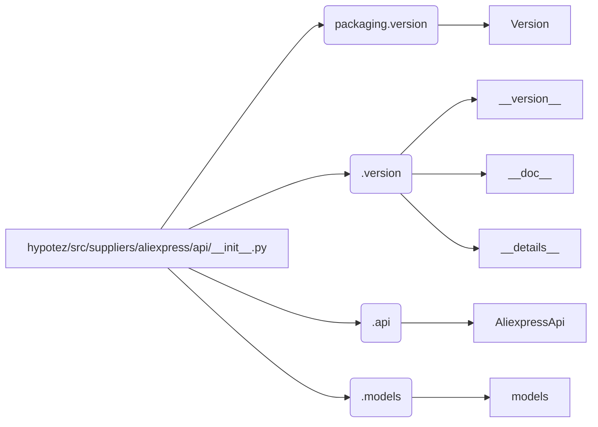

# <input code>

```python
## \file hypotez/src/suppliers/aliexpress/api/__init__.py
# -*- coding: utf-8 -*-
#! venv/Scripts/python.exe # <- venv win
## ~~~~~~~~~~~~~
""" module: src.suppliers.aliexpress.api """
""" Aliexpress API wrapper"""
...

...
from packaging.version import Version
from .version import __version__, __doc__, __details__  
from .api import AliexpressApi
from . import models
```

# <algorithm>

В данном коде показан фрагмент модуля `__init__.py` для пакета `aliexpress` внутри проекта `hypotez`. Алгоритм работы в данном случае не предполагает  выполнения какого-либо действия, а скорее определяет импортируемые элементы и устанавливает зависимости.  Нет циклов, условных операторов, или вызовов функций.

Нет логической последовательности обработки данных, которая могла бы быть изображена в виде блок-схемы, так как здесь всего лишь производится импорт.

# <mermaid>



**Объяснение диаграммы:**

* **hypotez/src/suppliers/aliexpress/api/__init__.py:** Модуль, инициализирующий пакет `aliexpress`.
* **packaging.version:** Пакет для работы с версиями.
* **.version:** Модуль внутри пакета `aliexpress/api`, содержащий информацию о версии.
* **.api:** Модуль внутри пакета `aliexpress/api`, содержащий класс `AliexpressApi`.
* **.models:** Модуль внутри пакета `aliexpress/api`, содержащий модели данных.

Диаграмма демонстрирует, как модуль `__init__.py` импортирует необходимые компоненты из других модулей внутри пакета `aliexpress/api` и внешней библиотеки `packaging`.

# <explanation>

**Импорты:**

* `from packaging.version import Version`: Импортирует класс `Version` из пакета `packaging.version`.  Этот импорт нужен для работы с версиями, вероятно, для проверки версий или обработки информации о версиях.
* `from .version import __version__, __doc__, __details__`: Импортирует переменные `__version__`, `__doc__`, и `__details__` из модуля `.version` внутри того же пакета. Эти переменные, скорее всего, содержат информацию о версии, документацию и дополнительные данные модуля или пакета.  Это стандартный способ организации метаданных о пакете Python.
* `from .api import AliexpressApi`: Импортирует класс `AliexpressApi` из модуля `.api` внутри пакета. Это, скорее всего, класс, представляющий API AliExpress.
* `from . import models`: Импортирует модуль `models` из пакета. Вероятно, `models` содержит классы, представляющие данные, используемые для работы с API.

**Классы:**

* `AliexpressApi`: Класс, представляющий API AliExpress.  Детали реализации (атрибуты и методы) не показаны в данном фрагменте кода, но он, вероятно, содержит методы для взаимодействия с API (например, для запроса данных, авторизации).

**Функции:**

В этом фрагменте кода нет функций, только импорты.

**Переменные:**

Нет переменных, объявленных в данном фрагменте кода.

**Возможные ошибки и улучшения:**

* Не указано содержимое `...`.  Недостаточно кода для полного понимания и анализа.
* Рекомендуется добавить документацию (docstrings) к импортируемым классам и переменным, чтобы пояснить их назначение и использование.
* Необходимо указать, какая версия Python используется и какие внешние библиотеки необходимы для работы кода (для обеспечения воспроизводимости).

**Взаимосвязь с другими частями проекта:**

Данный модуль является частью пакета `aliexpress`, который предполагает взаимодействие с API AliExpress, а следовательно, с кодом, который делает запросы и обрабатывает ответы.  Он, вероятно, связан с другими частями приложения, например, с модулями, осуществляющими загрузку или обработку данных, полученных от API.  `models` вероятно содержат классы для хранения и обработки данных, полученных с API.

**Важно:** Без остальной части кода сложно дать более подробное объяснение и возможные улучшения.