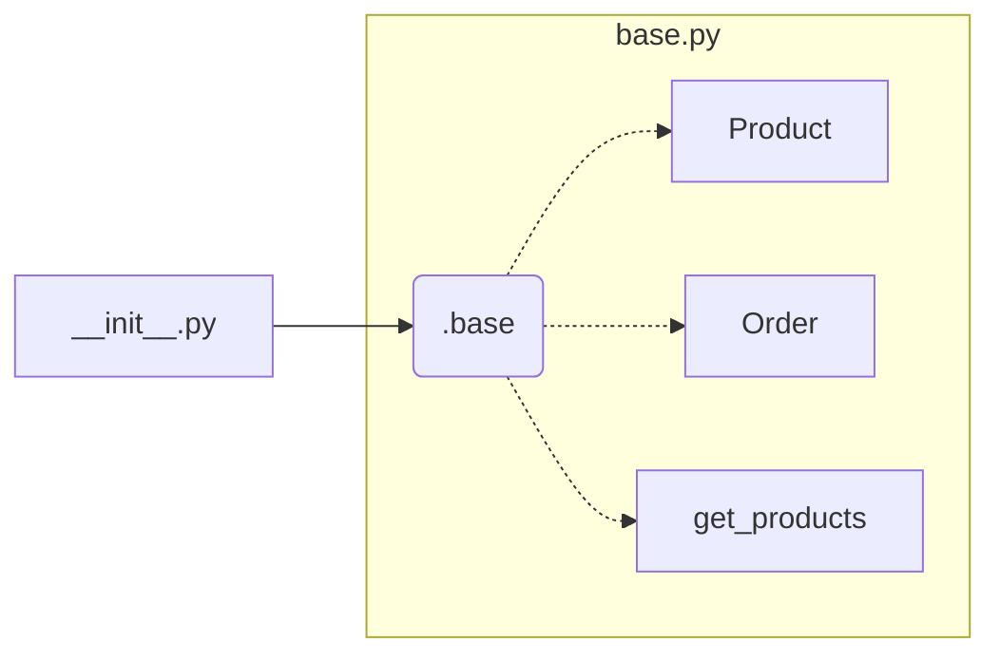

```MD
# Анализ кода из hypotez/src/suppliers/aliexpress/api/_examples/iop/__init__.py

**1. <input code>**

```python
## \file hypotez/src/suppliers/aliexpress/api/_examples/iop/__init__.py
# -*- coding: utf-8 -*-
 # <- venv win
## ~~~~~~~~~~~~~\
""" module: src.suppliers.aliexpress.api._examples.iop """
from .base import *
```

**2. <algorithm>**

Этот код представляет собой импорт всего содержимого из модуля `hypotez/src/suppliers/aliexpress/api/_examples/iop/base.py`.  Поскольку он просто импортирует все, алгоритм в данном фрагменте кода заключается в импорте. Нет шагов, данных или перемещения данных между функциями/классами.

**Пример:**

Если в `base.py` есть классы `Product`, `Order` и функция `get_products()`, этот код сделает их доступными в текущем файле (`__init__.py`).

**3. <mermaid>**



**Описание диаграммы:**

* **__init__.py:** Модуль, в котором находится код.
* **.base:** Модуль `base.py`. Стрелка указывает на то, что __init__.py импортирует из него всё.
* **Product, Order, get_products:** Предполагаемые классы и функция из `base.py`, которые будут доступны в `__init__.py`.


**4. <explanation>**

* **Импорты:**  Код импортирует всё из модуля `base.py`.  Символ `*` в `from .base import *` указывает на импорт всех определённых элементов (классов, функций, переменных) из модуля `base`.  Это значит, что все имена, определённые в `base.py`, теперь доступны в текущем файле `__init__.py` без необходимости указывать их явно.  Предполагается, что `base.py` содержит классы, функции или переменные, необходимые для работы с API AliExpress.  Связь с другими частями проекта косвенная,  через `base.py`, которое, вероятно, содержит реализацию API AliExpress (возможно, через другие модули или библиотеки).

* **Классы:**  Классы `Product`, `Order` и др. (если они есть в `base.py`) станут доступны для использования в `__init__.py`.

* **Функции:** Функции из `base.py` тоже станут доступными.

* **Переменные:**  Переменные из `base.py` станут доступными.

* **Возможные ошибки или области для улучшений:**
    * Использование `*` для импорта может привести к проблемам с именами, если в `__init__.py` и `base.py` есть переменные или функции с одинаковыми именами. В таких случаях стоит использовать явные импорты (`from .base import Product, get_products`).
    * Возможно, стоит добавить явную документацию в `__init__.py` для указания того, какие элементы будут импортированы. Это упростило бы использование кода и понимание его структуры.

**Цепочка взаимосвязей:**

`__init__.py` -> `base.py` (импорт) ->  (возможно) другие модули, содержащие API реализации или данные.  Эта цепочка показывает, что `__init__.py` зависит от `base.py`, который, вероятно, зависит от других модулей для работы с API.