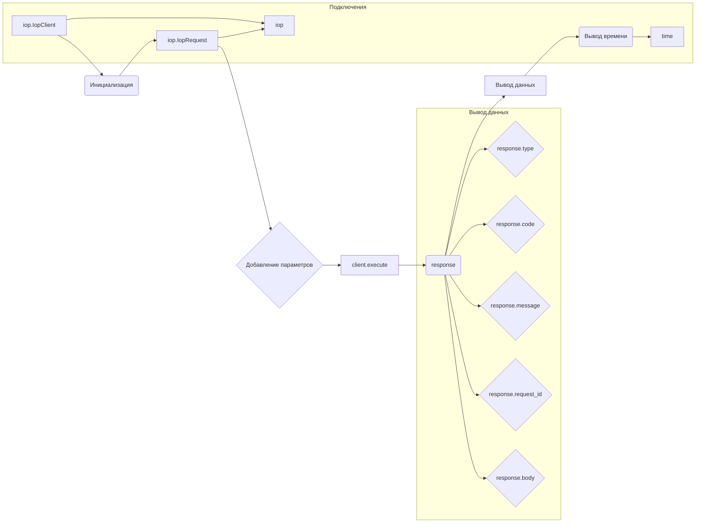

# <input code>

```python
## \file hypotez/src/suppliers/aliexpress/api/_examples/iop/test_internal.py
# -*- coding: utf-8 -*-\
#! venv/Scripts/python.exe # <- venv win
## ~~~~~~~~~~~~~\
""" module: src.suppliers.aliexpress.api._examples.iop """
"""   [File's Description]

 
 @section libs imports:
  - iop 
  - time 
Author(s):
  - Created by Davidka on 09.11.2023 .
"""


import iop
import time

# params 1 : gateway url
# params 2 : appkey
# params 3 : appSecret
client = iop.IopClient('https://api-pre.taobao.tw/rest', '100240', 'hLeciS15d7UsmXKoND76sBVPpkzepxex')
# client.log_level = iop.P_LOG_LEVEL_DEBUG
# create a api request set GET mehotd
# default http method is POST
request = iop.IopRequest('/product/item/get', 'GET')

# simple type params ,Number ,String
request.add_api_param('itemId','157432005')
request.add_api_param('authDO', '{\\"sellerId\\":2000000016002}')

response = client.execute(request)
#response = client.execute(request,access_token)

# response type nil,ISP,ISV,SYSTEM
# nil ：no error
# ISP : API Service Provider Error
# ISV : API Request Client Error
# SYSTEM : Iop platform Error
print(response.type)

# response code, 0 is no error
print(response.code)

# response error message
print(response.message)

# response unique id
print(response.request_id)

# full response
print(response.body)

print(str(round(time.time())) + '000')
```

# <algorithm>

**Шаг 1:** Импортирует модули `iop` и `time`.

**Шаг 2:** Инициализирует объект `IopClient` с указанными параметрами:

*   `gateway_url` - URL API.
*   `app_key` - Ключ приложения.
*   `app_secret` - Секрет приложения.

**Шаг 3:** Создаёт объект `IopRequest` для запроса типа GET к endpoint `/product/item/get`.

**Шаг 4:** Добавляет параметры запроса (`itemId`, `authDO`) к объекту `request`.

**Шаг 5:** Выполняет запрос к API, используя метод `execute` объекта `client` и передаёт в качестве аргумента объект `request`. Результат сохраняется в переменной `response`.

**Шаг 6:** Выводит тип результата (`response.type`), код (`response.code`), сообщение об ошибке (`response.message`), уникальный идентификатор запроса (`response.request_id`) и тело ответа (`response.body`).

**Шаг 7:** Выводит отформатированное значение текущего времени.

**Пример данных:**

*   Входные данные: `gateway_url`, `app_key`, `app_secret`, `/product/item/get`, `itemId=157432005`, `authDO={"sellerId":2000000016002}`.
*   Выходные данные: `response.type`, `response.code`, `response.message`, `response.request_id`, `response.body` (ответ от API).


# <mermaid>



# <explanation>

**Импорты:**

*   `import iop`: Импортирует модуль `iop`, который, судя по коду, содержит API-клиент для работы с определённым API. Вероятно, `iop` является собственным модулем проекта, либо внешней библиотекой, интегрированной в проект. `src` - это, вероятно, директория, содержащая собственные модули.

*   `import time`: Импортирует модуль `time` для работы со временем. Стандартный модуль Python.

**Классы:**

*   `IopClient`: Представляет клиент для взаимодействия с API.  Атрибуты: `gateway_url`, `app_key`, `app_secret` и, вероятно, другие настройки для взаимодействия с API. Методы: `execute` для выполнения запросов к API.

*   `IopRequest`: Представляет запрос к API.  Атрибуты: endpoint, метод запроса (`GET` в данном случае), и, вероятно, другие параметры запроса. Методы: `add_api_param` для добавления параметров запроса.

**Функции:**

*   В данном примере нет самостоятельных функций.

**Переменные:**

*   `client`: Объект `IopClient`, используемый для отправки запросов к API.
*   `request`: Объект `IopRequest`, описывающий запрос.
*   `response`: Объект, содержащий результат выполнения запроса.

**Возможные ошибки и улучшения:**

*   Нет обработки ошибок. Если API вернёт ошибку, код просто выведет соответствующее сообщение, без дополнительной обработки. Необходимо добавить обработку исключений (try...except блоки).
*   Нет проверки валидности данных, полученных от API.  Необходимо добавить проверку на корректность типа возвращаемых данных.
*   `access_token` -  Обработка `access_token` отсутствует. Если запрос требует аутентификации с помощью `access_token`, то его необходимо включить в запрос `client.execute`.
*   Отсутствует логирование. Для отладки и мониторинга полезно добавлять логирование (например, с использованием модуля `logging`).
*   Константы для уровней логов могли бы быть определены для лучшей читаемости.

**Цепочка взаимосвязей:**

Код использует библиотеку `iop`, которая, вероятно, предоставляет функциональность для взаимодействия с внешним API.  Этот код является примером использования этой библиотеки.  Цепочка взаимосвязей: `src.suppliers.aliexpress.api._examples.iop` -> `iop` -> API (внешний сервис).