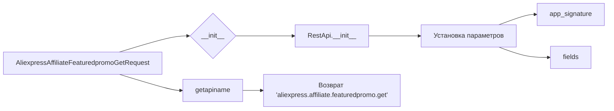

```MD
# Анализ кода AliexpressAffiliateFeaturedpromoGetRequest.py

**1. <input code>**

```python
## \file hypotez/src/suppliers/aliexpress/api/_examples/rest/AliexpressAffiliateFeaturedpromoGetRequest.py
# -*- coding: utf-8 -*-
 # <- venv win
## ~~~~~~~~~~~~
""" module: src.suppliers.aliexpress.api._examples.rest """

'''
Created by auto_sdk on 2020.09.25
'''
from ..base import RestApi
class AliexpressAffiliateFeaturedpromoGetRequest(RestApi):
	def __init__(self, domain="api-sg.aliexpress.com", port=80):
		RestApi.__init__(self,domain, port)
		self.app_signature = None
		self.fields = None

	def getapiname(self):
		return 'aliexpress.affiliate.featuredpromo.get'
```

**2. <algorithm>**

Код представляет собой определение класса `AliexpressAffiliateFeaturedpromoGetRequest`, который наследуется от класса `RestApi`.  Пошаговая блок-схема отсутствует, так как класс лишь определяет интерфейс для запроса, но не реализует логику выполнения.

**Пример данных:**

* `domain`: "api-sg.aliexpress.com"
* `port`: 80

**3. <mermaid>**



**Описание зависимости:**

Класс `AliexpressAffiliateFeaturedpromoGetRequest` использует базовый класс `RestApi`, который, скорее всего, определен в `hypotez/src/suppliers/aliexpress/api/base.py`.  Связь - наследование.


**4. <explanation>**

* **Импорты:**
    `from ..base import RestApi`: Импортирует класс `RestApi` из модуля `base`, который находится в родительском каталоге относительно текущего файла (`..`).  Это указывает на иерархию модулей и подразумевает, что `RestApi` предоставляет базовые методы и атрибуты для работы с API.

* **Классы:**
    `AliexpressAffiliateFeaturedpromoGetRequest`:  Этот класс предназначен для создания и отправки запроса к API AliExpress для получения информации о *featured promo*. Он наследуется от `RestApi`, что предполагает, что `RestApi` содержит общие методы для работы с API (например, формирование запроса, обработка ответов).

* **Методы:**
    `__init__(self, domain="api-sg.aliexpress.com", port=80)`: Конструктор класса.  Инициализирует атрибуты `self.domain` и `self.port`. Также вызывает конструктор родительского класса `RestApi`, передавая ему те же параметры.  `self.app_signature` и `self.fields`  —  пустые атрибуты, которые, вероятно, будут заполняться позже для создания запроса.  Это важные атрибуты, необходимые для корректной работы с API (например, подпись приложения и параметры запроса).
    `getapiname(self)`: Возвращает строку 'aliexpress.affiliate.featuredpromo.get'. Это имя API-метода, к которому необходимо обратиться.

* **Функции**: Класс содержит методы, а не функции.

* **Переменные**:
    `domain`, `port`:  строка и целое число, задающие параметры подключения к API.  Они являются атрибутами класса.
    `app_signature`, `fields`: атрибуты класса, скорее всего, используемые для хранения информации, необходимой для формирования запроса к API.


**Возможные ошибки/улучшения:**

* Нет реализации логики формирования и отправки запроса. Класс только определяет интерфейс. Необходима реализация методов, которые отправляют запрос и обрабатывают полученные данные.
*  Отсутствует проверка валидности параметров `domain` и `port`.
* Необходимо определить, как будут храниться данные, полученные от API.
* Отсутствуют комментарии к коду.

**Цепочка взаимосвязей:**

`AliexpressAffiliateFeaturedpromoGetRequest` -> `RestApi` ->  (вероятно) другие классы для обработки данных API (например, для формирования запросов, отправки/получения данных и парсинга).  Связь между этими классами осуществляется через наследование и вызов методов.


```