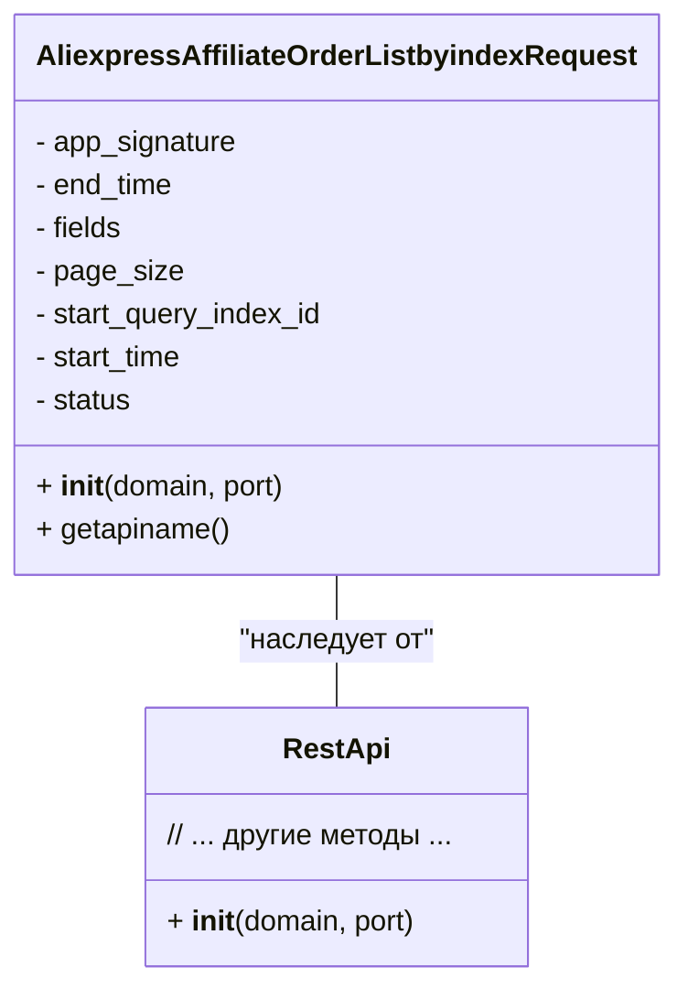

```MD
# Анализ кода AliexpressAffiliateOrderListbyindexRequest.py

1. **<input code>**:

```python
## \file hypotez/src/suppliers/aliexpress/api/_examples/rest/AliexpressAffiliateOrderListbyindexRequest.py
# -*- coding: utf-8 -*-\
#! venv/Scripts/python.exe # <- venv win
## ~~~~~~~~~~~~~\
""" module: src.suppliers.aliexpress.api._examples.rest """
'''
Created by auto_sdk on 2021.05.10
'''
from ..base import RestApi
class AliexpressAffiliateOrderListbyindexRequest(RestApi):
	def __init__(self, domain="api-sg.aliexpress.com", port=80):
		RestApi.__init__(self,domain, port)
		self.app_signature = None
		self.end_time = None
		self.fields = None
		self.page_size = None
		self.start_query_index_id = None
		self.start_time = None
		self.status = None

	def getapiname(self):
		return 'aliexpress.affiliate.order.listbyindex'
```

2. **<algorithm>**:

```mermaid
graph TD
    A[__init__(domain, port)] --> B{Инициализация self.app_signature, self.end_time, ...};
    B --> C[RestApi.__init__(domain, port)];
    C --> D[Возвращение экземпляра класса];
    E[getapiname()] --> F[Возвращение 'aliexpress.affiliate.order.listbyindex'];
```

Пример:

Если вызвать `AliexpressAffiliateOrderListbyindexRequest("api-us.aliexpress.com", 8080)`:
1. Вызов `__init__` создаёт экземпляр класса `AliexpressAffiliateOrderListbyindexRequest`.
2. `RestApi.__init__` инициализирует общие параметры API, например, соединение с сервером.
3. Переменные класса (self.app_signature, self.end_time, и т.д.) устанавливаются в `None`.
4. Метод `getapiname` возвращает строку `'aliexpress.affiliate.order.listbyindex'`.


3. **<mermaid>**:



**Объяснение диаграммы:**

Диаграмма `classDiagram` показывает, что класс `AliexpressAffiliateOrderListbyindexRequest` наследуется от класса `RestApi`. Пунктирная стрелка указывает на наследование.  Класс `RestApi`  содержит общие методы для работы с API, а `AliexpressAffiliateOrderListbyindexRequest` переопределяет метод `getapiname()` для получения имени API-метода.

4. **<explanation>**:

* **Импорты:** `from ..base import RestApi` импортирует базовый класс `RestApi` из папки `base`, которая находится в папке `../`. Это указывает на то, что код использует абстрактный базовый класс для работы с REST API.

* **Классы:**
    * `AliexpressAffiliateOrderListbyindexRequest`: Этот класс предназначен для взаимодействия с API AliExpress для получения списка заказов по определенным параметрам. Он наследует общую логику взаимодействия с API от базового класса `RestApi`.
    * `RestApi`: Базовый класс для работы с REST API, который, вероятно, содержит методы для запросов, обработки ответов, валидации параметров и т.д.  Непосредственный код класса `RestApi` не представлен, но подразумевается, что он существует в папке `hypotez/src/suppliers/aliexpress/api/base`.

* **Функции:**
    * `__init__(self, domain="api-sg.aliexpress.com", port=80)`: Конструктор класса. Инициализирует атрибуты класса, принимая домен и порт для подключения к API.  Также вызывает конструктор родительского класса.  Это важная часть класса, так как она устанавливает начальные значения для переменных, которые будут использованы другими методами класса.
    * `getapiname(self)`: Возвращает строку `'aliexpress.affiliate.order.listbyindex'`, которая представляет собой имя метода API AliExpress для получения списка заказов.

* **Переменные:**
    * Все переменные `self.app_signature`, `self.end_time`, `self.fields`, `self.page_size`, `self.start_query_index_id`, `self.start_time`, `self.status` являются атрибутами класса `AliexpressAffiliateOrderListbyindexRequest`. Они используются для хранения параметров запроса к API AliExpress. Их значения должны быть установлены перед использованием метода `getapiname()`.

* **Возможные ошибки/улучшения:**
    * Код не содержит никакой реализации для обработки запроса к API или получения данных.  Он только определяет, как создать запрос, но не как выполнить его.  Необходимо добавить логику для выполнения запроса и обработки ответа.
    * Не определены типы данных для атрибутов.  Указание типов (например, `self.page_size: int`) улучшит читаемость и позволит статической проверке кода выявлять возможные ошибки.
    * Отсутствует обработка ошибок.  Если запрос к API провалится, то это не будет обработано. Необходимо добавить обработку исключений (например, `try...except` блоки).


**Цепочка взаимосвязей:**

`AliexpressAffiliateOrderListbyindexRequest` использует `RestApi`, который, вероятно, взаимодействует с другими компонентами для работы с HTTP запросами (например, библиотекой `requests`).  Также этот класс напрямую связан с API AliExpress, для которого нужно понимать документацию и использовать корректные параметры.