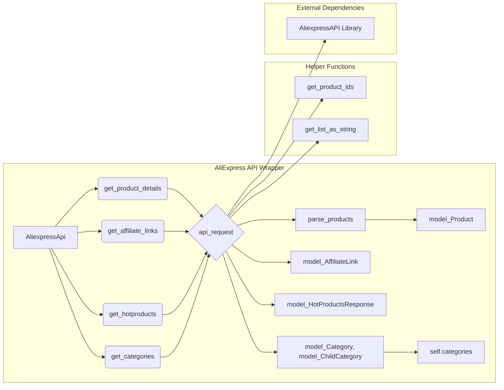

# <input code>

```python
## \file hypotez/src/suppliers/aliexpress/api/api.py
# -*- coding: utf-8 -*-\
 # <- venv win
## ~~~~~~~~~~~~~\
""" module: src.suppliers.aliexpress.api """
""" AliExpress API wrapper for Python
A simple Python wrapper for the AliExpress Open Platform API. This module allows
to get product information and affiliate links from AliExpress using the official
API in an easier way.
"""
...

...

from typing import List, Union

from src.logger import logger
from src.utils.printer import pprint

from .models import (
                    AffiliateLink as model_AffiliateLink,
                    Category as model_Category,
                    ChildCategory as model_ChildCategory,
                    Currency as model_Currency,
                    HotProductsResponse as model_HotProductsResponse,
                    Language as model_Language,
                    LinkType as model_LinkType,
                    Product as model_Product,
                    ProductType as model_ProductType,
                    SortBy as model_SortBy)

from .errors.exceptions import CategoriesNotFoudException
from .helpers.categories import filter_child_categories, filter_parent_categories
from .skd import setDefaultAppInfo
from .skd import api as aliapi
from .errors import ProductsNotFoudException, InvalidTrackingIdException
from .helpers import api_request, parse_products, get_list_as_string, get_product_ids


class AliexpressApi:
    """Provides methods to get information from AliExpress using your API credentials.

    @param key (str): Your API key.
    @param secret (str): Your API secret.
    @param language (str): Language code. Defaults to EN.
    @param currency (str): Currency code. Defaults to USD.
    @param tracking_id (str): The tracking id for link generator. Defaults to None.
    """

    def __init__(self,
        key: str,
        secret: str,
        language: model_Language,
        currency: model_Currency,
        tracking_id: str = None,
        app_signature: str = None,
        **kwargs):
        self._key = key
        self._secret = secret
        self._tracking_id = tracking_id
        self._language = language
        self._currency = currency
        self._app_signature = app_signature
        self.categories = None
        setDefaultAppInfo(self._key, self._secret)


    # ... (other methods)
```

# <algorithm>

The code defines a class `AliexpressApi` that provides methods for interacting with the AliExpress API.  A simplified block diagram would show:

1. **Initialization (`__init__`)**: Takes API key, secret, language, currency, and optional tracking ID as input. Stores these values in instance variables. Calls `setDefaultAppInfo` to initialize the AliExpress API library with the key and secret.

2. **`retrieve_product_details`**:
   - Takes product IDs as input.
   - Preprocesses the input to a string format.
   - Constructs an API request (`AliexpressAffiliateProductdetailGetRequest`). Sets parameters like `product_ids`, `language`, and `currency`.
   - Calls `api_request` to send the request to the API.
   - Parses the response using `parse_products`.
   - Returns a list of `model_Product` objects if successful, or potentially `None`.  Error handling is included (logging warnings).

3. **`get_affiliate_links`**:
   - Checks for the presence of the `tracking_id`. If not present, logs an error and returns `None`.
   - Converts the input list of links to a string.
   - Constructs an API request (`AliexpressAffiliateLinkGenerateRequest`). Sets parameters like `links`, `link_type`, and `tracking_id`.
   - Calls `api_request` to send the request to the API.
   - Checks the response for success. If the total_result_count is greater than 0 returns a list of `model_AffiliateLink` objects. Error handling is included (logging warnings).

4. **`get_hotproducts`**:
   - Takes filtering parameters (e.g., category IDs, price ranges).
   - Constructs an API request (`AliexpressAffiliateHotproductQueryRequest`), setting parameters.
   - Sends the request using `api_request`.
   - Parses the response, extracting product data.
   - Returns a `model_HotProductsResponse` object, which contains the products. Error handling is included (raising exception).


5. **`get_categories`**:
   - Constructs an API request (`AliexpressAffiliateCategoryGetRequest`).
   - Calls `api_request` to fetch categories.
   - Stores retrieved categories in `self.categories`.
   - Returns a list of `model_Category` and `model_ChildCategory` objects on success. Error handling is included (raising an exception).

6. **`get_parent_categories`**:
   - Optionally retrieves categories using `self.get_categories`.
   - Filters the categories to return only parent categories using `filter_parent_categories`.

7. **`get_child_categories`**:
   - Optionally retrieves categories using `self.get_categories`.
   - Filters the categories to return only child categories for the specified parent using `filter_child_categories`.


Data flows:
- Input parameters are passed to methods, which then create and send API requests.
- Responses from API calls are parsed into specific data models (e.g., `model_Product`).
- Retrieved data is returned from the methods or stored in `self.categories` for later use.


# <mermaid>



# <explanation>

- **Imports**:
    - `src.logger`: Provides logging functionality for the application (likely within the `src` package).
    - `src.utils.printer`: Likely a custom utility for pretty printing output, also in `src`.
    - `*.models`: Define data models for the AliExpress API response data (e.g., `model_Product`). Located in `./models`.
    - `*.errors.exceptions`: Contains custom exception types for specific errors that might occur during API interaction. Located in `./errors/exceptions`.
    - `*.helpers.categories`: Functions for filtering categories. Located in `./helpers/categories`.
    - `*.skd`: Likely a sub-package containing AliExpress API library specifications (`setDefaultAppInfo`). Located in `./skd`.
    - `*.errors`: Additional error handling.
    - `*.helpers`: Helper functions (`api_request`, `parse_products`, etc.).

- **Classes**:
    - `AliexpressApi`: A class that wraps the AliExpress API interaction. It stores API credentials, the results of category queries, and other data relevant to the interactions. Methods provide different API requests.

- **Functions**:
    - `__init__`: Initializes the `AliexpressApi` object with required parameters (API key, secret, language, currency, etc.).  `setDefaultAppInfo` initializes the external AliExpress API library.
    - `retrieve_product_details`, `get_affiliate_links`, `get_hotproducts`: These methods handle different types of API queries to AliExpress, all utilizing the `api_request` method to communicate. They each take different parameters relevant to the API request they are making.
    - `get_categories`, `get_parent_categories`, `get_child_categories`: These methods deal with retrieving category information. `get_categories` fetches all categories, caching them for use by `get_parent_categories` and `get_child_categories`.
    - `filter_parent_categories`, `filter_child_categories`: Helper functions for category filtering.


- **Variables**:
    - `_key`, `_secret`, `_tracking_id`, `_language`, `_currency`: Instance variables storing API credentials and other settings.
    - `categories`: A cached instance variable to hold category information, to avoid repeated API calls to get the same categories.


- **Possible Errors/Improvements**:
    - **Error Handling:** While the code includes error logging, it's more robust to raise exceptions instead of relying solely on logging. `try...except` blocks could be more specific about the exceptions they're catching to prevent swallowing unexpected errors.  Consider using `ProductsNotFoundException` in places where returning None is now happening.
    - **Input Validation:**  Input validation could be enhanced for `product_ids`, `links`, etc. to ensure the data is in the correct format.
    - **API Rate Limiting:**  The code lacks explicit handling of API rate limits, which could be an important consideration if the API has such limits. This should be addressed in real-world applications.
    - **More descriptive error messages:**  The error messages are currently quite generic (e.g., "No products found"). Adding more context to the error messages will be helpful for debugging.

- **Dependencies:** The code heavily depends on the `aliexpress` API library (`aliAPI`). The `api_request` function likely handles the communication with this library, using the `request` objects constructed in the different methods.  It also depends on the `model` and `helpers` packages for data structures and utility functions, all likely located in `./suppliers/aliexpress`.


This analysis provides a detailed understanding of the code's functionality, structure, and potential areas for improvement.