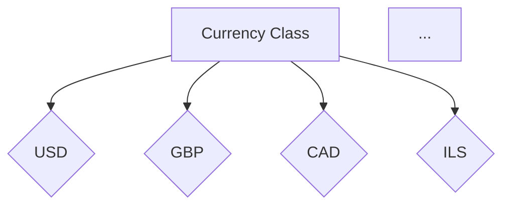
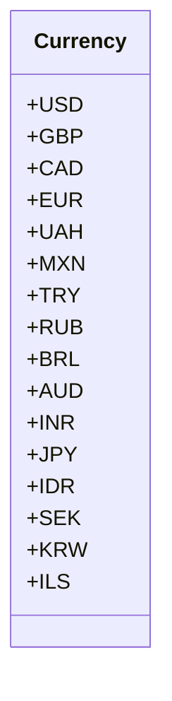

# <input code>

```python
## \file hypotez/src/suppliers/aliexpress/api/models/currencies.py
# -*- coding: utf-8 -*-
#! venv/Scripts/python.exe # <- venv win
## ~~~~~~~~~~~~
""" module: src.suppliers.aliexpress.api.models """
class Currency:
    USD = 'USD'
    GBP = 'GBP'
    CAD = 'CAD'
    EUR = 'EUR'
    UAH = 'UAH'
    MXN = 'MXN'
    TRY = 'TRY'
    RUB = 'RUB'
    BRL = 'BRL'
    AUD = 'AUD'
    INR = 'INR'
    JPY = 'JPY'
    IDR = 'IDR'
    SEK = 'SEK'
    KRW = 'KRW'
    ILS = 'ILS'
```

# <algorithm>

Этот код определяет класс `Currency`, содержащий константы, представляющие различные валюты. Алгоритм прост: он объявляет класс и внутри него — ряд констант-строк, представляющих разные валютные коды (USD, GBP и т.д.).  Данные не обрабатываются, а только хранятся.



Пример: Вы можете использовать `Currency.USD` для доступа к значению `'USD'`.

# <mermaid>



# <explanation>

**Импорты:**

В данном коде нет импорта других модулей.  Файл `currencies.py` находится в иерархии папок `hypotez/src/suppliers/aliexpress/api/models`. Это указывает на то, что он, скорее всего, содержит данные, необходимые для работы с API AliExpress.

**Классы:**

* `Currency`:  Этот класс содержит константы, представляющие различные валютные коды (USD, EUR и т.д.).  Класс предназначен для хранения и организации этих данных.

**Функции:**

Нет функций в этом коде. Все данные представлены в виде атрибутов класса `Currency`.

**Переменные:**

В коде нет переменных в традиционном смысле, только константы.  Они являются строками, хранящими символьные обозначения валют.

**Возможные ошибки и улучшения:**

* **Отсутствие методов:** Класс `Currency` в текущем виде не предоставляет никаких методов для работы с валютами. Возможно, в будущем потребуется добавить методы, например, для конвертации валют, проверки валидности кода валюты или для хранения метаданных (например, значений курса обмена).
* **Возможность перечислений (Enums):** В Python для хранения наборов констант часто лучше использовать `Enum` (перечисления). Это сделало бы код более читаемым и предотвратило бы ошибки, связанные с неверными значениями.

**Цепочка взаимосвязей с другими частями проекта:**

Вероятно, этот модуль используется в других частях проекта для работы с данными, связанными с валютами. Например, в методах, связанных с обработкой запросов к API AliExpress, где могут потребоваться валюты для расчетов или отображения.  Это может включать такие части проекта, как обработчики заказов, конвертеры валют или модули отображения цен.