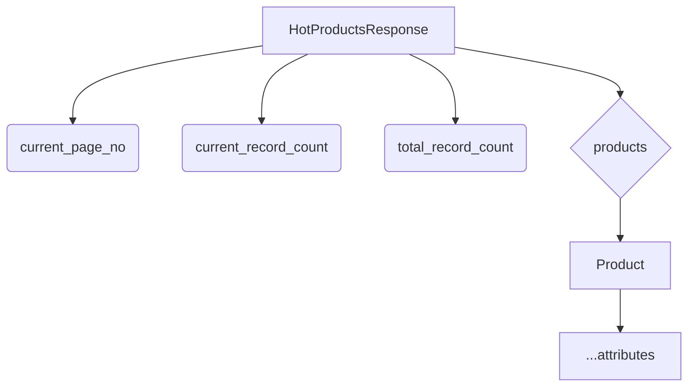
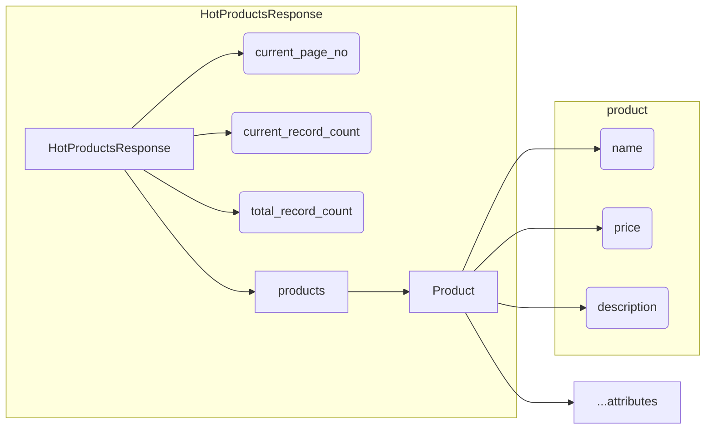

# <input code>

```python
## \file hypotez/src/suppliers/aliexpress/api/models/hotproducts.py
# -*- coding: utf-8 -*-
#! venv/Scripts/python.exe # <- venv win
## ~~~~~~~~~~~~~
""" module: src.suppliers.aliexpress.api.models """
from .product import Product
from typing import List


class HotProductsResponse:
    current_page_no: int
    current_record_count: int
    total_record_count: int
    products: List[Product]
```

# <algorithm>



**Пример:**

Предположим, API запроса возвращает данные для первой страницы с 10 продуктами.  `HotProductsResponse` содержит информацию о количестве продуктов на странице, общей информации и самих продуктах.


* **`current_page_no`**: 1
* **`current_record_count`**: 10
* **`total_record_count`**: 100
* **`products`**: Список из 10 объектов `Product`, каждый содержащий информацию о конкретном продукте.

Данные из API (например, JSON) десериализуются и заполняют атрибуты класса `HotProductsResponse`, после чего данные о `Product` передаются дальше по цепочке.


# <mermaid>



В данной диаграмме мы видим:

* `HotProductsResponse` — основной класс, содержащий информацию о странице результатов.
* `Product` — вложенный класс, представляющий собой один продукт.
* `products` — список объектов `Product` в `HotProductsResponse`.

Подключаемые зависимости:

* `Product`:  `HotProductsResponse` использует `Product` для хранения информации о каждом продукте.  Это указывает на то, что `Product` определён в другом файле (скорее всего `product.py` в той же директории `models`), и импортируется в текущем файле.


# <explanation>

* **Импорты:**
    * `from .product import Product`: Импортирует класс `Product` из файла `product.py` внутри той же директории (`./`). Это означает, что `Product` является частью той же модели или API-пакета, что и `HotProductsResponse`.  Это важно для понимания взаимосвязей в проекте.  Без знания `Product` невозможно понять полную функциональность `HotProductsResponse`.
    * `from typing import List`: Импортирует тип данных `List` из модуля `typing`.  Это стандартный тип данных Python для списков, используемый для типизации списка продуктов.

* **Классы:**
    * `HotProductsResponse`:  Представляет структуру данных для ответа, содержащего информацию о нескольких продуктах.
        * `current_page_no: int`: Номер текущей страницы.
        * `current_record_count: int`: Количество продуктов на текущей странице.
        * `total_record_count: int`: Общее количество продуктов.
        * `products: List[Product]`: Список продуктов, полученных с данной страницы.  Важно, что это список объектов, а не просто значения. Это указывает на возможность дальнейшей работы с атрибутами каждого продукта.

* **Функции:**  Нет функций.  Код определяет только классы, которые нужны для моделирования данных.

* **Переменные:**  Нет глобальных переменных.  Все атрибуты являются атрибутами класса `HotProductsResponse` и `Product`.


* **Возможные ошибки/улучшения:**
    * Нет проверки типов.  Не указано, что делать при ошибках.  Например, если `current_page_no` или `current_record_count` приходят из API как не числовые значения, это может привести к ошибкам.
    * Не хватает комментариев к атрибутам.  Возможно, есть дополнительные атрибуты в `Product` классе, которые стоило бы описать.

**Цепочка взаимосвязей:**

`HotProductsResponse` получает данные из API, используя другие части приложения (может быть, контроллеры, сервисы). Затем эта информация используется для дальнейшей обработки или отображения (например, в UI).  `Product` используется для описания отдельных продуктов, являясь важным компонентом для структуры данных.  Далее, `Product` может быть использован в других частях проекта для дальнейшей обработки, отображения, или хранения информации.