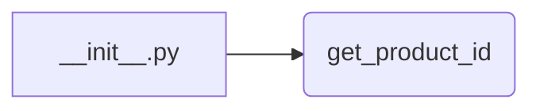

1. **<input code>**

```python
## \file hypotez/src/suppliers/aliexpress/api/tools/__init__.py
# -*- coding: utf-8 -*-
 # <- venv win
## ~~~~~~~~~~~~~
""" module: src.suppliers.aliexpress.api.tools """
from .get_product_id import get_product_id
```

2. **<algorithm>**

Этот код представляет собой модуль `__init__.py` для пакета `tools` в подпакете `api` для поставщика AliExpress.  Он не содержит логики сам по себе, а только импортирует функцию `get_product_id`.  В принципе, блок-схема очень простая:



Функция `get_product_id` находится в подпакете `get_product_id`.  В данном контексте, нет данных, которые проходят между функциями или классами, так как `__init__.py` только импортирует функцию.  Алгоритм работы сводится к обеспечению доступности функции `get_product_id` в других частях проекта.


3. **<mermaid>**


4. **<explanation>**

* **Импорты:**
    * `from .get_product_id import get_product_id`: Этот импорт делает функцию `get_product_id` доступной в текущем модуле (`__init__.py`).  `.` указывает на то, что функция находится в подпакете `get_product_id` того же уровня, что и текущий модуль.  Это стандартный подход для импорта функций/классов из модулей внутри пакета Python.

* **Классы:**
   Нет классов в данном `__init__.py` файле.  Функциональность реализуется исключительно через импортируемые функции.


* **Функции:**
    * `get_product_id`:  Этот импорт указывает, что функция `get_product_id`  (находится в модуле `get_product_id.py` внутри пакета `tools`)  доступна для использования в `__init__.py` файле. Более подробное объяснение этой функции требует доступа к коду `get_product_id.py`  (которого у нас нет).  В идеале, `get_product_id`  получает какие-то данные на вход, например, параметры для запроса API, обрабатывает их, и возвращает результат (например, ID продукта).

* **Переменные:**
   Нет переменных объявленных напрямую в данном файле.

* **Возможные ошибки или улучшения:**

    * **Отсутствие документации:** `get_product_id` не имеет документации в `get_product_id.py`.  Это может затруднить понимание её функциональности.
    * **Возможное использование в других частях проекта:**  В зависимости от того, как организовано приложение, `get_product_id` вероятно будет использоваться в других модулях, например, для получения информации с AliExpress. Нужно изучить остальные модули в `src` чтобы проследить цепочку зависимостей.  Отсутствие  комментариев в `__init__.py` может усложнить навигацию в проекте.
    * **Неясная связь с остальной частью проекта:** Необходимо проанализировать остальные модули (например, `aliexpress.py` или подобные файлы), чтобы понять, как `get_product_id` интегрируется в процесс сбора данных с AliExpress.


**Цепочка взаимосвязей:**

Модуль `__init__.py` в `tools` зависит от модуля `get_product_id`.  Модуль `get_product_id` вероятно взаимодействует с API AliExpress, используя какие-то библиотеки для обработки HTTP-запросов (например, `requests`).  В конечном итоге данные, полученные от API AliExpress, обрабатываются и используются в других частях проекта `hypotez`.  Без кода `get_product_id.py`  полностью проследить цепочку сложно, но в общем виде взаимодействие выглядит так:

```
Aliexpress API -> get_product_id.py -> __init__.py -> Остальные части проекта