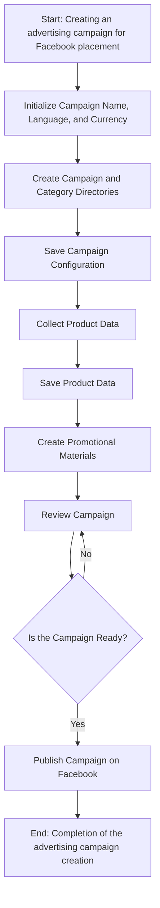
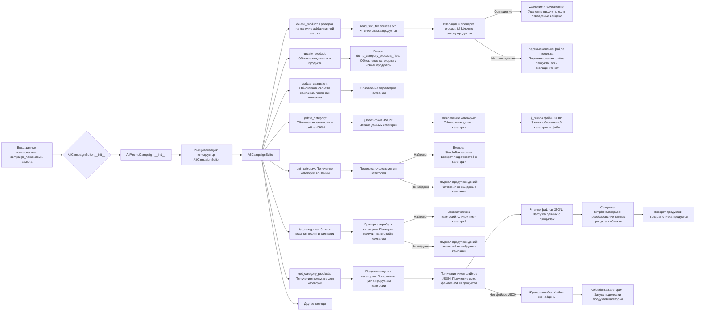
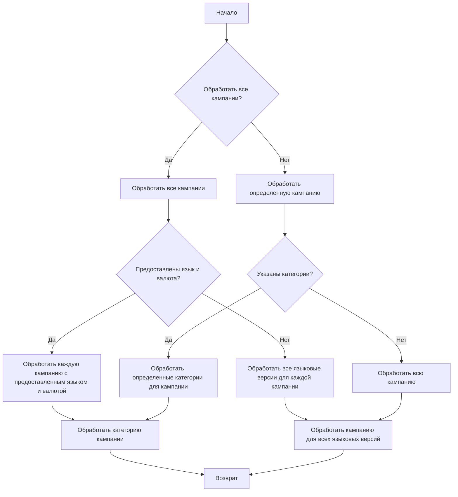

```MD
# Анализ кода модуля `src.suppliers.aliexpress.campaign`

## <input code>

```rst
.. :module: src.suppliers.aliexpress.campaign
```

### `campaign`

The `campaign` module is designed to manage the process of creating and publishing advertising campaigns on Facebook. It includes functionality for initializing campaign parameters (name, language, currency), creating directory structures, saving configurations for the new campaign, collecting and saving product data via `ali` or `html`, generating promotional materials, reviewing the campaign, and publishing it on Facebook.



- **Шаг 1**: Начало - процесс начинается.
- **Шаг 2**: Инициализация данных кампании - определяются имя, язык и валюта кампании. Пример: Название кампании: "Летняя распродажа", Язык: "Русский", Валюта: "RUB".
- **Шаг 3**: Создание каталогов кампании и категорий - создаются необходимые каталоги или файлы для кампании. Пример: Создается структура каталогов на файловой системе для хранения активов кампании.
- **Шаг 4**: Сохранение конфигурации кампании - сохранены инициализированные данные кампании. Пример: Данные записываются в базу данных или конфигурационный файл.
- **Шаг 5**: Сбор данных о продуктах - собираются данные, связанные с продуктами, которые будут рекламироваться в рамках кампании. Пример: Идентификаторы продуктов, описания, изображения и цены извлекаются из системы инвентаризации.
- **Шаг 6**: Сохранение данных о продуктах - сохранены собранные данные о продуктах. Пример: Данные записываются в таблицу базы данных, предназначенную для продуктов кампании.
- **Шаг 7**: Создание рекламных материалов - генерируются или выбираются графические изображения, баннеры и другие рекламные материалы. Пример: Изображения и описания подбираются для привлечения клиентов.
- **Шаг 8**: Проверка кампании - процесс проверки подтверждает готовность компонентов кампании. Пример: Человек или система проверяют качество и полноту всех компонентов кампании.
- **Шаг 9**: Готова ли кампания? - проверка для определения того, завершена ли кампания и готова к публикации. Пример: Логическая переменная сигнализирует "Да", если все готово, иначе "Нет", что запускает цикл возврата к предыдущему шагу для внесения исправлений.
- **Шаг 10**: Публикация кампании - кампания становится активной на платформе, готовой к маркетинговым мероприятиям. Пример: выполняется вызов API для публикации кампании на соответствующей платформе.
- **Шаг 11**: Конец - процесс создания кампании завершен.


# Редактирование кампании



# Подготовка кампании



## <algorithm>

(Подробная блок-схема отсутствует в предоставленном коде, но она описывается на естественном языке)

## <mermaid>

(Диаграммы Mermaid предоставлены в тексте)

## <explanation>

**Импорты:**  

Модуль `src.suppliers.aliexpress.campaign` не содержит прямых импортов, но предполагается импорт необходимых библиотек и модулей для работы с файлами, JSON-данными, списками, Facebook API (если используется), и возможно, для работы с базами данных.  Встречаются зависимости на чтение файлов, создание/модификацию каталогов,  `SimpleNamespace`, что предполагает использование модулей из стандартной библиотеки Python.


**Классы:**

* `AliCampaignEditor`: Класс, вероятно, отвечает за редактирование кампаний. В нем находятся методы для обновления, удаления и получения данных о кампании, категориях и продуктах.


**Функции:**

* Функции `delete_product`, `update_product`, `update_campaign`, `update_category`, `get_category`, `list_categories`, `get_category_products`:  Каждая из этих функций имеет определенную задачу в работе с кампаниями.

**Переменные:**

Переменные, относящиеся к кампаниям, вероятно, хранят информацию о имени, языке, валюте, списки продуктов, и другие параметры для кампании. Типы этих переменных зависят от конкретной реализации.


**Возможные ошибки/улучшения:**

* **Отсутствие обработки исключений:** Код не содержит блоков `try...except`, что может привести к ошибкам во время работы программы при возникновении проблем (например, с чтением файлов).
* **Неопределенные зависимости:** Необходимо указать, какие именно модули используются и где они расположены (если они не из стандартной библиотеки Python).
* **Недостаточная документация:**  Не хватает комментариев, которые бы объяснили, что делают отдельные части кода, как они взаимодействуют.

**Цепочка взаимосвязей:**

Модуль `src.suppliers.aliexpress.campaign` взаимодействует с другими частями проекта,  связанными с обработкой данных и данными о продуктах.  Используемые API для Facebook и для взаимодействия с внутренней базой данных (если присутствует) тоже влияют на функциональность.  Без кода конкретных классов сложно точно сказать, какова структура взаимосвязей.


**Выводы:**

Предоставленный код описывает общую логику работы модуля для управления кампаниями.  Он нуждается в дополнительной информации для более точного анализа, включая сам код Python-классов и функций.