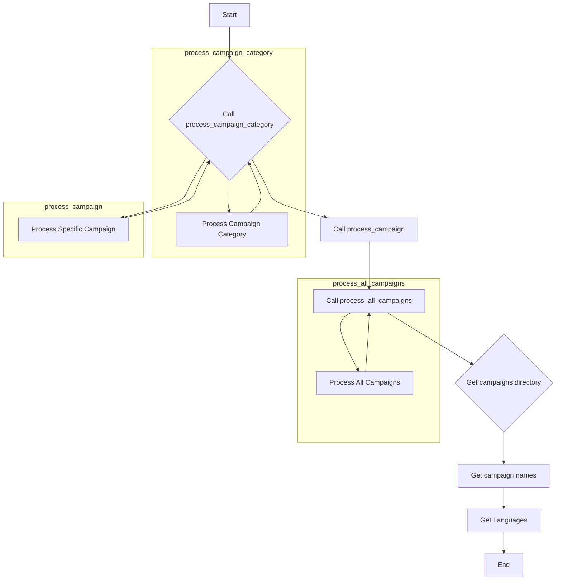
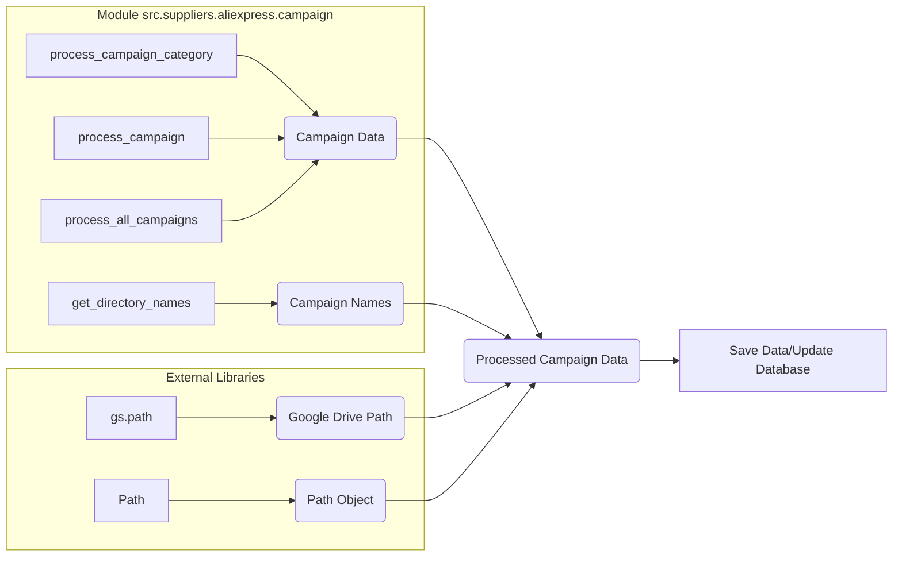

# <input code>

```python
## \file hypotez/src/suppliers/aliexpress/campaign/_examples/_examle_prepare_campains.py
# -*- coding: utf-8 -*-

#! venv/bin/python/python3.12

"""
.. module: src.suppliers.aliexpress.campaign._examples 
	:platform: Windows, Unix
	:synopsis:

"""


"""
	:platform: Windows, Unix
	:synopsis:

"""


"""
	:platform: Windows, Unix
	:synopsis:

"""


"""
  :platform: Windows, Unix

"""
"""
  :platform: Windows, Unix
  :platform: Windows, Unix
  :synopsis:
"""
  
""" module: src.suppliers.aliexpress.campaign._examples """


from ..prepare_campaigns import *

# Example 1: Process a Single Campaign Category
process_campaign_category("SummerSale", "Electronics", "EN", "USD", force=True)

# Example 2: Process a Specific Campaign
process_campaign("WinterSale", categories=["Clothing", "Toys"], language="EN", currency="USD", force=False)

# Example 3: Process All Campaigns
process_all_campaigns(language="EN", currency="USD", force=True)


campaigns_directory = Path(gs.path.google_drive,'aliexpress','campaigns')
campaign_names = get_directory_names(campaigns_directory)
languages = {'EN': 'USD', 'HE': 'ILS', 'RU': 'ILS'}
```

# <algorithm>



This example demonStartes how to call functions. First, it calls `process_campaign_category` with specific arguments, then it calls `process_campaign` and `process_all_campaigns` which likely perform tasks of preparing campaign data. Then it retrieves campaign data, their names and supported languages.


# <mermaid>



**Explanation of Dependencies:**

* `gs.path`: This likely refers to a global variable or module (`gs`) providing access to Google Drive file paths. This shows a dependency on an external library or module for interacting with Google Drive.
* `Path`: This indicates a dependency on the `pathlib` module for working with file paths. This is a built-in Python module, so it's not an external library.
* `process_campaign_category`, `process_campaign`, `process_all_campaigns`, and `get_directory_names` are functions likely defined in another file within the same module or sub-module (`src.suppliers.aliexpress.campaign.prepare_campaigns`). This shows a module level dependency.

# <explanation>

* **Imports:**
    * `from ..prepare_campaigns import *`: Imports all functions from the `prepare_campaigns` module within the `src.suppliers.aliexpress.campaign` sub-module.  This imports the logic for processing campaigns. This is a clear indication of a well-structured project, where reusable functions are organized in dedicated modules.  The `..` indicates moving up one directory level in the file structure.

* **Functions (implicit):**
    * `process_campaign_category`, `process_campaign`, `process_all_campaigns`, `get_directory_names`: These are likely functions within the `prepare_campaigns` module. The code demonStartes how to use them, but the exact logic inside is not shown. This highlights the top-level structure of the program, showing the interaction with a campaign data processing module.


* **Variables:**
    * ``: A global variable likely used for configuration purposes (e.g., different modes for development and production).
    * `campaigns_directory`:  Represents a path to a directory containing campaign data.
    * `campaign_names`: Will hold the names of campaigns found in the directory.
    * `languages`: A dictionary mapping languages to currencies.  This could be a configuration variable, defining how campaigns in different languages should be treated.


* **Example Usage:**
    * The code provides example calls to the imported functions `process_campaign_category`, `process_campaign`, and `process_all_campaigns` with different parameters. This demonStartes how to use the functions to perform specific campaign preparations.


* **Possible Errors/Improvements:**
    * **Error Handling:** The code lacks error handling. If there are issues reading the directory or accessing Google Drive, or if the campaign functions raise exceptions, the program will likely crash.  Adding `try...except` blocks around file operations and function calls would be important.
    * **Logging:** Adding logging statements to track progress and potential errors would greatly enhance the code's maintainability and debugging capabilities.
    * **Clearer Variable Names:** Some variable names like `gs.path` could be more descriptive (e.g., `google_drive_path`).
    * **`Path` Object:** The use of `Path` suggests the code is Python 3.4+ utilizing the `pathlib` module for better handling of paths.  There's an implied dependency on the `pathlib` module.
    * **Missing function definitions:** The code assumes that `process_campaign_category`, `process_campaign`, `process_all_campaigns`, and `get_directory_names` are defined elsewhere.  Without these functions, the script will fail.

**Relationship to Other Parts:**

The code clearly interacts with a `prepare_campaigns` module for the main campaign processing logic.  There's also a dependency on a `gs` module (likely custom-built) for handling Google Drive interaction. This implies a larger project structure with modules for different functionalities (campaign processing, Google Drive interactions).