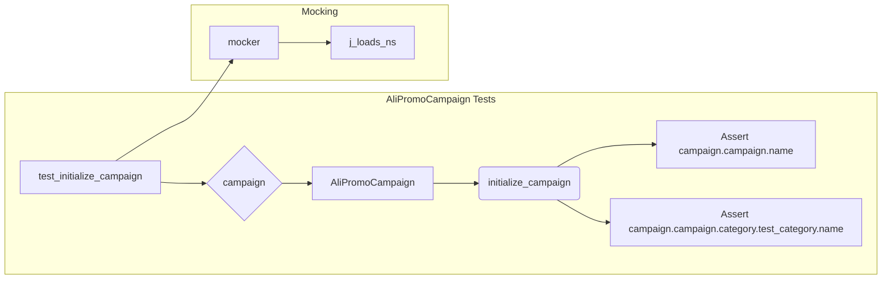

# <input code>

```python
## \file hypotez/src/suppliers/aliexpress/campaign/_pytest/test_alipromo_campaign.py
# -*- coding: utf-8 -*-\n#! venv/Scripts/python.exe\n#! venv/bin/python/python3.12\n\n"""
.. module: src.suppliers.aliexpress.campaign._pytest 
	:platform: Windows, Unix
	:synopsis:

"""
MODE = 'dev'

"""
	:platform: Windows, Unix
	:synopsis:

"""

"""
	:platform: Windows, Unix
	:synopsis:

"""


"""
  :platform: Windows, Unix

"""
"""
  :platform: Windows, Unix
  :platform: Windows, Unix
  :synopsis:
"""MODE = 'dev'
  
""" module: src.suppliers.aliexpress.campaign._pytest """


#Fixtures:
 - campaign: Fixture to create an instance of AliPromoCampaign for use in tests.

#Tests: 
 - test_initialize_campaign: Tests if the initialize_campaign method correctly initializes the campaign data.
 - test_get_category_products_no_json_files: Tests get_category_products when no JSON files are present.
 - test_get_category_products_with_json_files: Tests get_category_products when JSON files are present.
 - test_create_product_namespace: Tests if create_product_namespace correctly creates a product namespace.
 - test_create_category_namespace: Tests if create_category_namespace correctly creates a category namespace.
 - test_create_campaign_namespace: Tests if create_campaign_namespace correctly creates a campaign namespace.
 - test_prepare_products: Tests if prepare_products calls process_affiliate_products.
 - test_fetch_product_data: Tests if fetch_product_data correctly fetches product data.
 - test_save_product: Tests if save_product correctly saves product data.
 - test_list_campaign_products: Tests if list_campaign_products correctly lists product titles.
"""

import pytest
from pathlib import Path
from types import SimpleNamespace
from src.suppliers.aliexpress.campaign.ali_promo_campaign import AliPromoCampaign
from src.utils.jjson import j_dumps, j_loads_ns
from src.utils.file import save_text_file
from src import gs

# Sample data for testing
campaign_name = "test_campaign"
category_name = "test_category"
language = "EN"
currency = "USD"

@pytest.fixture
def campaign():
    """Fixture for creating a campaign instance."""
    return AliPromoCampaign(campaign_name, category_name, language, currency)

def test_initialize_campaign(mocker, campaign):
    """Test the initialize_campaign method."""
    # ... (rest of the code)
```

# <algorithm>

The code defines a series of unit tests for the `AliPromoCampaign` class.  A `campaign` fixture is created to instantiate `AliPromoCampaign`.  Tests then verify the expected behavior of various methods of the `AliPromoCampaign` class using mocking.

**Example test flow (test_initialize_campaign):**

1. **Mocking:**  The `j_loads_ns` function is mocked to return predefined `json` data.
2. **Method call:** `campaign.initialize_campaign()` is executed.
3. **Assertions:**  The assertions check if `campaign.campaign.name` and `campaign.campaign.category.test_category.name` match the expected values from the mocked data.


# <mermaid>




# <explanation>

* **Imports:**
    * `pytest`:  A testing framework for Python.
    * `pathlib`: Provides object-oriented way of working with file paths.
    * `types`: Contains the `SimpleNamespace` class for creating namespace objects.  This is likely used for handling data structures similar to Python dictionaries as objects.
    * `AliPromoCampaign`: The class being tested, likely residing in `src.suppliers.aliexpress.campaign.ali_promo_campaign`.
    * `j_dumps`, `j_loads_ns`: Functions for handling JSON data, probably from `src.utils.jjson`.
    * `save_text_file`: Function for saving text files, from `src.utils.file`.
    * `gs`: Potentially a global state module from `src`.
    * The imports are consistent with a project structure where `src` is a source root directory.


* **Classes:**
    * `AliPromoCampaign`:  This is the class under test.  It likely handles the campaign logic, loading data, and interacting with file systems.
    * `SimpleNamespace`:  Used in tests to quickly create objects with named attributes, mimicking data structures.


* **Functions:**
    * `campaign()`: A `pytest` fixture that creates an instance of `AliPromoCampaign` with predefined values.
    * `test_initialize_campaign()`, `test_get_category_products_...`, etc.: These are test functions.  They exercise the methods of the `AliPromoCampaign` class, using `mocker` to isolate them from other parts of the application.  They make assertions about the results of the methods' executions.
    * `j_loads_ns()`: Loads JSON data into a `SimpleNamespace` object.
    * `save_text_file()`: Saves text to a file.

* **Variables:**
    * `campaign_name`, `category_name`, `language`, `currency`:  These are sample data used in tests to initialize and test the `AliPromoCampaign` class.


* **Possible Improvements:**
    * **Error Handling:** The tests are currently using mocking extensively.  Real-world code should consider error handling in the `AliPromoCampaign` class (e.g., file not found, invalid JSON data).
    * **Mocking Startegies:** Mocking is used extensively. The use of mocks can become cumbersome for complex interactions, so consider using an alternative approach in production code (e.g., dependency injection if the behavior is not part of the test itself).
    * **Code Organization:** While the tests are well-organized and focused, consider separating the `src` import from the rest of the testing logic for better modularity.


* **Relationships to other parts of the project:**
    * The `AliPromoCampaign` class likely depends on classes and functions within `src.utils.jjson` and `src.utils.file` for its campaign data manipulation and file I/O.
    * The `src.suppliers` folder probably contains other supplier-specific campaign classes, possibly including different campaign structures.
    * The tests are isolated but depend on the implementation of the `AliPromoCampaign` class.


The provided code snippet focuses on testing specific aspects of the `AliPromoCampaign` class, such as initialization, data fetching, and saving.  These tests aim to verify the correct functionality of the `AliPromoCampaign` class without considering how the data is acquired or where it comes from.