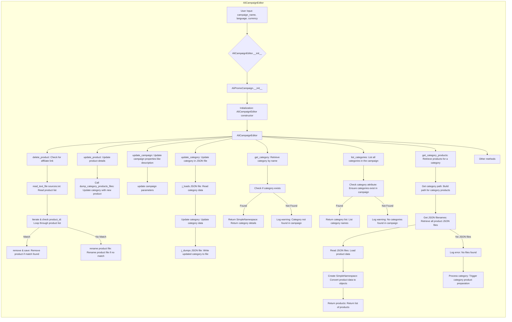

```MD
# <input code>

```python
## \file hypotez/src/suppliers/aliexpress/campaign/ali_campaign_editor.py
# -*- coding: utf-8 -*-\
#! venv/Scripts/python.exe
#! venv/bin/python/python3.12

"""
.. module: src.suppliers.aliexpress.campaign 
	:platform: Windows, Unix
	:synopsis: This module provides the editor for advertising campaigns


"""


import re
import shutil
from pathlib import Path
from types import SimpleNamespace
from typing import List, Optional

import header
from src import gs
from src.suppliers.aliexpress.campaign.ali_promo_campaign import AliPromoCampaign
from src.suppliers.aliexpress.campaign.gsheet import AliCampaignGoogleSheet
from src.suppliers.aliexpress.utils import extract_prod_ids, ensure_https
from src.utils.jjson import j_loads_ns, j_loads, j_dumps
from src.utils.convertors.csv import csv2dict
from src.utils.printer import pprint
from src.utils.file import read_text_file, save_text_file, get_filenames
from src.logger import logger

```
# <algorithm>

The algorithm for the `AliCampaignEditor` class, focusing on the `delete_product` method and initialization, is shown below:

1. **Initialization (`__init__`)**:
   - Takes `campaign_name`, `language`, and `currency` as input.
   - Calls the `__init__` method of the parent class `AliPromoCampaign` to perform initializations for the campaign. This part isn't detailed in the given code.
   - Sets up the `google_sheet` object if needed.
   - *Example:* `editor = AliCampaignEditor(campaign_name="Summer Sale", language="EN", currency="USD")`

2. **Product Deletion (`delete_product`)**:
   - Takes `product_id` as input.
   - Extracts product IDs from the input string.
   - Constructs the path to the `sources.txt` file within the product category.
   - Reads the product list from `sources.txt`.
   - Iterates through the product list.
   - Checks if the current product ID matches the provided `product_id`.
   - Removes the matched product from the list if found and saves the updated list to `sources.txt` or renames the corresponding .html file if not found.
   - *Example:* `editor.delete_product("12345")`


# <mermaid>


# <explanation>

### Imports

The imports define the necessary modules for the functionality:

- `re`: Regular expressions for pattern matching.
- `shutil`: For file operations (not directly used in the provided example).
- `pathlib`: For working with file paths.
- `types`: For using `SimpleNamespace`.
- `typing`: For type hints.
- `header`: likely for project-specific header file.
- `gs`: Likely a module for Google Sheets interactions, part of the `src` package.
- `AliPromoCampaign`: Base class for campaign operations, in the `src.suppliers.aliexpress.campaign` package.
- `AliCampaignGoogleSheet`: Likely a class for interacting with Google Sheets data, also part of the `src` package.
- `extract_prod_ids`, `ensure_https`: Helper functions related to AliExpress product IDs and URLs in the `src.suppliers.aliexpress.utils` package.
- `j_loads_ns`, `j_loads`, `j_dumps`: Functions for handling JSON data from the `src.utils.jjson` package.
- `csv2dict`: Function for converting CSV data to a dictionary in `src.utils.convertors.csv`.
- `pprint`: Function for pretty printing data in `src.utils.printer`.
- `read_text_file`, `save_text_file`, `get_filenames`: File utilities located in `src.utils.file`.
- `logger`: Logging module from `src.logger`.

All imports are structured with a `src` prefix. This indicates they come from modules in the project's `src` directory.

### Classes

- `AliCampaignEditor`: This class extends `AliPromoCampaign`, inheriting functionality for handling campaigns. It provides methods for managing campaign products, categories, and Google Sheet data.  The `__init__` method initializes the campaign editor with campaign-specific details and potentially interacts with Google Sheets through the `AliCampaignGoogleSheet` class.  The `delete_product`, `update_product`, `update_campaign`, `update_category`, `get_category`, `list_categories`, and `get_category_products` methods implement the core editing functionality.

### Functions

- `delete_product`:  Deletes a product from the campaign's product list, managing whether it's stored in a text file or individual HTML files, based on whether an affiliate link is present.
- `update_product`: Updates product details for a specific category.
- `update_campaign`: Updates properties like campaign description or tags.
- `update_category`: Updates category data in a JSON file.
- `get_category`: Retrieves the category information for a given name as a `SimpleNamespace`.
- `list_categories`: Lists all category names for the campaign.
- `get_category_products`: Retrieves all products in a specified category as `SimpleNamespace` objects.

### Variables

- `MODE`: A constant likely defining the development mode (e.g., 'dev', 'prod').
- `campaign_name`, `language`, `currency`: Strings used for campaign setup.
- `product_id`, `category_name`, `lang`: Strings related to individual product or category operations.
- `product`: Dictionary or `SimpleNamespace` object holding product data.  `category` is a `SimpleNamespace` object storing category data.

### Possible Improvements and Errors

- **Error Handling:** While the code includes `try...except` blocks, the error handling could be improved by providing more specific exception handling and logging mechanisms.  For instance, not all exceptions are caught or handled.
- **Data Validation:**  Input validation (e.g., checking for valid product IDs, campaign names) should be included to prevent unexpected behavior.
- **Efficiency:** Iterating through a list to find a match in `delete_product` could be inefficient for very large lists.  Consider using a dictionary for faster lookup if the product list is likely to grow.

### Relationships with Other Parts of the Project

The code interacts heavily with other modules in the `src` directory, particularly `gs`, `AliCampaignGoogleSheet`, `AliPromoCampaign`, `src.suppliers.aliexpress.utils`, `src.utils.jjson`, `src.utils.file`, `src.logger` showing a clear modular design and dependency structure that promotes code reuse and maintainability.   The data flows between these modules via objects (e.g., `AliCampaignEditor` interacting with `AliPromoCampaign` and `AliCampaignGoogleSheet`) to encapsulate related logic.