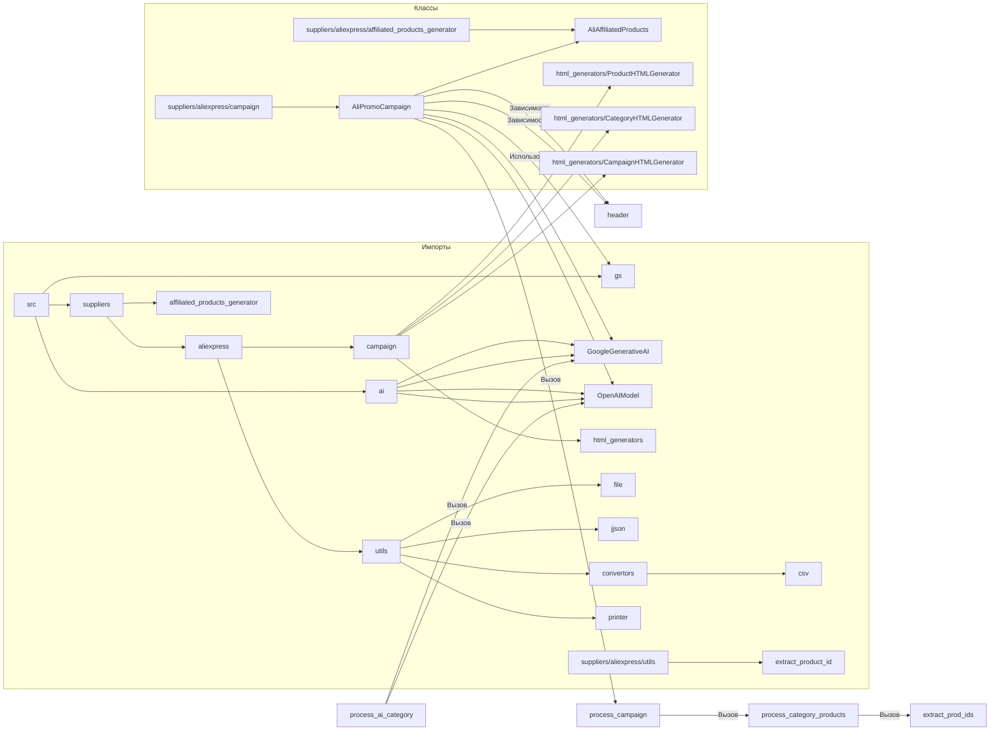

# Анализ кода `ali_promo_campaign.py`

## <input code>

```python
# -*- coding: utf-8 -*-
#! venv/Scripts/python.exe
#! venv/bin/python/python3.12

"""
.. module: src.suppliers.aliexpress.campaign 
	:platform: Windows, Unix
	:synopsis: AliPromoCampaign


## AliPromoCampaign

### Назначение:
Модуль предназначен для управления рекламными кампаниями на платформе AliExpress, включая обработку данных о категориях и товарах, создание и редактирование JSON-файлов с информацией о кампаниях, а также использование AI для генерации данных о кампаниях.

### Описание:
Класс `AliPromoCampaign` позволяет загружать и обрабатывать данные рекламных кампаний, управлять категориями и товарами, а также использовать ИИ для генерации описаний и других данных. Модуль поддерживает различные языки и валюты, обеспечивая гибкость в настройке кампаний.

### Примеры:
Пример инициализации рекламной кампании:

    >>> campaign = AliPromoCampaign("new_campaign", "EN", "USD")
    >>> print(campaign.campaign_name)

Пример обработки всей кампании:

    >>> campaign = AliPromoCampaign("new_campaign", "EN", "USD")
    >>> campaign.process_campaign()

Пример обработки данных о товарах в категории:

    >>> campaign = AliPromoCampaign("new_campaign", "EN", "USD")
    >>> products = campaign.process_category_products("electronics")

Пример заполнения данных категорий с использованием AI:

    >>> campaign = AliPromoCampaign("new_campaign", "EN", "USD")
    >>> campaign.process_ai_category("Electronics")
"""
# ... (остальной код)
```

## <algorithm>

```mermaid
graph TD
    A[Инициализация AliPromoCampaign] --> B{Проверка наличия файла кампании};
    B -- Да -> C[Использование данных из файла];
    B -- Нет -> D[Создание новой кампании];
    C --> E[Получение языковых и валютных данных];
    C --> F[Инициализация моделей AI];
    D --> G[Процесс создания новой кампании];
    G --> F;
    E --> H[Обработка кампании];
    F --> H;
    H --> I[Итерация по категориям];
    I --> J[Обработка товаров категории];
    J --> K[Обработка категории с помощью AI];
    I --> L[Сохранение данных о товарах в файлы];
    K --> M[Сохранение обновленных данных категории];
    I --> N[Генерация HTML];
    N --> O[Сохранение HTML];
    O --> P[Конец];
```

**Описание алгоритма:**

Код инициализирует класс `AliPromoCampaign`, проверяет существование файла кампании. Если файл существует, он загружает данные из него и инициализирует модели AI. Если файла нет, запускается процесс создания новой кампании.  После инициализации, код итерируется по категориям, обрабатывает товары в каждой категории, использует AI для обработки данных категорий и сохраняет результат. Код генерирует и сохраняет HTML-страницы для кампании.


## <mermaid>




## <explanation>

**Импорты:**

- `header`: Вероятно, содержит общие импорты, необходимые для работы проекта. Необходимо более подробное описание `header`.
- `asyncio`: Библиотека для асинхронного программирования. Используется для задач, которые могут выполняться параллельно, как в функции `process_category_products`.
- `time`:  Библиотека для работы со временем.
- `copy`:  Библиотека для создания копий объектов.
- `html`: Библиотека для работы с HTML-символами (в функции `generate_html`).
- `pathlib`:  Для работы с файловыми путями.
- `types`:  Для работы с `SimpleNamespace`
- `typing`:  Для типов данных.
- `gs`: Вероятно, содержит глобальные настройки (например, путь к Google Drive). Подробнее о `gs` в документе.
- `src`:  Корневой пакет проекта.
- `src.suppliers.aliexpress`: Пакет с реализациями для работы с поставщиком AliExpress.
- `src.suppliers.aliexpress.campaign`: Подпакет для обработки кампаний на AliExpress.
- `src.suppliers.aliexpress.affiliated_products_generator`: Модуль для генерации партнерских ссылок.
- `src.suppliers.aliexpress.utils`: Модуль с вспомогательными функциями для работы с AliExpress.
- `src.ai`: Пакет, содержащий инструменты для работы с искусственным интеллектом.
- `src.ai.GoogleGenerativeAI`: Класс для работы с Google AI.
- `src.ai.OpenAIModel`: Класс для работы с OpenAI.
- `src.logger`: Модуль для логирования.
- `src.utils.file`: Модуль для работы с файлами.
- `src.utils.jjson`: Модуль для работы с JSON-данными.
- `src.utils.convertors.csv`: Модуль для работы с CSV-данными.
- `src.utils.printer`: Модуль для вывода данных (pprint).
- `src.suppliers.aliexpress.utils.extract_product_id`: Модуль для извлечения ID товаров из данных.


**Классы:**

- `AliPromoCampaign`: Класс для управления рекламной кампанией. Имеет атрибуты `language`, `currency`, `base_path`, `campaign_name`, `campaign`, `campaign_ai` и др.  Методы класса управляют загрузкой, обработкой и сохранением данных кампании, включая использование AI.  Есть методы `process_campaign`, `process_category_products`, `process_ai_category`,  `process_new_campaign`, и другие.

**Функции:**

- `__init__`: Конструктор класса `AliPromoCampaign`,  инициализирует атрибуты и загружает данные кампании из JSON, если таковые имеются.  Если нет, запускает процесс создания новой кампании.
- `_models_payload`: Инициализирует модели GoogleGenerativeAI и OpenAIModel.
- `process_campaign`: Обрабатывает все категории кампании.
- `process_category_products`: Обрабатывает продукты в конкретной категории, используя `AliAffiliatedProducts`.
- `process_ai_category`: Использует AI для обработки данных о категориях, получая описание и другую информацию.
- `process_new_campaign`: Создание новой рекламной кампании.
- `dump_category_products_files`: Сохраняет данные о товарах в JSON-файлы.
- `set_categories_from_directories`: Устанавливает категории кампании из названий директорий.
- `generate_output`:  Функция для генерации выходных данных (JSON, HTML) для товара.
- `generate_html`: Генерирует HTML-страницы для категории и корневой страницы.
- `generate_html_for_campaign`: Генерирует HTML-страницы для всей кампании.


**Переменные:**

- `MODE`: Переменная, вероятно, для настройки режима работы (например, "dev" или "prod").
- `language`, `currency`: Язык и валюта кампании.


**Возможные ошибки и области для улучшений:**

- Отсутствует документация для многих функций и методов.
- Код может быть сложнее для понимания и сопровождения из-за большого количества функций и вложенных вызовов.
- Возможны ошибки в обработке исключений.
- Недостаточно ясности в отношении логики `process_ai_category`.
- Нет ясности о том, как создаются файлы `.json` для кампаний, категорий и продуктов, так как их хранение и чтение не всегда очевидно.
- Отсутствует проверка корректности данных, получаемых от AI.


**Цепочка взаимосвязей:**

Код использует данные из Google Drive, обрабатывает их с помощью AI, генерирует HTML и сохраняет результат в файлы.  Он тесно связан с другими модулями, такими как `gs`, `src.ai`, `src.suppliers.aliexpress` и т. д. для выполнения операций, например, загрузки файлов, сохранения данных и работы с API AI.


**Дополнения:**

В коде используется `SimpleNamespace` для организации данных, что позволяет более гибко добавлять и изменять поля. Это хороший выбор, но стоит учитывать, что `SimpleNamespace` не гарантирует валидность данных, которые в него помещаются.  Также, необходимо обратить внимание на работу с HTML-данными, так как в коде присутствуют эскейп-функции для предотвращения XSS-уязвимостей.