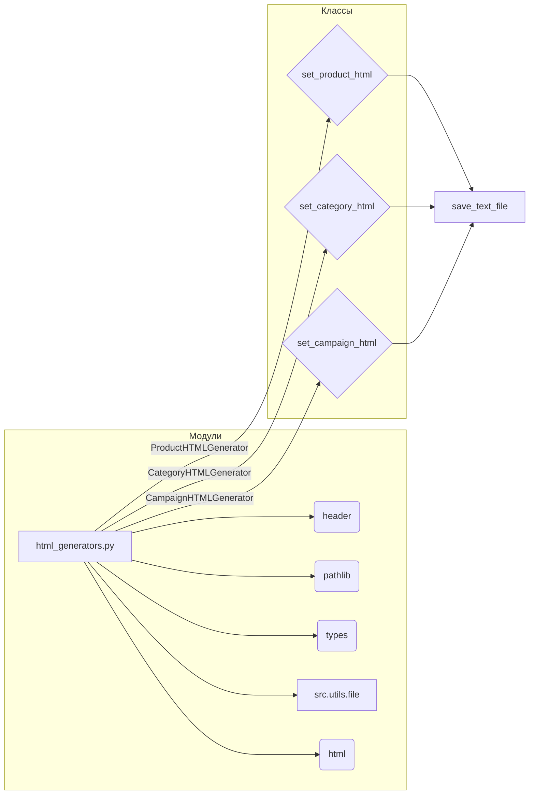

```MD
# <input code>

```python
## \file hypotez/src/suppliers/aliexpress/campaign/html_generators.py
# -*- coding: utf-8 -*-\
#! venv/Scripts/python.exe
#! venv/bin/python/python3.12

"""
.. module: src.suppliers.aliexpress.campaign 
	:platform: Windows, Unix
	:synopsis: Генератор HTML контента рекламной кампании

"""


import header   
from pathlib import Path
from types import SimpleNamespace
from src.utils.file import save_text_file
import html

class ProductHTMLGenerator:
    """ Class for generating HTML for individual products."""

    @staticmethod
    def set_product_html(product: SimpleNamespace, category_path: str | Path):
        """ Creates an HTML file for an individual product.

        @param product: The product details to include in the HTML.
        @param category_path: The path to save the HTML file.
        """
        category_name = Path(category_path).name
        html_path = Path(category_path) / 'html' / f"{product.product_id}.html"

        html_content = f"""<!DOCTYPE html>
<html lang="en">
<head>
    <meta charset="UTF-8">
    <meta name="viewport" content="width=device-width, initial-scale=1.0">
    <title>{html.escape(product.product_title)}</title>
    <link rel="stylesheet" href="https://stackpath.bootstrapcdn.com/bootstrap/5.3.0/css/bootstrap.min.css">
    <link rel="stylesheet" href="styles.css"> <!-- Link to custom CSS file -->
</head>
<body>
    <div class="container">
        <h1 class="my-4">{html.escape(product.product_title)}</h1>
        <div class="card">
            
            <div class="card-body">
                <p class="card-text">Price: <span class="product-price">{product.target_sale_price} {product.target_sale_price_currency}</span></p>
                <p class="card-text">Original Price: <span class="product-original-price">{product.target_original_price} {product.target_original_price_currency}</span></p>
                <p class="card-text">Category: <span class="product-category">{html.escape(product.second_level_category_name)}</span></p>
                <a href="{product.promotion_link}" class="btn btn-primary">Buy Now</a>
            </div>
        </div>
    </div>

    <script src="https://stackpath.bootstrapcdn.com/bootstrap/5.3.0/js/bootstrap.bundle.min.js"></script>
</body>
</html>
"""
        save_text_file(html_content, html_path)


class CategoryHTMLGenerator:
    """ Class for generating HTML for product categories."""

    @staticmethod
    def set_category_html(products_list: list[SimpleNamespace] | SimpleNamespace, category_path: str | Path):
        """ Creates an HTML file for the category.

        @param products_list: List of products to include in the HTML.
        @param category_path: Path to save the HTML file.
        """
        products_list = products_list if isinstance(products_list, list) else [products_list]

        category_name = Path(category_path).name
        html_path = Path(category_path) / 'html' / 'index.html'

        html_content = f"""<!DOCTYPE html>
<html lang="en">
<head>
    <meta charset="UTF-8">
    <meta name="viewport" content="width=device-width, initial-scale=1.0">
    <title>{html.escape(category_name)} Products</title>
    <link rel="stylesheet" href="https://stackpath.bootstrapcdn.com/bootstrap/5.3.0/css/bootstrap.min.css">
    <link rel="stylesheet" href="styles.css"> <!-- Link to custom CSS file -->
</head>
<body>
    <div class="container">
        <h1 class="my-4">{html.escape(category_name)} Products</h1>
        <div class="row product-grid">
"""

        for product in products_list:
            image_url = Path(product.local_saved_image).as_posix()
            html_content += f"""
                <div class="col-md-4 mb-4">
                    <div class="card">
                        
                        <div class="card-body">
                            <h5 class="card-title">{html.escape(product.product_title)}</h5>
                            <p class="card-text">Price: <span class="product-price">{product.target_sale_price} {product.target_sale_price_currency}</span></p>
                            <p class="card-text">Original Price: <span class="product-original-price">{product.target_original_price} {product.target_original_price_currency}</span></p>
                            <p class="card-text">Category: <span class="product-category">{html.escape(product.second_level_category_name)}</span></p>
                            <a href="{product.promotion_link}" class="btn btn-primary">Buy Now</a>
                        </div>
                    </div>
                </div>
            """

        html_content += """
        </div>
    </div>

    <script src="https://stackpath.bootstrapcdn.com/bootstrap/5.3.0/js/bootstrap.bundle.min.js"></script>
</body>
</html>
"""
        save_text_file(html_content, html_path)


class CampaignHTMLGenerator:
    """ Class for generating HTML for a campaign."""

    @staticmethod
    def set_campaign_html(categories: list[str], campaign_path: str | Path):
        """ Creates an HTML file for the campaign, listing all categories.

        @param categories: List of category names.
        @param campaign_path: Path to save the HTML file.
        """
        html_path = Path(campaign_path) / 'index.html'

        html_content = f"""<!DOCTYPE html>
<html lang="en">
<head>
    <meta charset="UTF-8">
    <meta name="viewport" content="width=device-width, initial-scale=1.0">
    <title>Campaign Overview</title>
    <link rel="stylesheet" href="https://stackpath.bootstrapcdn.com/bootstrap/5.3.0/css/bootstrap.min.css">
    <link rel="stylesheet" href="styles.css"> <!-- Link to custom CSS file -->
</head>
<body>
    <div class="container">
        <h1 class="my-4">Campaign Overview</h1>
        <ul class="list-group">
"""

        for category in categories:
            html_content += f"""
                <li class="list-group-item">
                    <a href="{category}/index.html">{html.escape(category)}</a>
                </li>
            """

        html_content += f"""
        </ul>
    </div>

    <script src="https://stackpath.bootstrapcdn.com/bootstrap/5.3.0/js/bootstrap.bundle.min.js"></script>
</body>
</html>
"""
        save_text_file(html_content, html_path)
```

# <algorithm>

**Блок-схема:**

```mermaid
graph TD
    A[Входные данные: категории, список продуктов] --> B{Проверка типа products_list};
    B -- list --> C[Генерация HTML для категории];
    B -- not list --> D[Преобразование products_list в список];
    C --> E[Формирование html_content (категория)];
    D --> C;
    E --> F[Сохранение файла категории];
    A --> G[Генерация HTML для всей кампании];
    G --> H[Формирование html_content (кампания)];
    H --> I[Сохранение файла кампании];
    subgraph "Генерация HTML для категории"
        J[Получение имени категории] --> K[Формирование пути к файлу] --> L[Генерация HTML для продукта]
        L --> M[Формирование html_content];
        M --> N[Сохранение файла продукта]
    end
```

**Описание шагов:**

1.  **Входные данные**: Принимаются список категорий и список продуктов (или один продукт).
2.  **Проверка типа products_list**: Проверяется, является ли products_list списком. Если нет, преобразуется в список из одного элемента.
3.  **Генерация HTML для категории**: Для каждой категории генерируется HTML-код, содержащий список продуктов.
4.  **Формирование html_content (категория)**: Формируется содержимое HTML-файла категории, содержащий заголовок и HTML-представление каждого продукта из списка.
5.  **Сохранение файла категории**: Сгенерированный HTML-код сохраняется в соответствующий файл.
6.  **Генерация HTML для всей кампании**: Генерируется HTML-код для всей рекламной кампании, содержащий список категорий.
7.  **Формирование html_content (кампания)**: Формируется содержимое HTML-файла кампании, содержащий заголовок и список ссылок на страницы каждой категории.
8.  **Сохранение файла кампании**: Сгенерированный HTML-код сохраняется в файл кампании.

# <mermaid>



# <explanation>

**Импорты:**

- `header`: Вероятно, импортирует вспомогательные функции или константы из модуля `header`.  Необходимость в нём не ясна без контекста остальных файлов проекта.
- `pathlib`: Предоставляет объекты `Path` для удобной работы с файловыми путями.
- `types`: Используется для работы с типом `SimpleNamespace`, который, вероятно, предназначен для хранения данных о продуктах.
- `src.utils.file`: Импортирует функцию `save_text_file`, которая используется для сохранения HTML-кода в файлы.
- `html`:  Предоставляет функции для безопасной обработки HTML-данных (например, `html.escape`), предотвращая возможные уязвимости XSS.

**Классы:**

- `ProductHTMLGenerator`: Отвечает за генерацию HTML-кода для каждого продукта.  Использует `@staticmethod` для статических методов, что позволяет вызывать их без создания экземпляра класса.
- `CategoryHTMLGenerator`: Отвечает за генерацию HTML-кода для страницы категории, содержащей несколько продуктов.  Использует `@staticmethod` для статических методов.  Реализует логику обработки как списка, так и одного элемента.
- `CampaignHTMLGenerator`:  Отвечает за генерацию HTML-кода для страницы с перечислением всех категорий в рамках кампании.  Также использует статические методы.

**Функции:**

- `set_product_html(product, category_path)`: Создаёт HTML-файл для отдельного продукта.  Принимает `product` (объект `SimpleNamespace` с данными о продукте) и путь к категории.  Возвращает `None`.
- `set_category_html(products_list, category_path)`: Создаёт HTML-файл для списка продуктов в заданной категории.  Принимает список продуктов и путь к категории.  Возвращает `None`. Обрабатывает как список, так и один элемент.
- `set_campaign_html(categories, campaign_path)`:  Создаёт HTML-файл для всей кампании, содержащий список ссылок на страницы категорий.  Принимает список названий категорий и путь к файлу кампании. Возвращает `None`.


**Переменные:**

- `MODE`: Строковая переменная, скорее всего, для определения режима работы (например, `'dev'` или `'prod'`).
- `html_path`, `html_content`, `category_name`, `image_url` и другие: Локальные переменные, используемые в методах для хранения путей, содержимого HTML-страниц, и т.д.


**Возможные ошибки и улучшения:**

- **Обработка исключений**: Не хватает обработки исключений, например, если файл не удалось создать или произошла ошибка ввода-вывода.
- **Валидация данных**:  Нет проверки корректности входных данных (например, отсутствие нужных полей в `product`).
- **Динамические шаблоны**: Используется прямой вставка данных в строку. Для более сложных шаблонов и масштабируемости стоит рассмотреть использование темплейтинговых систем (например, Jinja2).
- **Логирование**: Добавление логирования для отслеживания ошибок и состояния процесса.
- **Разделение логики**: Можно выделить функции для форматирования HTML-кода отдельных блоков (например, `format_product_card`), что сделает код более читаемым.
- **Использование дополнительных библиотек**: Вместо использования bootstrap inline можно добавить его в отдельную папку и импортировать.

**Взаимосвязи с другими частями проекта:**

Код зависит от модуля `src.utils.file` для сохранения файлов. Также предполагается существование файла `styles.css` в той же директории, что и сгенерированные HTML-файлы, и он подключается из файлов.  Связь с другими частями проекта (например, как `product` попадает в  `html_generators`)  не совсем ясна без контекста остальных модулей.