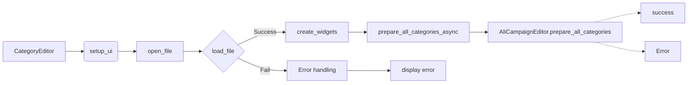

# <input code>

```python
## \file hypotez/src/suppliers/aliexpress/gui/category.py
# -*- coding: utf-8 -*-
#! venv/Scripts/python.exe
#! venv/bin/python/python3.12

"""
.. module: src.suppliers.aliexpress.gui 
	:platform: Windows, Unix
	:synopsis:

"""
MODE = 'dev'


""" Window interface for preparing advertising campaigns """


import header
import sys
import asyncio
from pathlib import Path
from types import SimpleNamespace
from PyQt6 import QtWidgets, QtGui, QtCore
from qasync import QEventLoop, asyncSlot
from src.utils.jjson import j_loads_ns, j_dumps
from src.suppliers.aliexpress.campaign import AliCampaignEditor
```

```markdown
# <algorithm>

**Алгоритм работы модуля `category.py`:**

1. **Инициализация `CategoryEditor`:**
   - Принимает `parent` (родительский элемент) и `main_app` (главное приложение).
   - Вызывает `setup_ui` для настройки интерфейса.
   - Вызывает `setup_connections` для подключения сигналов.

2. **`setup_ui`:**
   - Устанавливает заголовок окна и размеры.
   - Создает кнопки ("Открыть JSON", "Подготовить все категории", "Подготовить категорию").
   - Подключает обработчики событий нажатия кнопок.
   - Создает макет окна (QVBoxLayout).
   - Добавляет элементы в макет.

3. **`open_file`:**
   - Открывает диалоговое окно выбора файла.
   - Если файл выбран, вызывает `load_file` для загрузки данных.

4. **`load_file`:**
   - Попытка загрузить данные из файла JSON с помощью `j_loads_ns`.
   - Если загрузка успешна:
     - Устанавливает имя файла в лейбле.
     - Запоминает имя кампании, путь к файлу и загружает данные в объект `AliCampaignEditor`.
     - Вызывает `create_widgets` для отображения данных в интерфейсе.

5. **`create_widgets`:**
   - Удаляет предыдущие виджеты (кроме кнопки "Открыть" и метки файла).
   - Создает метки с информацией о загруженных данных (название кампании, категории).

6. **`prepare_all_categories_async`:**
   - Если `editor` существует:
     - Асинхронно вызывает `prepare_all_categories` у `editor`.
     - Выводит сообщение об успехе или ошибке.

7. **`prepare_category_async`:**
   - Если `editor` существует:
     - Асинхронно вызывает `prepare_category` у `editor` с именем кампании.
     - Выводит сообщение об успехе или ошибке.

**Пример данных:**

```json
{
  "campaign_name": "MyCampaign",
  "title": "Awesome Campaign",
  "categories": [
    {"name": "Electronics"},
    {"name": "Clothes"}
  ]
}
```

**Передача данных:**

- Данные загружаются из файла JSON и передаются в `CategoryEditor`.
- Объект `AliCampaignEditor` получает путь к файлу и обрабатывает данные для подготовки кампаний.
- Сообщения об успехе/ошибке отображаются в интерфейсе.


```markdown
# <mermaid>


```markdown
# <explanation>

**Импорты:**

- `header`: Вероятно, импортирует общие заголовки или конфигурацию проекта.  Необходимо больше контекста, чтобы понять, что это.
- `sys`: Предоставляет доступ к системным переменным и функциям.
- `asyncio`: Для асинхронной обработки.
- `pathlib`: Для работы с путями к файлам.
- `SimpleNamespace`: Для создания объекта, хранящего данные кампании.
- `QtWidgets`, `QtGui`, `QtCore`: Компоненты PyQt6 для создания графического интерфейса.
- `qasync`:  Для асинхронной работы с PyQt6.
- `j_loads_ns`, `j_dumps`: Функции для работы с JSON, вероятно из `src.utils.jjson`.
- `AliCampaignEditor`: Класс для подготовки кампаний, вероятно, из `src.suppliers.aliexpress.campaign`.

**Классы:**

- `CategoryEditor`: Класс для управления интерфейсом редактирования категорий.
  - `campaign_name`: Название кампании.
  - `data`: Данные кампании в формате `SimpleNamespace`.
  - `language`, `currency`, `file_path`: Характеристики загружаемой кампании.
  - `editor`:  Ссылка на экземпляр `AliCampaignEditor`.
  - `__init__`: Инициализация окна, включает настройку интерфейса (`setup_ui`) и подключения сигналов (`setup_connections`).
  - `setup_ui`: Создание виджетов и макета.
  - `setup_connections`: Подключение сигналов и слотов (пустой метод).
  - `open_file`: Открывает диалог для выбора файла JSON.
  - `load_file`: Загружает данные из файла JSON. Обрабатывает ошибки при загрузке.
  - `create_widgets`: Создает виджеты (лейблы) для отображения данных кампании.
  - `prepare_all_categories_async`, `prepare_category_async`: Асинхронные методы для подготовки всех и одной категории соответственно. Используют `AliCampaignEditor` для выполнения основной работы.


**Функции:**

- `open_file`, `load_file`, `create_widgets`, `prepare_all_categories_async`, `prepare_category_async`:
  - Отвечают за конкретные действия, описанные в алгоритме.

**Переменные:**

- `MODE`: Вероятно, константа, определяющая режим работы.
- `campaign_file`: Путь к файлу кампании.

**Возможные ошибки и улучшения:**

- Отсутствие обработки случаев, когда `AliCampaignEditor` не существует. В `prepare_all_categories_async` и `prepare_category_async`.
- Неудачные попытки загрузки JSON (обработка исключений `except Exception as ex:`).
- Неявное преобразование типов (например, при работе с `pathlib.Path`).
- Отсутствует валидация данных из файла JSON.
- Нет явного описания того, что делает `AliCampaignEditor`.


**Взаимосвязи с другими частями проекта:**

- `AliCampaignEditor`:  Является ключевой зависимостью. Он отвечает за подготовку кампаний на основе данных из файла JSON.
- `src.utils.jjson`:  Необходим для парсинга JSON-файлов.
- Возможно, существуют другие модули, использующие эти подготовленные кампании.


**Рекомендации:**

- Добавить проверку на существование `self.data` и `self.editor` перед использованием в асинхронных методах.
- Использовать более точные типы данных для `file_path`.
- Улучшить обработку ошибок, добавив более конкретные типы исключений.
- Документировать `AliCampaignEditor` более подробно.