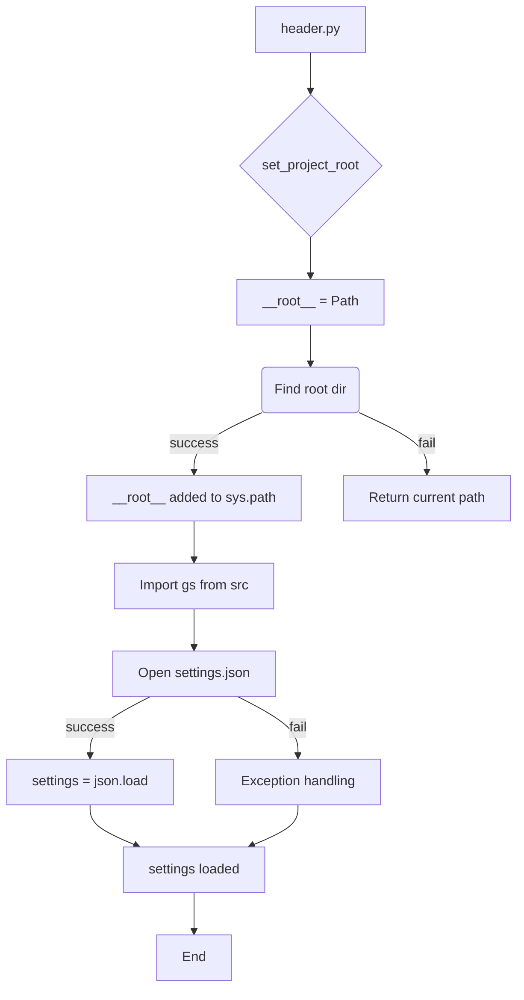

# <input code>

```python
## \file hypotez/src/suppliers/aliexpress/gui/header.py
# -*- coding: utf-8 -*-
#! venv/Scripts/python.exe
#! venv/bin/python/python3.12

"""
.. module: src.suppliers.aliexpress.gui 
	:platform: Windows, Unix
	:synopsis:

"""


import sys
import json
from packaging.version import Version

from pathlib import Path
def set_project_root(marker_files=('__root__')) -> Path:
    """
    Finds the root directory of the project starting from the current file's directory,
    searching upwards and stopping at the first directory containing any of the marker files.

    Args:
        marker_files (tuple): Filenames or directory names to identify the project root.
    
    Returns:
        Path: Path to the root directory if found, otherwise the directory where the script is located.
    """
    __root__:Path
    current_path:Path = Path(__file__).resolve().parent
    __root__ = current_path
    for parent in [current_path] + list(current_path.parents):
        if any((parent / marker).exists() for marker in marker_files):
            __root__ = parent
            break
    if __root__ not in sys.path:
        sys.path.insert(0, str(__root__))
    return __root__


# Get the root directory of the project
__root__ = set_project_root()
"""__root__ (Path): Path to the root directory of the project"""

from src import gs

settings:dict = None
try:
    with open(gs.path.root / 'src' / 'settings.json', 'r') as settings_file:
        settings = json.load(settings_file)
except (FileNotFoundError, json.JSONDecodeError):
    ...
```

# <algorithm>

**Шаг 1:** Определение корневой директории проекта.
* Функция `set_project_root` ищет корневую директорию проекта, начиная с текущей директории и идя вверх по иерархии директорий.
* Она проверяет, содержит ли директория один из файлов `pyproject.toml`, `requirements.txt` или `.git`.
* Если корневая директория найдена, она добавляется в `sys.path` для поиска импортируемых модулей.
* В случае неудачи возвращает текущую директорию.

**Пример:** Если файл `header.py` находится в `hypotez/src/suppliers/aliexpress/gui`, функция найдет директорию `hypotez` и добавит ее в `sys.path`.

**Шаг 2:** Импорт модуля `gs` из модуля `src`.
* Этот шаг происходит после определения корневой директории.
* Импортируется модуль `gs` из пакета `src`.

**Шаг 3:** Загрузка настроек из `settings.json`.
* Происходит попытка открыть файл `settings.json` в директории `src`.
* Если файл найден и успешно загружен, переменная `settings` получает данные из файла.
* В противном случае, исключения обрабатываются, и выполнение продолжается без настроек.


# <mermaid>



**Объяснение зависимостей:**

* `packaging.version`:  Требуется для работы с версиями пакетов (непосредственно не в этом примере).
* `pathlib`: Обеспечивает удобный способ работы с путями к файлам.
* `json`:  Используется для обработки данных из файла `settings.json`.
* `sys`: Используется для манипулирования `sys.path`, что критично для поиска импортируемых модулей.
* `gs`:  Модуль, импортированный из пакета `src`, вероятно, содержит функции и классы для работы с файловой системой и другими ресурсами приложения.


# <explanation>

* **Импорты:**
    * `sys`:  Для манипулирования системным путем импорта (`sys.path`) и доступа к системным параметрам.
    * `json`: Для работы с JSON-файлами.
    * `packaging.version`: Для работы с версиями пакетов (непосредственно не используется в этом фрагменте).
    * `pathlib`:  Обеспечивает объектно-ориентированный подход к работе с файловыми путями, что повышает читаемость и безопасность кода по сравнению с `os.path`.
    * `gs`:  Объекты, предоставляемые этим модулем, вероятно, необходимы для доступа к корневому каталогу проекта.

* **Классы:** Нет определенных классов в данном фрагменте кода.

* **Функции:**
    * `set_project_root(marker_files=...)`:  Ищет корневой каталог проекта, начиная с текущей директории и поднимаясь по иерархии директорий.  `marker_files` позволяет задавать файлы или директории, используемые для определения корневого каталога.  Возвращает `Path` к найденному корневому каталогу или к текущему, если не был найден.  **Важная функция для управления путями в проекте.**

* **Переменные:**
    * `MODE`: Строковая константа, вероятно, для определения режима работы приложения (например, 'dev', 'prod').
    * `__root__`:  `Path`-объект, содержащий путь к корневому каталогу проекта.
    * `settings`:  Словарь, содержащий настройки, загруженные из `settings.json`.

* **Возможные ошибки или области для улучшений:**
    * Если файл `settings.json` не существует или содержит невалидный JSON, код вызывает исключение `FileNotFoundError` или `json.JSONDecodeError`.  Это необходимо обработать в более полном коде, чтобы предотвратить сбой программы.  В данном фрагменте код просто пропускает эту ситуацию, что может привести к проблемам.
    *  Указывается тип возвращаемого значения для `set_project_root`, но отсутствует проверка на валидность возвращенного пути. В реальном коде это может быть важно для обработки неверного расположения проекта.


* **Взаимосвязи с другими частями проекта:**
    * Функция `set_project_root` используется для определения пути к файлу `settings.json`, и, следовательно, для доступа к настройкам приложения.
    * Модуль `gs` играет ключевую роль в управлении файловой системой, включая поиск файлов в проекте.  Связь с ним необходима для работы приложения.
    * Очевидно, что для использования `settings` существует дальнейшая логика в других частях проекта.