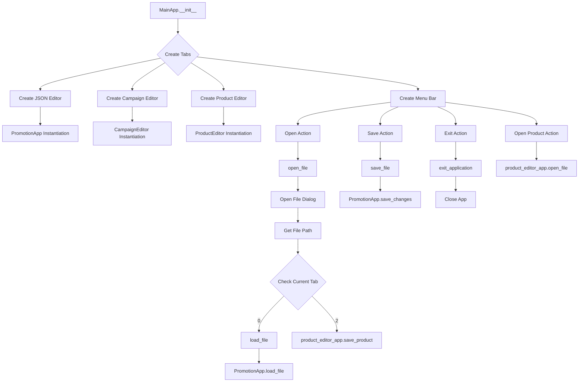
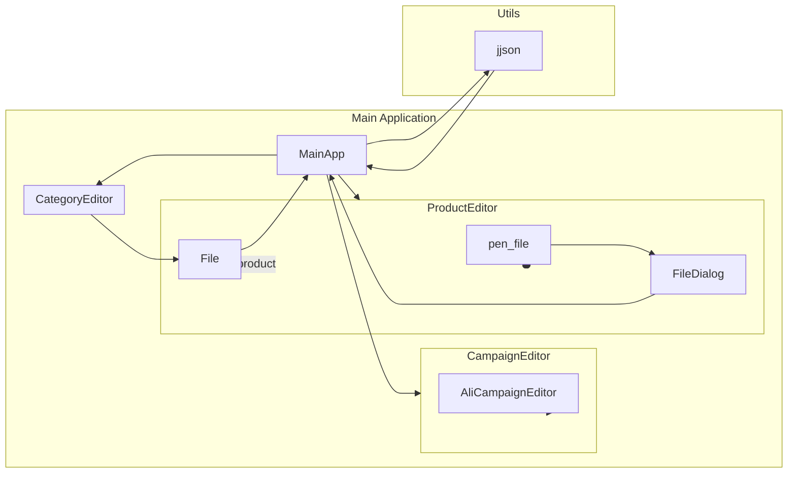

## <input code>

```python
## \file hypotez/src/suppliers/aliexpress/gui/main.py
# -*- coding: utf-8 -*-
#! venv/Scripts/python.exe
#! venv/bin/python/python3.12

"""
.. module: src.suppliers.aliexpress.gui 
	:platform: Windows, Unix
	:synopsis:

"""
MODE = 'dev'


""" Main window interface for managing advertising campaigns """


import header
import asyncio
import sys
from PyQt6 import QtWidgets, QtGui, QtCore
from qasync import QEventLoop
from pathlib import Path
from src.utils.jjson import j_loads_ns, j_dumps
from product import ProductEditor
from campaign import CampaignEditor
from category import CategoryEditor
from src.suppliers.aliexpress.campaign import AliCampaignEditor
from styles import set_fixed_size

class MainApp(QtWidgets.QMainWindow):
    def __init__(self):
        """ Initialize the main application with tabs """
        super().__init__()
        self.setWindowTitle("Main Application with Tabs")
        self.setGeometry(100, 100, 1800, 800)

        self.tab_widget = QtWidgets.QTabWidget()
        self.setCentralWidget(self.tab_widget)

        # Create the JSON Editor tab and add it to the tab widget
        self.tab1 = QtWidgets.QWidget()
        self.tab_widget.addTab(self.tab1, "JSON Editor")
        self.promotion_app = CampaignEditor(self.tab1, self)

        # Create the Campaign Editor tab and add it to the tab widget
        self.tab2 = QtWidgets.QWidget()
        self.tab_widget.addTab(self.tab2, "Campaign Editor")
        self.campaign_editor_app = CategoryEditor(self.tab2, self)

        # Create the Product Editor tab and add it to the tab widget
        self.tab3 = QtWidgets.QWidget()
        self.tab_widget.addTab(self.tab3, "Product Editor")
        self.product_editor_app = ProductEditor(self.tab3, self)

        self.create_menubar()

    # ... (rest of the code)
```

## <algorithm>



Example: The user clicks "Open" on the JSON Editor tab.  The `open_file` method is called. It opens a file dialog, the user selects a JSON file (`campaign_file`). The `load_file` method is called, passing the `campaign_file` to the `PromotionApp` instance for processing.

## <mermaid>



This diagram shows the dependency flow between the main application and its component classes:
- `MainApp` interacts with `CampaignEditor`, `ProductEditor`, `CategoryEditor`, and potentially other parts via `jjson` for data handling.
- `CampaignEditor` depends on `AliCampaignEditor` for specific AliExpress campaign handling.
- `ProductEditor` interacts with a `FileDialog` and `File` system for file operations.


## <explanation>

**Импорты:**

- `header`: Предположительно содержит другие импорты или конфигурационные данные, относящиеся к приложению. Необходимо взглянуть на этот файл, чтобы определить, что он содержит.
- `asyncio`:  Используется для асинхронных операций, возможно, для работы с UI.
- `sys`: Стандартный модуль для доступа к параметрам командной строки и завершения работы программы.
- `PyQt6`: Библиотека для создания графического интерфейса.
- `qasync`:  Библиотека для интеграции asyncio с PyQt6, позволяющая выполнять асинхронные операции в PyQt6 приложении.
- `Pathlib`: Для удобной работы с путями к файлам.
- `jjson`: Модуль для работы с JSON-данными. Предположительно `j_loads_ns` для разбора JSON, а `j_dumps` для сериализации.
- `product`, `campaign`, `category`:  Предполагаются другими модулями или классами в `src` для работы с продуктами, кампаниями и категориями соответственно.
- `AliCampaignEditor`:  Класс для работы с кампаниями AliExpress.
- `styles`: Вероятно, модуль для управления стилями UI элементов приложения.

**Классы:**

- `MainApp`: Главный класс приложения, создаёт окно приложения с вкладками для различных редакторов. `__init__` инициализирует все составляющие: редакторов, меню и устанавливает геометрию окна.
- `CampaignEditor`, `ProductEditor`, `CategoryEditor`: Редакторы кампаний, продуктов и категорий соответственно.  Они взаимодействуют с `MainApp` для получения/передачи данных, и предположительно с собственными представлениями и логикой в соответствующих файлах.
- `AliCampaignEditor`: Обрабатывает специфику кампаний AliExpress, наследует от `CampaignEditor`.

**Функции:**

- `open_file`, `save_file`, `exit_application`, `copy`, `paste`: Функции для работы с файлами и операциями копирования/вставки в интерфейсе.  В `open_file` происходит проверка активной вкладки и вызов соответствующего метода загрузки.  `save_file` проверяет, какая вкладка активна, и вызывает корректный метод сохранения для каждого редактора.
- `load_file`: Загружает данные из файла в приложение, вызывая корректный метод загрузки для текущей вкладки.
- `main`: Точка входа в приложение. Создаёт экземпляр `QApplication`, запускает главный цикл обработки событий, и создаёт и отображает `MainApp`.

**Переменные:**

- `MODE`:  Переменная для хранения режима работы (например, `'dev'` или `'prod'`).
- `tab_widget`: Объект `QTabWidget` для управления вкладками.
- `promotion_app`, `campaign_editor_app`, `product_editor_app`: Экземпляры классов редакторов, используемые в приложении.

**Возможные ошибки/улучшения:**

- Недостаточное выявление ошибок при загрузке JSON. Можно добавить более подробную обработку исключений.
- Отсутствие поддержки других типов файлов, кроме JSON.
- Необходимость проверки корректности данных, получаемых из JSON.
- Отсутствие логирования действий.
- Отсутствие комментариев в коде внутри функций.
- Желательно использовать более типизированные переменные.

**Взаимосвязи с другими частями проекта:**

Код взаимодействует с модулями `src.utils.jjson`, `product`, `campaign`, `category`, `AliCampaignEditor`, `styles`.  Они обеспечивают функциональность обработки JSON-данных, работы с продуктами/кампаниями/категориями, стилями элементов UI и спецификой кампаний AliExpress.  Взаимодействие происходит через вызовы методов классов (например, `product_editor_app.save_product()`).