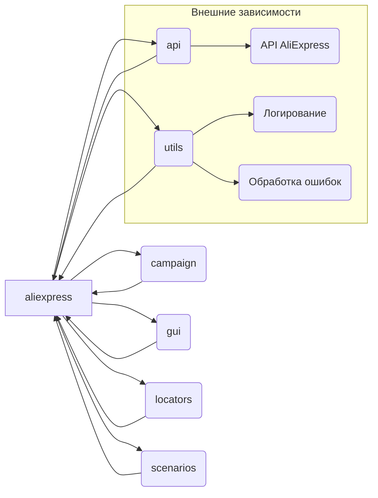

```MD
# Анализ кода модуля AliExpress

## <input code>

```
# Aliexpress
## Модуль для  интеракций с поставщиком `aliexpress.com`

Модуль педоставляет доступ к данным поставщика по протоколам `HTTPS` (webdriver) и `API`  

**webdriver**
 - Прямой доступ к `html` страницам  товара через `Driver` . Позволяет исполнять сценарии сбора информации включая
переход по категориям.

**api**
 - Используется для получения `affiliate link` и кратких характеристик товара. 


## Внутернние модули:
 ### `utils`   
содержит вспомогательные функции и утилитарные классы для выполнения общих операций в интеграции с AliExpress. Вероятно, включает инструменты для форматирования данных, обработки ошибок, логирования и других задач, которые упрощают взаимодействие с экосистемой AliExpress.

---

### `api`    
предоставляет методы и классы для прямого взаимодействия с API AliExpress. Вероятно, включает функциональность для отправки запросов, обработки ответов и управления аутентификацией, упрощая взаимодействие с API для получения или отправки данных.

---

### `campaign`    
предназначен для управления маркетинговыми кампаниями на AliExpress. Вероятно, включает инструменты для создания, обновления и отслеживания кампаний, а также методы для анализа их эффективности и оптимизации на основе предоставленных метрик.

---

### `gui`    
предоставляет графические элементы пользовательского интерфейса для взаимодействия с функциональностью AliExpress. Вероятно, включает реализации форм, диалогов и других визуальных компонентов, которые позволяют пользователям более интуитивно управлять операциями AliExpress.

---

### `locators`    
содержит определения для поиска элементов на веб-страницах AliExpress. Эти локаторы используются вместе с инструментами WebDriver для выполнения автоматизированных взаимодействий, таких как сбор данных или выполнение действий на платформе AliExpress.

---

### `scenarios`    
определяет сложные сценарии или последовательности действий для взаимодействия с AliExpress. Вероятно, включает комбинацию задач (например, API-запросов, взаимодействий с GUI и обработки данных) в рамках более крупных операций, таких как синхронизация товаров, управление заказами или выполнение кампаний.
```

## <algorithm>

К сожалению, предоставленный код — это описание, а не функциональный код.  Поэтому построить блок-схему невозможно.  Мы можем лишь представить возможную логику взаимодействия модулей:

1. Модуль `aliexpress` взаимодействует с `utils` для общей обработки данных, `api` для доступа к API, `campaign` для управления маркетинговыми кампаниями, `gui` для отображения информации пользователю, `locators` для поиска элементов на веб-страницах.
2. Модуль `scenarios` координирует сложные сценарии, используя функциональность других модулей.


## <mermaid>



## <explanation>

**Описание предоставленного кода**

Это описание архитектуры модуля для взаимодействия с AliExpress.  Здесь нет кода для анализа, только текстовое описание различных модулей и их предназначения.

**Импорты**

Не указано, какие именно импорты используются. Ожидается, что каждый из указанных модулей (`utils`, `api`, `campaign`, `gui`, `locators`, `scenarios`) импортирует необходимые библиотеки для работы с веб-драйвером (webdriver), API AliExpress, графическими элементами и т.д.

**Классы**

Подробная информация о классах отсутствует, так как нет кода.  Предполагается, что каждый модуль содержит классы, отвечающие за различные аспекты работы с AliExpress.  Например, классы для отправки API запросов, управления сессиями, хранения данных и т.д.


**Функции**

Аналогично классам,  функциональность функций не может быть проанализирована без кода.

**Переменные**

Не указано.

**Возможные ошибки и улучшения**

Недостаток кода препятствует выявлению конкретных ошибок.  Однако можно отметить, что для повышения читаемости и модульности, желательно:

* Разделить логику на более мелкие и специализированные функции и классы, отвечающие за конкретные задачи.
*  Указать типы данных переменных для улучшения понимания кода.
* Дополнительно документировать каждый модуль, класс, функцию с описанием, аргументами и возвращаемыми значениями.

**Цепочка взаимосвязей**

Модуль `aliexpress` взаимодействует с другими модулями для выполнения задач.  `scenarios` скорее всего  служит координатором, организуя последовательность действий других модулей.  Связи с другими частями проекта не указаны, но предполагается, что  они могут включать базу данных для хранения данных, а также другие службы.

**Заключение**

Предоставленное описание дает общее понимание архитектуры модуля, но без кода анализ ограничен.