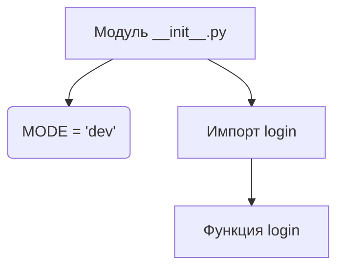
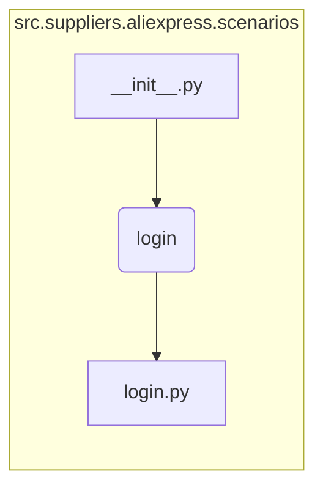

```MD
# <input code>

```python
## \file hypotez/src/suppliers/aliexpress/scenarios/__init__.py
# -*- coding: utf-8 -*-
#! venv/Scripts/python.exe
#! venv/bin/python/python3.12

"""
.. module: src.suppliers.aliexpress.scenarios 
	:platform: Windows, Unix
	:synopsis: Сценарии для алиэкспресс

"""
MODE = 'dev'


from .login import login
```

# <algorithm>



Пример:
В модуле `__init__.py` переменная `MODE` инициализируется со значением 'dev'.  
Модуль импортирует функцию `login` из модуля `login.py` внутри пакета `scenarios`.

# <mermaid>



**Описание зависимостей:**

Модуль `__init__.py`  импортирует функцию `login` из модуля `login.py`. Это указывает на зависимость модуля `__init__.py` от модуля `login.py`.  `login.py` предполагается, что находится в подпапке `login` внутри папки `scenarios` в иерархии пакетов `src.suppliers.aliexpress`.


# <explanation>

**Импорты:**

- `from .login import login`: Этот импорт подключает функцию `login` из модуля `login.py`, который находится в той же директории (`scenarios`), что и `__init__.py`.  Символ `.` перед `login` означает, что импортируемый модуль находится в текущем пакете (подпапке `scenarios`).  Это типичная структура для организации кода по функциональным областям.

**Классы:**

В данном файле нет классов.  Он содержит только переменную `MODE` и импорт функции.

**Функции:**

- `login`: Данная функция импортируется, но ее определение не представлено в текущем файле.  Ожидается, что она определена в модуле `login.py` и отвечает за выполнение задач аутентификации на сайте AliExpress.  Конкретные параметры и возвращаемые значения функции `login` должны быть определены в `login.py`.

**Переменные:**

- `MODE`: Строковая переменная, хранящая значение конфигурации (`'dev'`).  Возможно, она используется для выбора различных режимов работы приложения (разработка, производство).   

**Возможные ошибки и улучшения:**

- **Отсутствие документации:** В `login.py`  необходимо добавить подробную документацию (документировать параметры функции, ожидаемые возвращаемые значения, и обрабатываемые исключения).
- **Неясность использования `MODE`:**  Необходимо описать, как переменная `MODE` используется в коде. Как она влияет на поведение программы?
- **Неполные пути к файлам:** Пути к файлам (`venv/Scripts/python.exe` и т.д.) должны быть относительными, а не абсолютными, если это возможно, для повышения переносимости кода.  Использование абсолютных путей менее гибко, и их использование, когда они не строго необходимы, не рекомендуется.  Лучше использовать переменные среды для определения путей к интерпретатору Python и Python-модулям.
- **Недостаточный контекст:** Для полного понимания кода необходим код модуля `login.py`.


**Взаимосвязи с другими частями проекта:**

Данный `__init__.py` является частью иерархии пакетов, которая определяет входную точку в функциональность сценариев для работы с AliExpress.  Дальнейшие компоненты приложения, возможно, будут использовать функции, импортированные из `login.py` для работы с AliExpress.