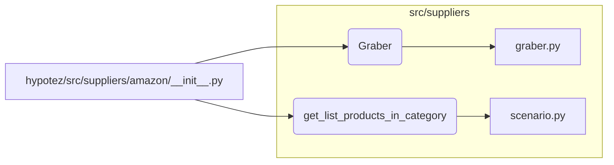

```MD
# Анализ файла hypotez/src/suppliers/amazon/__init__.py

1. **<input code>**

```python
## \file hypotez/src/suppliers/amazon/__init__.py
# -*- coding: utf-8 -*-\
#! venv/Scripts/python.exe
#! venv/bin/python/python3.12

"""
.. module: src.suppliers.amazon 
	:platform: Windows, Unix
	:synopsis:

"""


from .graber import Graber
from .scenario import get_list_products_in_category
```

2. **<algorithm>**

Этот файл является инициализатором модуля `amazon` для получения данных из Amazon.  Он импортирует необходимые классы и функции из других файлов.  Поскольку в коде нет вызовов функций и инициализации каких-либо объектов, алгоритм работы сводится к импорту.  Нет пошаговой обработки данных, поэтому блок-схема не нужна.

3. **<mermaid>**



4. **<explanation>**

* **Импорты**:
    * `from .graber import Graber`: Импортирует класс `Graber` из файла `graber.py` в текущем подпакете (`src.suppliers.amazon`).  Этот класс, вероятно, отвечает за сбор данных с сайта Amazon.
    * `from .scenario import get_list_products_in_category`: Импортирует функцию `get_list_products_in_category` из файла `scenario.py` в текущем подпакете. Эта функция, скорее всего, реализует логику получения списка продуктов по определенной категории на Amazon.

* **Переменные**:
    * ``: Глобальная переменная, хранящая строку 'dev'.  Вероятно, используется для различных режимов работы, например, 'dev' (разработка) или 'prod' (производство).

* **Классы**:
    * `Graber`: Этот класс (из `graber.py`) является ключевым для получения данных из Amazon.  Без его реализации и описания мы не можем судить о функциональности.


* **Функции**:
    * `get_list_products_in_category`: Эта функция (из `scenario.py`) предоставляет возможность получить список продуктов по категории на Amazon. Необходимые параметры и возвращаемые значения нам неизвестны.  Без реализации этой функции нельзя оценить ее поведение.


* **Возможные ошибки или улучшения**:
    * Отсутствует описание работы, без реализации `Graber` и `get_list_products_in_category`, мы не можем полноценно оценить работоспособность.
    *  Файлы `graber.py` и `scenario.py` должны содержать документацию, описывающую, как они используются, и какие аргументы и возвращаемые значения имеют.
    * Нет проверки корректности входных данных (например, валидации категорий).
    *  Нет обработки ошибок (например, при проблемах с соединением с Amazon или отсутствии данных).
    *  Не указано, как `MODE` влияет на код.
    *  Не указана кодировка в коде, хотя указано в комментариях, что используется `utf-8`.
* **Взаимосвязи с другими частями проекта**:
    *  Файл `__init__.py` служит точкой входа для модуля `amazon`. Он импортирует классы и функции, необходимые для работы с данным поставщиком.  Дальнейшее взаимодействие будет происходить через методы `Graber` и вызовы `get_list_products_in_category`.  Необходимо изучить другие файлы, чтобы понять, как этот модуль используется в остальном проекте.


**Вывод**: Код представляет собой начальную точку для модуля, но требует дальнейшего расширения.  Для полного понимания необходимы реализации `Graber` и `get_list_products_in_category` с описанием их поведения.