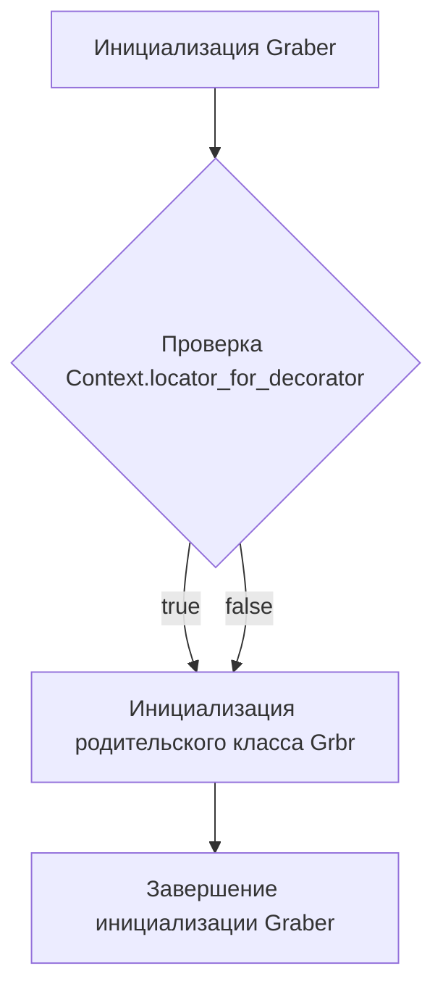
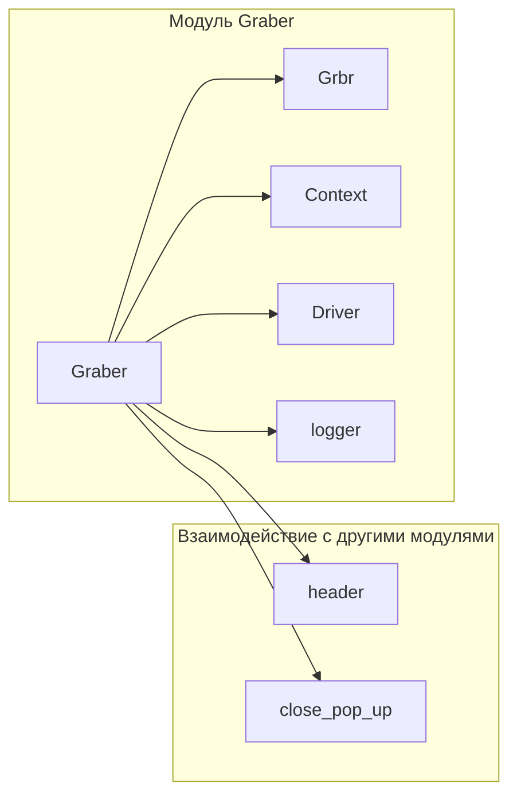

# <input code>

```python
## \file hypotez/src/suppliers/amazon/graber.py
# -*- coding: utf-8 -*-\

#! venv/bin/python/python3.12

"""
.. module: src.suppliers.amazon 
	:platform: Windows, Unix
	:synopsis:  Класс собирает значение полей на странице  товара `amazon.com`. 
    Для каждого поля страницы товара сделана функция обработки поля в родительском классе.
    Если нужна нестандертная обработка, функция перегружается в этом классе.
    ------------------
    Перед отправкой запроса к вебдрайверу можно совершить предварительные действия через декоратор. 
    Декоратор по умолчанию находится в родительском классе. Для того, чтобы декоратор сработал надо передать значение 
    в `Context.locator`, Если надо реализовать свой декоратор - раскоментируйте строки с декоратором и переопределите его поведение

"""


from typing import Any
import header
from src.suppliers.graber import Graber as Grbr, Context, close_pop_up
from src.webdriver.driver import Driver
from src.logger import logger


# # Определение декоратора для закрытия всплывающих окон
# # В каждом отдельном поставщике (`Supplier`) декоратор может использоваться в индивидуальных целях
# # Общее название декоратора `@close_pop_up` можно изменить 


# def close_pop_up(value: Any = None) -> Callable:
#     """Создает декоратор для закрытия всплывающих окон перед выполнением основной логики функции.

#     Args:
#         value (Any): Дополнительное значение для декоратора.

#     Returns:
#         Callable: Декоратор, оборачивающий функцию.
#     """
#     def decorator(func: Callable) -> Callable:
#         @wraps(func)
#         async def wrapper(*args, **kwargs):
#             try:
#                 # await Context.driver.execute_locator(Context.locator.close_pop_up)  # Await async pop-up close  
#                 ... 
#             except ExecuteLocatorException as e:
#                 logger.debug(f'Ошибка выполнения локатора: {e}')
#             return await func(*args, **kwargs)  # Await the main function
#         return wrapper
#     return decorator


class Graber(Grbr):
    """Класс для операций захвата Morlevi."""
    supplier_prefix: str

    def __init__(self, driver: Driver):
        """Инициализация класса сбора полей товара."""
        self.supplier_prefix = 'amazon'
        super().__init__(supplier_prefix=self.supplier_prefix, driver=driver)
        # Устанавливаем глобальные настройки через Context
        
        Context.locator_for_decorator = None # <- если будет уастановлено значение - то оно выполнится в декораторе `@close_pop_up`

```

# <algorithm>

Алгоритм работы представленного кода можно описать следующей блок-схемой:



**Пример:**
* **Инициализация Graber (A):** Создается экземпляр класса `Graber` с переданным `webdriver.driver` и устанавливается `supplier_prefix`.
* **Проверка Context.locator_for_decorator (B):** Проверяется, есть ли значение в `Context.locator_for_decorator`. Если есть, то это значение используется в декораторе, который по умолчанию находится в родительском классе. В данном случае, значение установлено в `None`.
* **Инициализация родительского класса (C):** В `super().__init__` выполняется инициализация родительского класса `Grbr`. Это, вероятно, подразумевает настройку общих атрибутов и методов для обработки данных, таких как  обработка различных полей страницы товара.
* **Завершение инициализации Graber (D):**  Выполняются необходимые завершающие действия.


# <mermaid>



**Объяснение диаграммы:**

Диаграмма показывает взаимосвязи между основными элементами кода и другими модулями. `Graber` зависит от `Grbr`, `Context`, `Driver`, `logger`, `header` и `close_pop_up`. `close_pop_up` (декоратор) является функцией, которая, возможно, реализуется в другом модуле (`src.suppliers.graber`).


# <explanation>

**Импорты:**

* `header`:  Неизвестный модуль, скорее всего, содержит вспомогательные функции или константы, специфичные для данной части проекта.  Необходим дополнительный контекст для точного анализа.
* `src.suppliers.graber`: Модуль, содержащий базовый класс `Graber` для обработки данных.
* `src.webdriver.driver`: Модуль, отвечающий за взаимодействие с веб-драйвером (например, Selenium).
* `src.logger`: Модуль, отвечающий за логирование.


**Классы:**

* **`Graber`**:  Наследуется от `Grbr` (из `src.suppliers.graber`). Предназначен для сбора данных с сайта Amazon.  Атрибут `supplier_prefix` определяет префикс поставщика ('amazon'). Метод `__init__` инициализирует класс с `webdriver.driver`. Важным аспектом является инициализация `Context.locator_for_decorator`. Если будет передано значение в `Context.locator_for_decorator`, то будет выполнена логика декоратора из родительского класса.
* **`Grbr`**: Родительский класс `Graber` (вероятно, абстрактный).  Осуществляет общую логику сбора данных.

**Функции:**

* Код содержит заготовку функции `close_pop_up` в виде декоратора,  но она не реализована.  В родительском классе она вероятно обрабатывает взаимодействие с веб-драйвером для закрытия всплывающих окон.

**Переменные:**

* `MODE`: Вероятно, константа, определяющая режим работы приложения.
* `Context.locator_for_decorator`: Переменная, хранящая значение для декоратора, если таковое необходимо.
* `supplier_prefix`: Хранит префикс поставщика для идентификации.


**Возможные ошибки и улучшения:**

* **Неиспользуемый декоратор:** Декоратор `close_pop_up` не используется в классе, в нем нет await, и декоратор в таком виде работать не будет. Нужно реализовать или удалить его, если он не нужен.
* **Неопределенность `header`:** Непонятно назначение импорта `header`.
* **Сложная логика в `Grbr`:** Предполагается, что `Grbr` содержит сложную логику, связанную с обработкой данных, но код не предоставляет этой информации.
* **Дополнительно:**  Следует обратить внимание на обработку ошибок (`try...except`) в декораторе, чтобы избежать критических падений.


**Цепочка взаимосвязей:**

```
logger -> src.logger
Driver -> src.webdriver.driver
Graber -> Grbr (src.suppliers.graber)
Graber -> Context (модуль Context, вероятно, глобальный)
```

Взаимодействие происходит через импорты и наследование классов. `Graber` использует `Driver` и `logger` для работы, а также функциональность, предоставляемую `Grbr`.