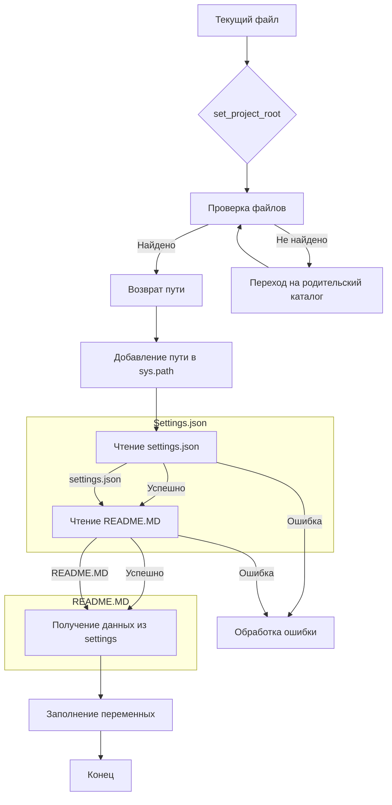

```MD
# <input code>

```python
## \file hypotez/src/suppliers/amazon/header.py
# -*- coding: utf-8 -*-
#! venv/Scripts/python.exe
#! venv/bin/python/python3.12

"""
.. module: src.suppliers.amazon 
	:platform: Windows, Unix
	:synopsis:

"""


import sys
import json
from packaging.version import Version

from pathlib import Path
def set_project_root(marker_files=('__root__','.git')) -> Path:
    """
    Finds the root directory of the project starting from the current file's directory,
    searching upwards and stopping at the first directory containing any of the marker files.

    Args:
        marker_files (tuple): Filenames or directory names to identify the project root.
    
    Returns:
        Path: Path to the root directory if found, otherwise the directory where the script is located.
    """
    __root__:Path
    current_path:Path = Path(__file__).resolve().parent
    __root__ = current_path
    for parent in [current_path] + list(current_path.parents):
        if any((parent / marker).exists() for marker in marker_files):
            __root__ = parent
            break
    if __root__ not in sys.path:
        sys.path.insert(0, str(__root__))
    return __root__


# Get the root directory of the project
__root__ = set_project_root()
"""__root__ (Path): Path to the root directory of the project"""

from src import gs

settings:dict = None
try:
    with open(gs.path.root / 'src' /  'settings.json', 'r') as settings_file:
        settings = json.load(settings_file)
except (FileNotFoundError, json.JSONDecodeError):
    ...

doc_str:str = None
try:
    with open(gs.path.root / 'src' /  'README.MD', 'r') as settings_file:
        doc_str = settings_file.read()
except (FileNotFoundError, json.JSONDecodeError):
    ...


__project_name__ = settings.get("project_name", 'hypotez') if settings  else 'hypotez'
__version__: str = settings.get("version", '')  if settings  else ''
__doc__: str = doc_str if doc_str else ''
__details__: str = ''
__author__: str = settings.get("author", '')  if settings else ''
__copyright__: str = settings.get("copyrihgnt", '')  if settings else ''
__cofee__: str = settings.get("cofee", "Treat the developer to a cup of coffee for boosting enthusiasm in development: https://boosty.to/hypo69")  if settings else "Treat the developer to a cup of coffee for boosting enthusiasm in development: https://boosty.to/hypo69"
```

# <algorithm>

**Шаг 1:** Определение корневой директории проекта. Функция `set_project_root` ищет корневую директорию проекта, начиная с текущей директории файла и двигаясь вверх по дереву директорий. Она проверяет наличие файлов `pyproject.toml`, `requirements.txt` и `.git` в каждой директории. Если один из этих файлов найден, функция возвращает путь к этой директории. В противном случае она возвращает путь к текущей директории.

**Шаг 2:** Добавление корневой директории в `sys.path`. Функция проверяет, находится ли корневая директория проекта в `sys.path`, и если нет, добавляет её в начало списка. Это необходимо для корректного импорта модулей из других директорий проекта.


**Шаг 3:** Чтение `settings.json`. Файл `settings.json` считывается из корневой директории проекта.  Если файл найден и данные парсятся корректно, то `settings` заполняется.

**Шаг 4:** Чтение `README.MD`. Файл `README.MD` считывается из корневой директории проекта. Если файл найден, то `doc_str` заполняется.


**Шаг 5:** Получение переменных из `settings.json`. Значения из словаря `settings` присваиваются переменным `__project_name__`, `__version__`, `__author__`, `__copyright__` и `__cofee__`. Если `settings` пусто, то используется значение по умолчанию.

**Пример:**  Если файл `settings.json` содержит ключ `project_name` со значением `"MyProject"`, то `__project_name__` будет равно `"MyProject"`. Если файла `settings.json` не существует или в нем нет ключа `project_name`, то используется значение по умолчанию `"hypotez"`.


# <mermaid>



# <explanation>

**Импорты:**

- `sys`: Модуль `sys` предоставляет доступ к системным переменным и функциям. В данном случае используется для добавления пути к корневому каталогу проекта в `sys.path`.
- `json`: Модуль `json` используется для работы с файлами в формате JSON. Он используется для считывания и парсинга настроек из файла `settings.json`.
- `packaging.version`: Модуль для работы с версиями пакетов.
- `pathlib`: Модуль `pathlib` обеспечивает объектно-ориентированный подход к работе с файлами и путями, что делает код более читаемым и безопасным.
- `gs`: Этот импорт предполагает наличие модуля `gs` в `src`, который вероятно отвечает за работу с путями и ресурсами проекта.


**Классы:**

Нет явно объявленных классов.

**Функции:**

- `set_project_root(marker_files=...)`: Эта функция находит корневую директорию проекта.  Она принимает кортеж `marker_files`, содержащий имена файлов или директорий, которые должны присутствовать в корневой директории.  Функция возвращает `Path` объект, представляющий путь к корневой директории.  Возможные улучшения:  можно добавить проверку на существование указанных файлов/папок, чтобы предотвратить неожиданные ошибки.


**Переменные:**

- `MODE`: Строковая переменная, хранящая режим работы (в данном случае `'dev'`).
- `__root__`: Переменная, хранящая путь к корню проекта, полученный с помощью функции `set_project_root()`.
- `settings`: Словарь, содержащий данные из `settings.json`.
- `doc_str`: Строка, содержащая содержимое файла `README.MD`.
- `__project_name__`, `__version__`, `__author__`, `__copyright__`, `__cofee__`, `__doc__`, `__details__`: Переменные, содержащие метаданные проекта, считанные из `settings.json` или имеющие значения по умолчанию.

**Возможные ошибки и улучшения:**

- **Обработка ошибок:** В коде используются блоки `try...except` для обработки `FileNotFoundError` и `json.JSONDecodeError`. Это хороший подход, но можно добавить более подробную информацию об ошибке в случае её возникновения.  Можно вывести сообщение об ошибке и пути к файлу, для лучшей диагностики проблем.
- **Чтение настроек:** Если `settings.json` не существует или имеет неправильный формат, код может выдать исключение.  Возникновение таких ошибок может привести к аварийной остановке приложения.  Более гибкий подход заключается в инициализации переменных с значениями по умолчанию.
- **Использование `gs.path.root`:** Необходимо прояснить, как определен объект `gs.path.root`.  Проверка того, что этот объект правильно определен и доступен из модуля `gs` повысит устойчивость кода.


**Взаимосвязи с другими частями проекта:**

Функция `set_project_root` и использование `gs` предполагают существование модуля `gs` в каталоге `src`.  Возможно, `gs` отвечает за обработку путей и ресурсов в проекте `hypotez`.