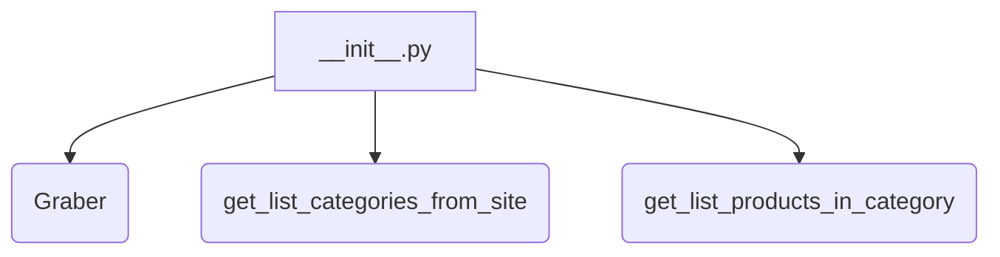
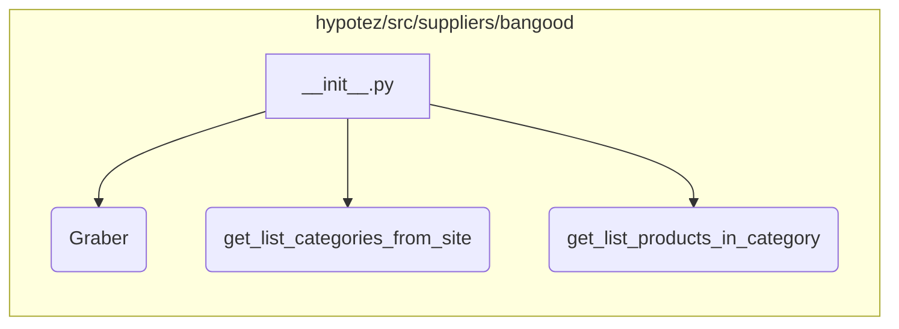

```MD
# Анализ кода hypotez/src/suppliers/bangood/__init__.py

## <input code>

```python
## \file hypotez/src/suppliers/bangood/__init__.py
# -*- coding: utf-8 -*-
#! venv/Scripts/python.exe
#! venv/bin/python/python3.12

"""
.. module: src.suppliers.bangood 
	:platform: Windows, Unix
	:synopsis:

"""


from .graber import Graber
from .scenario import get_list_categories_from_site, get_list_products_in_category
```

## <algorithm>

Этот код представляет собой модуль `__init__.py` для пакета `bangood` в проекте `hypotez`.  Он импортирует необходимые классы и функции из подпапок `graber` и `scenario`.  Блок-схема простая, так как она не содержит собственного логического исполнения.  Она лишь импортирует функции и классы, необходимые для использования в других частях проекта.




## <mermaid>




## <explanation>

**Импорты:**

- `from .graber import Graber`: Импортирует класс `Graber` из модуля `graber`.  Это указывает на то, что `graber` находится в подпапке `bangood` и содержит код, отвечающий за получение данных с сайта Banggood.
- `from .scenario import get_list_categories_from_site, get_list_products_in_category`: Импортирует функции `get_list_categories_from_site` и `get_list_products_in_category` из модуля `scenario`. Эти функции, вероятно, содержат логику для получения списков категорий и продуктов с сайта.

**Классы:**

- `Graber`: Класс, который, судя по имени, отвечает за извлечение данных (скрепачивание) с сайта Banggood.  Без доступа к коду класса `Graber` трудно дать точное описание его функциональности.


**Функции:**

- `get_list_categories_from_site()`:  Получает список категорий с сайта Banggood.  Необходимо детализировать поведение этой функции (например, какие аргументы принимает, какие данные возвращает).
- `get_list_products_in_category()`: Получает список продуктов в заданной категории с сайта Banggood.  Аналогично функции выше, нужны детали реализации (аргументы, возвращаемые значения).

**Переменные:**

- ``: Переменная, которая, скорее всего, указывает на режим работы (например, 'dev' - режим разработки, 'prod' - режим производства).  Эта переменная может использоваться для настройки поведения кода в разных средах.


**Возможные ошибки и улучшения:**

- **Отсутствие документации:**  Не хватает подробной документации для импортированных функций и класса `Graber`.  Непонятно, какие аргументы они принимают и что возвращают.  Добавление docstrings (строки документации) в функции и методы существенно повысит читаемость и понимание кода.
- **Нет обработки ошибок:**  Отсутствует обработка исключений, возникающих при взаимодействии с внешними ресурсами (сайтом Banggood).  В случае возникновения проблем, код может аварийно завершиться.
- **Сложная логика:** Необходимо более подробно изучить подмодули `graber` и `scenario`, чтобы прояснить алгоритмы извлечения и обработки данных.

**Взаимосвязи с другими частями проекта:**

Этот модуль является частью инфраструктуры для получения данных с сайта Banggood.  Он будет использоваться другими частями проекта `hypotez`, где эти данные будут обрабатываться и использоваться.  Без доступа к другим модулям трудно оценить весь масштаб взаимосвязей.  Например, `Graber` взаимодействует с HTTP-запросами для получения данных.  `get_list_categories_from_site` и `get_list_products_in_category` вероятно, содержат функции для парсинга HTML-страниц, полученных с сайта.